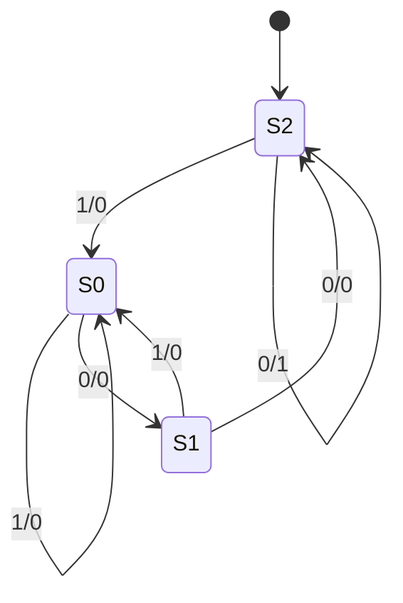
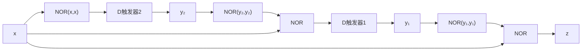
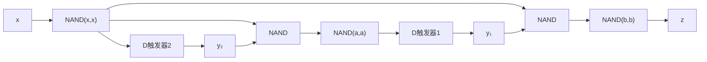

# 東北大学 工学研究科 電気・情報系 2017年3月実施 専門科目 問題4 計算機1

## **Author**

祭音Myyura (co-authored with GPT 5.6 SOL)

## **Description**

### 日本語版

クロックに同期して、各時刻 $t=1,2,\ldots$ に 1 ビット信号 $x_t\in\{0,1\}$ を受け取り、1 ビット信号 $z_t\in\{0,1\}$ を出力する順序回路を考える。本順序回路の出力 $z_t$ は

$$
\left(\sum_{i=1}^t2^{t-i}\cdot x_i\right)\bmod8=0
$$

のときに $1$、それ以外では $0$ となる。ただし $p\bmod q$ は $p$ を $q$ で割った余りを表す。以下の問に答えよ。

(1) 入力系列 $x_1x_2x_3x_4x_5x_6=110001$ に対する出力系列 $z_1z_2z_3z_4z_5z_6$ を示せ。

(2) できるだけ少ない状態数を用いて、本順序回路の状態遷移図を示せ。

(3) 本順序回路の励起式（状態式）および出力式を最簡積和形の論理式で示せ。ただし、$x,z,y_j\in\{0,1\}$ および $Y_j\in\{0,1\}$（$j=1,2,\ldots$）をそれぞれ入力信号、出力信号、現在の状態を表す状態信号、および次の状態を表す状態信号とする。また、論理積、論理和、否定演算子をそれぞれ $\cdot,+,\overline{\phantom{x}}$ とする。

(4) 本順序回路を D フリップフロップおよび 2 入力 NOR ゲートを用いて構成せよ。

(5) 本順序回路を D フリップフロップおよび 2 入力 NAND ゲートを用いて構成せよ。

### 题目描述

同步时序电路在时刻 $t=1,2,\ldots$ 接收位 $x_t$，并输出

$$
z_t=1\iff\left(\sum_{i=1}^t2^{t-i}x_i\right)\bmod8=0.
$$

1. 输入 $110001$ 时，求输出序列。
2. 画状态数尽可能少的状态转移图。
3. 用最简与或式给出状态方程与输出方程，当前状态记为 $y_j$，下一状态记为 $Y_j$。
4. 仅用 D 触发器和二输入 NOR 门实现。
5. 仅用 D 触发器和二输入 NAND 门实现。

## **Kai**

### (1)

各前缀的整数值为 $1,3,6,12,24,49$，故 $\boxed{z_1\cdots z_6=000010}$。

### (2)、(3)

整除 $8$ 当且仅当末三位为零；不足三位时补前导零。令 $S_0,S_1,S_2$ 分别表示末尾连续零的个数为 $0,1,\ge2$，初态为 $S_2$。边标记为输入/输出。

$S_0,S_1$ 可由后缀 $00$ 区分，$S_2$ 与其余状态可由后缀 $0$ 区分，因此三状态最少。

编码 $S_0=00,S_1=01,S_2=11$，未使用状态 $10$ 作无关项，得

$$
\boxed{Y_1=\bar x y_2,\qquad Y_2=\bar x,\qquad z=\bar x y_1}.
$$

两触发器初始化为 $11$；在本拍输入与前一拍状态下得到本拍输出，时钟沿更新状态。

### (4) NOR 实现

记 $N(a,b)=\overline{a+b}$，则

$$
Y_2=N(x,x),\quad Y_1=N(x,N(y_2,y_2)),\quad z=N(x,N(y_1,y_1)).
$$

### (5) NAND 实现

记 $M(a,b)=\overline{ab}$，先令 $u=M(x,x)=\bar x$，再令

$$
a=M(u,y_2),\quad b=M(u,y_1),\quad
Y_1=M(a,a),\quad Y_2=u,\quad z=M(b,b).
$$

