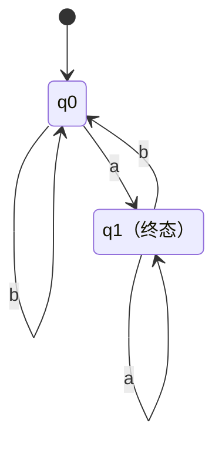
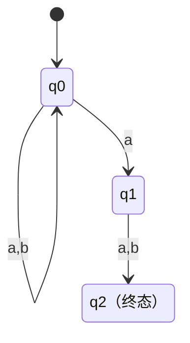
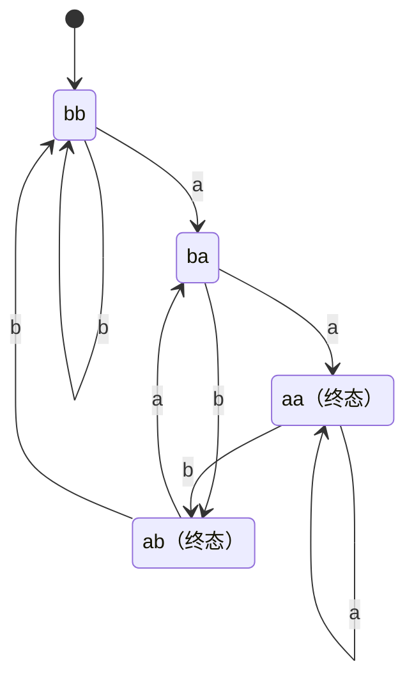
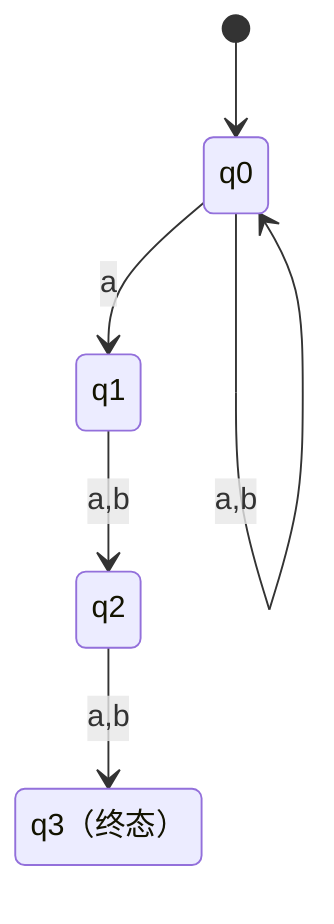

# 東北大学 工学研究科 電気・情報系 2017年8月実施 基礎科目 問題3 情報基礎1

## **Author**

祭音Myyura (co-authored with GPT 5.6 SOL)

## **Description**

### 日本語版

アルファベット $\Sigma=\{a,b\}$ 上の有限状態機械について、次の問に答えよ。

(1) 最後の文字が $a$ であるような文字列全てからなる言語 $L_1$ を考える。なお、$L_1$ は空文字列を含まない。

(a) $L_1$ を受理する決定性有限状態機械で、状態数が最小であるものを図示せよ。初期状態、受理状態を明確にすること。

(b) $L_1$ を受理する非決定性有限状態機械で、問 (1)(a) で問われた有限状態機械よりも状態数が小さいものがあるか。あるならこれを示し、ないならないことを証明せよ。

(2) 長さが 2 以上でかつ最後から 2 番目の文字が $a$ であるような文字列全てからなる言語 $L_2$ を考える。

(a) $L_2$ を受理する非決定性有限状態機械で、状態数が最小であるものを図示せよ。

(b) $L_2$ を受理する決定性有限状態機械で、状態数が最小であるものを図示せよ。

(3) 長さが 3 以上でかつ最後から 3 番目の文字が $a$ であるような文字列全てからなる言語 $L_3$ を受理する非決定性有限状態機械で、状態数が最小であるものを図示せよ。

(4) 長さが $k$（$k\ge3$）以上でかつ最後から $k$ 番目の文字が $a$ であるような文字列全てからなる言語 $L_k$ を考える。

(a) $L_k$ を受理する非決定性有限状態機械で、状態数が最小であるものの状態数はいくつか。

(b) $L_k$ を受理する決定性有限状態機械で、状態数が最小であるものの状態数はいくつか。

### 题目描述

字母表 $\Sigma=\{a,b\}$。令 $L_k$ 为长度至少为 $k$、倒数第 $k$ 个字符为 $a$ 的全部字符串构成的语言。

1. (a) 画出识别 $L_1$ 的最少状态 DFA，标明初态和终态；(b) 是否存在状态更少的 NFA？给出构造或证明。
2. 分别画出识别 $L_2$ 的最少状态 NFA 和 DFA。
3. 画出识别 $L_3$ 的最少状态 NFA。
4. 对一般 $k\ge3$，分别给出识别 $L_k$ 的 NFA 和 DFA 的最少状态数。

## **Kai**

图中的“终态”表示接受状态。

### (1)

DFA 为两状态：

一状态 NFA 若接受 $a$，唯一状态既是初态又是终态，必接受空串，与题意矛盾。因此 NFA 也至少需要两状态。

### (2)

最少状态 NFA：

DFA 记录末两字符，长度不足时在左侧补 $b$，初态为 $bb$；$aa,ab$ 为终态。

### (3)

### (4)

$$
\boxed{\text{NFA 最少 }k+1\text{ 个状态；DFA 最少 }2^k\text{ 个状态。}}
$$

NFA 用初态任意循环，并在某个 $a$ 上猜测倒数第 $k$ 位，随后恰读 $k-1$ 个字符后接受，共 $k+1$ 状态。反过来，最短接受串长为 $k$；其接受路径若重复状态，就可删去环得到更短的接受串，矛盾，故至少 $k+1$ 状态。

DFA 可记录末 $k$ 位，左侧用 $b$ 补齐，共 $2^k$ 状态。任意不同 $u,v\in\Sigma^k$，取一处不同字符的位置 $j$（从左数），追加 $b^{j-1}$，则该位置恰成为倒数第 $k$ 位，两个串一个接受、一个拒绝。因此 $2^k$ 个状态两两可区分，达到下界。
