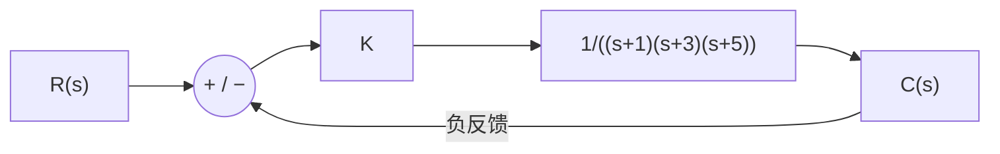

# 東北大学 工学研究科 電気・情報系 2017年8月実施 専門科目 問題1 電気工学

## **Author**

祭音Myyura (co-authored with GPT 5.6 SOL)

## **Description**

### 日本語版

(1) Fig. 1(a) のような制御系がある。同図において、$R(s)$ は目標値、$E(s)$ は偏差、$C(s)$ は制御量、$K$ は正の定数である。次の問に答えよ。

(a) 目標値 $R(s)$ が単位ステップ関数である場合、偏差 $E(s)$ を求めよ。

(b) 定常位置偏差 $\varepsilon_p$ が $0.1$ 未満となるゲイン $K$ の範囲を求めよ。

(c) 開ループ周波数伝達関数 $G_o(j\omega)$ を求めよ。

(d) 位相交差角周波数を求めよ。

(e) この制御系が安定であるためのゲイン $K$ の値の範囲を求めよ。

#### 題意の要約

(2) 電圧 $e_1$ の入力端から抵抗 $R$ を経て節点 $e_2$、次にコイル $L$ を経て出力 $e_3$ に接続する。$e_2,e_3$ の各節点と接地の間には、それぞれ容量 $C$ のコンデンサを置く。抵抗とコイルの電流を $i_1,i_2$ とする。(a)(b) 二つの閉回路の方程式を求める。(c) $E_2=G_1(E_1-E_2-G_3E_3)$、$E_3=G_2(E_2-E_3)$ に対応する各伝達関数を求める。図と原文は[大学公開の原題、1–3 ページ](https://www.ecei.tohoku.ac.jp/ecei_web/files/admission/201708senmon.pdf#page=1)を参照。

### 题目描述

(1) 单位负反馈系统的前向传递函数为

$$
G_0(s)=\frac K{(s+1)(s+3)(s+5)},\qquad K>0.
$$

$R(s),E(s),C(s)$ 分别为目标输入、误差与输出。求：(a) 单位阶跃输入时的 $E(s)$；(b) 稳态位置误差 $\varepsilon_p<0.1$ 的 $K$ 范围；(c) 开环频率传递函数 $G_0(j\omega)$；(d) 相位交越频率；(e) 闭环稳定的 $K$ 范围。

## **Kai**

### (1)(a)、(b)

$$
\boxed{E(s)=\frac{(s+1)(s+3)(s+5)}{s\{(s+1)(s+3)(s+5)+K\}}}.
$$

在闭环稳定的前提下，终值定理给出

$$
\varepsilon_p=\frac{15}{15+K}<0.1\iff K>135.
$$

结合 (e)，能实际达到该稳态误差的范围为 $\boxed{135<K<192}$。

### (1)(c)、(d)

$$
\boxed{G_0(j\omega)=\frac K{15-9\omega^2+j(23\omega-\omega^3)}}.
$$

正频率处相位达到 $-\pi$ 时，分母虚部为零且实部为负。由 $23\omega-\omega^3=0$ 得

$$
\boxed{\omega_{pc}=\sqrt{23}},\qquad G_0(j\omega_{pc})=-K/192.
$$

### (1)(e)

闭环特征多项式为 $s^3+9s^2+23s+15+K$。Routh 第一列为

$$
1,\quad9,\quad\frac{192-K}{9},\quad15+K.
$$

故 $\boxed{0<K<192}$。

### (2)

**(a)** 中间电容的电流为 $i_1-i_2$，故

$$
e_1=Ri_1+e_2,\qquad e_2=e_2(0)+\frac1C\int_0^t(i_1-i_2)\,d\tau.
$$

**(b)** 输出电容的电流为 $i_2$，故

$$
e_2=L\dot i_2+e_3,\qquad e_3=e_3(0)+\frac1C\int_0^t i_2\,d\tau.
$$

**(c)** 求传递函数时取零初始条件。由 $I_2=CsE_3$、$I_1=Cs(E_2+E_3)$，得到

$$
RCsE_2=E_1-E_2-RCsE_3,\qquad LCs^2E_3=E_2-E_3.
$$

与题图各块的输入、输出逐一比较，得

$$
\boxed{G_1(s)=\frac1{RCs},\quad G_2(s)=\frac1{LCs^2},\quad G_3(s)=RCs}.
$$
