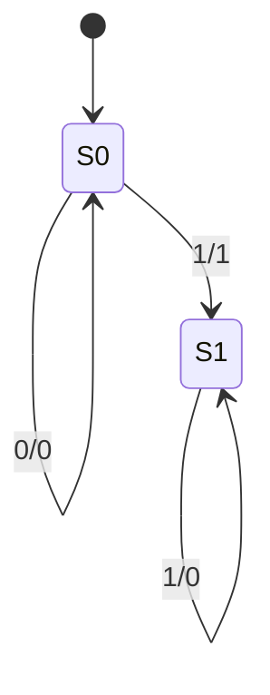
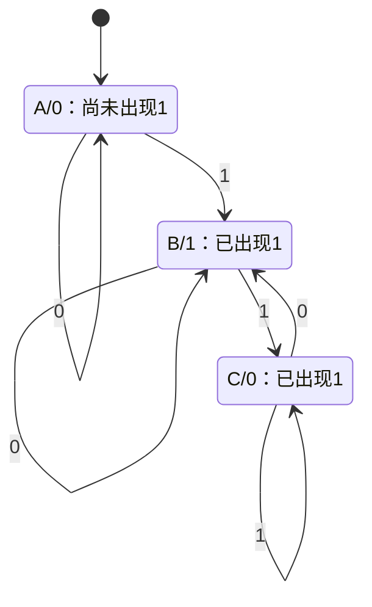
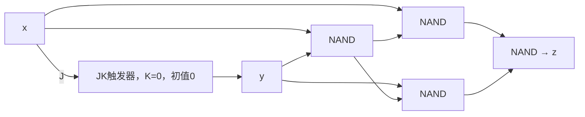

# 東北大学 工学研究科 電気・情報系 2017年8月実施 専門科目 問題4 計算機1

## **Author**

祭音Myyura (co-authored with GPT 5.6 SOL)

## **Description**

### 日本語版

クロックに同期して、各時刻 $t=1,2,\ldots$ に 1 ビット信号 $x_t\in\{0,1\}$ を受け取り、1 ビット信号 $z_t\in\{0,1\}$ を出力する順序回路を考える。本順序回路において、各時刻 $t$ における出力系列に対応する 2 進数の値 $(z_tz_{t-1}\cdots z_3z_2z_1)_2$ は、入力系列に対応する 2 進数の値 $(x_tx_{t-1}\cdots x_3x_2x_1)_2$ の 2 の補数となる。また、論理積、論理和、排他的論理和、論理否定演算子をそれぞれ $\cdot,+,\oplus,\overline{\phantom{x}}$ とする。以下の問に答えよ。

(1) 入力系列 $x_6x_5x_4x_3x_2x_1=011001$ に対する出力系列 $z_6z_5z_4z_3z_2z_1$ を示せ。

(2) $z_t$ を $x_t,x_{t-1},\ldots,x_1$ に関する論理式で表わせ。

(3) できるだけ少ない状態数を用いて、本順序回路の Mealy 型状態遷移図を示せ。

(4) できるだけ少ない状態数を用いて、本順序回路の Moore 型状態遷移図を示せ。

(5) 本順序回路の励起式（状態式）および出力式を最簡積和形の論理式で示せ。ただし、$x$ および $z$ をそれぞれ入力信号、および出力信号とする。また、$y_j\in\{0,1\}$ および $Y_j\in\{0,1\}$（$j=1,2,\ldots$）をそれぞれ現在の状態を表す状態信号、および次の状態を表す状態信号とする。

(6) できるだけ少ない個数の JK フリップフロップおよび 2 入力 NAND ゲートを用いて、本順序回路を構成せよ。

### 题目描述

同步电路按最低位优先顺序接收 $x_1,x_2,\ldots$，输出 $z_1,z_2,\ldots$，使每个 $t$ 时刻，二进制数 $(z_t\cdots z_1)_2$ 都是 $(x_t\cdots x_1)_2$ 的 $t$ 位二进制补码。

1. 输入 $x_6\cdots x_1=011001$ 时，求 $z_6\cdots z_1$。
2. 用 $x_t,x_{t-1},\ldots,x_1$ 表示 $z_t$。
3. 画状态最少的 Mealy 状态图。
4. 画状态最少的 Moore 状态图。
5. 给出最简与或式的状态方程与输出方程。
6. 使用尽可能少的 JK 触发器与二输入 NAND 门画实现电路。

## **Kai**

### (1)、(2)

$$
\boxed{z_6\cdots z_1=100111}.
$$

补码运算从最低位开始，首个 $1$ 及其之前的位保持不变，之后逐位取反，故

$$
\boxed{z_t=x_t\oplus\left(\bigvee_{i=1}^{t-1}x_i\right)},
$$

空的 OR 取 $0$。

### (3)

$S_0$ 表示尚未读到 $1$，$S_1$ 表示已读到 $1$。二者输入 $0$ 时输出不同，故不可合并。

### (4)

Moore 图中状态标签为“状态/输出”；输入后进入的状态输出本拍结果。

$B$ 的输出与其余不同，$A,C$ 在后续输入 $0$ 时输出不同，故最少三状态。

### (5)、(6)

采用两状态 Mealy 实现，$y=0,1$ 对应 $S_0,S_1$，初值 $y=0$：

$$
\boxed{Y=x+y,\qquad z=\bar xy+x\bar y}.
$$

JK 特征式为 $Y=J\bar y+\bar Ky$，故取 $\boxed{J=x,K=0}$。输出异或用四个 NAND 门实现：

$$
u=\overline{xy},\quad v=\overline{xu},\quad w=\overline{yu},\quad z=\overline{vw}.
$$

因此使用一个 JK 触发器、四个二输入 NAND 门。
