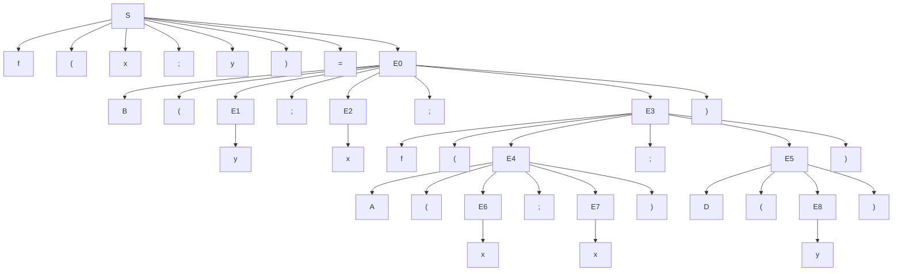

# 東北大学 工学研究科 電気・情報系 2017年8月実施 専門科目 問題5 計算機2

## **Author**

祭音Myyura (co-authored with GPT 5.6 SOL)

## **Description**

### 日本語版

$n$ は非負整数を表すとする。以下の言語を考える。

$$
\begin{aligned}
S&::=\mathrm f(\mathrm x;\mathrm y)=E\\
E&::=n\mid\mathrm x\mid\mathrm y\mid\mathrm D(E)\mid\mathrm A(E;E)\mid\mathrm B(E;E;E)\mid\mathrm f(E;E)
\end{aligned}
$$

ここで、$S$ および $E$ はそれぞれ関数定義および式を表す非終端記号であり、また `n, f, x, y, A, D, B, (, ;, )` および `=` は終端記号である。

式 $E$ は関数定義 $S$ の下で評価される。$S=\mathrm f(\mathrm x;\mathrm y)=E_0$ の下での $E$ の評価は、$E$ を以下の規則に従って書き換えることによって行う。

**規則 1**　$E$ に $\mathrm D(n)$（ただし $n>0$）という形の部分式が含まれているとき、その部分式 $\mathrm D(n)$ を $n$ から 1 を引いた整数で置き換える。

**規則 2**　$E$ に $\mathrm A(n_1;n_2)$ という形の部分式が含まれているとき、その部分式 $\mathrm A(n_1;n_2)$ を $n_1$ と $n_2$ の和に等しい整数で置き換える。

**規則 3**　$E$ に $\mathrm B(n;E_1;E_2)$ という形の部分式が含まれているとき、その部分式 $\mathrm B(n;E_1;E_2)$ を、$n=0$ ならば $E_1$ に、そうでなければ $E_2$ に置き換える。

**規則 4**　$E$ に $\mathrm f(n_1;n_2)$ という形の部分式が含まれているとき、その部分式 $\mathrm f(n_1;n_2)$ を、$E_0$ に現れる全ての $\mathrm x$ を $n_1$ に、全ての $\mathrm y$ を $n_2$ に置き換えた式で置き換える。

$E$ に含まれる部分式のひとつに対して $S$ の下で上記規則のひとつを適用すると $E$ が $E'$ になることを $\langle S,E\rangle\longrightarrow\langle S,E'\rangle$ と書く。また、$\longrightarrow$ の 0 回以上の繰り返しを $\xrightarrow{*}$ と書く。例えば

$$
\langle S,\mathrm A(\mathrm D(5);\mathrm D(4))\rangle\longrightarrow\langle S,\mathrm A(4;\mathrm D(4))\rangle\longrightarrow\langle S,\mathrm A(4;3)\rangle\longrightarrow\langle S,7\rangle
$$

であり、従って、$\langle S,\mathrm A(\mathrm D(5);\mathrm D(4))\rangle\xrightarrow{*}\langle S,7\rangle$ である。

$P$ と $Q$ を以下のように定義する。

$$
\begin{aligned}
P&=\mathrm f(\mathrm x;\mathrm y)=\mathrm B(\mathrm y;\mathrm x;\mathrm f(\mathrm A(\mathrm x;\mathrm x);\mathrm D(\mathrm y)))\\
Q&=\mathrm f(\mathrm x;\mathrm y)=\mathrm B(\mathrm y;\mathrm x;\mathrm A(\mathrm f(\mathrm x;\mathrm D(\mathrm y));\mathrm f(\mathrm x;\mathrm D(\mathrm y))))
\end{aligned}
$$

次の問に答えよ。

(1) $P$ の構文木を、終端記号を葉とする木構造として図示せよ。

(2) $\langle P,\mathrm f(3;1)\rangle\xrightarrow{*}\langle P,n\rangle$ なる $n$ を求めよ。

(3) 任意の非負整数 $n_1,n_2$ について、ある $n$ が存在し、$\langle P,\mathrm f(n_1;n_2)\rangle\xrightarrow{*}\langle P,n\rangle$ かつ $\langle Q,\mathrm f(n_1;n_2)\rangle\xrightarrow{*}\langle Q,n\rangle$ であることを証明せよ。

(4) 評価 $\langle Q,\mathrm f(n_1;n_2)\rangle\xrightarrow{*}\langle Q,n\rangle$ において規則 2 が使われた回数を $n_2$ を用いた式で表せ。

### 题目描述

给定语言

$$
S::=\mathrm f(\mathrm x;\mathrm y)=E,\qquad
E::=n\mid\mathrm x\mid\mathrm y\mid\mathrm D(E)\mid\mathrm A(E;E)\mid\mathrm B(E;E;E)\mid\mathrm f(E;E),
$$

其中 $n$ 是非负整数。函数定义 $S=\mathrm f(\mathrm x;\mathrm y)=E_0$ 下可在任一子表达式使用以下重写规则：

1. $\mathrm D(n)\to n-1$，仅当 $n>0$。
2. $\mathrm A(n_1;n_2)\to n_1+n_2$。
3. $\mathrm B(0;E_1;E_2)\to E_1$；$n\ne0$ 时 $\mathrm B(n;E_1;E_2)\to E_2$。
4. $\mathrm f(n_1;n_2)$ 替换为 $E_0$，其中所有 $\mathrm x,\mathrm y$ 分别替换为 $n_1,n_2$。

令

$$
P:\quad\mathrm f(\mathrm x;\mathrm y)=\mathrm B(\mathrm y;\mathrm x;\mathrm f(\mathrm A(\mathrm x;\mathrm x);\mathrm D(\mathrm y))),
$$

$$
Q:\quad\mathrm f(\mathrm x;\mathrm y)=\mathrm B(\mathrm y;\mathrm x;\mathrm A(\mathrm f(\mathrm x;\mathrm D(\mathrm y));\mathrm f(\mathrm x;\mathrm D(\mathrm y)))).
$$

1. 画 $P$ 的语法树，每个叶子必须为终结符。
2. 求 $P$ 下 $\mathrm f(3;1)$ 的求值结果。
3. 证明对任意非负整数 $n_1,n_2$，$P,Q$ 下 $\mathrm f(n_1;n_2)$ 均可重写至相同整数 $n$。
4. 求 $Q$ 下上述求值使用规则 2 的次数，以 $n_2$ 表示。

## **Kai**

### (1)

以下为具体语法树，括号、分号与等号也列为终结叶。

### (2)

$$
\begin{aligned}
\mathrm f(3;1)&\to\mathrm B(1;3;\mathrm f(\mathrm A(3;3);\mathrm D(1)))\\
&\to\mathrm f(\mathrm A(3;3);\mathrm D(1))
\to^*\mathrm f(6;0)\\
&\to\mathrm B(0;6;\mathrm f(\mathrm A(6;6);\mathrm D(0)))\to6.
\end{aligned}
$$

所以 $\boxed{n=6}$。

### (3)

两者均计算 $\boxed{n=2^{n_2}n_1}$。对 $n_2$ 归纳：$n_2=0$ 时规则 3 直接给出 $n_1$。若结论对 $k$ 成立，则

$$
P(n_1,k+1)=P(2n_1,k)=2^{k+1}n_1,
$$

$$
Q(n_1,k+1)=Q(n_1,k)+Q(n_1,k)=2^{k+1}n_1.
$$

递归的第二参数严格减小；到零时选取首分支，不求值 $\mathrm D(0)$，所以以上求值均可终止。

### (4)

按先选定条件分支、再求所选分支的求值顺序，设规则 2 的次数为 $T(k)$，则

$$
T(0)=0,\qquad T(k+1)=2T(k)+1.
$$

解得 $\boxed{T(n_2)=2^{n_2}-1}$。

其他终止重写顺序的次数也相同：第二参数非零时，两个递归结果都必须参与本层加法；到零时，舍弃分支中的调用被 $\mathrm D(0)$ 阻塞，不能产生额外的数值加法。
