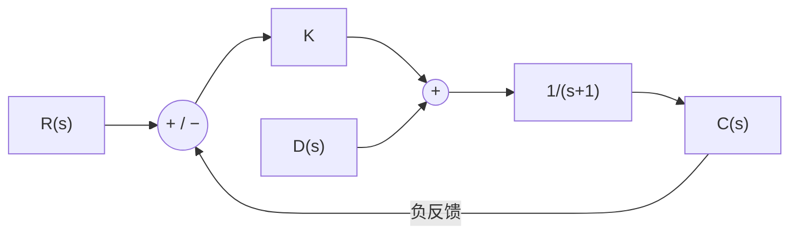

# 東北大学 工学研究科 電気・情報系 2018年3月実施 専門科目 問題1 電気工学

## **Author**

祭音Myyura (co-authored with GPT 5.6 SOL)

## **Description**

### 日本語版

(1) Fig. 1(a) は直流電動機であり、$v_a(t)$ は電機子電圧、$i_a(t)$ は電機子電流、$R_a$ は電機子巻線の抵抗、$L_a$ は電機子巻線のインダクタンス、$\theta(t)$ は回転角である。直流電動機の速度起電力 $e_V(t)$ は次式で与えられる。

$$
e_V(t)=K_V\frac{d\theta(t)}{dt}.\tag{1A}
$$

ここで、$K_V$ は速度起電力定数である。また、直流電動機の機械系に関する方程式は次式で与えられる。

$$
K_Ti_a(t)=J\frac{d^2\theta(t)}{dt^2}+D\frac{d\theta(t)}{dt}.\tag{1B}
$$

ここで、$K_T$ はトルク定数、$J$ は負荷も含めた電動機の慣性モーメント、$D$ は電動機の粘性抵抗である。次の問に答えよ。

(d) 伝達関数 $G(s)$ の単位インパルス応答 $g(t)$ を求めよ。ただし、$R_a=1$、$L_a=1$、$J=1$、$D=4$、$K_V=2$、$K_T=1$ とする。

(2) Fig. 1(b) のような制御系がある。同図において、$R(s)$、$E(s)$、$C(s)$、$D(s)$ は目標値 $r(t)$、偏差 $e(t)$、制御量 $c(t)$、外乱 $d(t)$ をそれぞれラプラス変換したものである。また、$K$ は正の定数である。次の問に答えよ。

(a) $R(s)$、$D(s)$、$K$、$s$ を使って $E(s)$ を表わせ。

(b) 定常位置偏差 $\varepsilon_p$ を求めよ。ただし、$r(t)=1$、$d(t)=0.2$、$K=1$ とする。

(c) 偏差 $e(t)$ に含まれる周期的な振動成分 $p(t)$ を求めよ。ただし、$r(t)=0$、$d(t)=\sin t$、$K=1$ とする。

(d) 目標値 $r(t)=0$、外乱 $d(t)=\sin t$ とする。周期的な振動成分の大きさが (2)(c) で求めた $p(t)$ の大きさの $1/2$ となる $K$ に関する条件を求めよ。

#### 題意の要約

(1)(a)–(c) 直流モータの電機子回路は $R_a,L_a$ と逆起電力 $K_V\dot\theta$ の直列回路であり、機械系は $K_Ti_a=J\ddot\theta+D\dot\theta$ に従う。(a) 電気回路の方程式、(b) 初期値を含む各方程式のラプラス変換、(c) $G(s)=\Theta(s)/V_a(s)$ を求める。図と原文は[大学公開の原題、1–3 ページ](https://www.ecei.tohoku.ac.jp/ecei_web/files/admission/201803senmon.pdf#page=1)を参照。

### 题目描述

(1)(d) 给定传递函数 $G(s)=1/[s(s+2)(s+3)]$，求单位冲激响应 $g(t)$。

(2) 单位负反馈系统中，误差 $E=R-C$ 经比例增益 $K>0$ 后，与扰动 $D$ 相加，再经过对象 $1/(s+1)$，得到输出 $C$。

- (a) 用 $R,D,K,s$ 表示 $E(s)$。
- (b) $r(t)=1,d(t)=0.2,K=1$ 时求稳态位置误差。
- (c) $r(t)=0,d(t)=\sin t,K=1$ 时求误差中的周期振荡 $p(t)$。
- (d) $r(t)=0,d(t)=\sin t$ 时，求使周期振荡幅度恰为 (c) 的一半的 $K$。

## **Kai**

### (1)(a)–(c)

**(a)** Kirchhoff 电压定律给出

$$
\boxed{v_a=R_ai_a+L_a\dot i_a+K_V\dot\theta}.
$$

**(b)** 单边拉普拉斯变换为

$$
V_a=(R_a+L_as)I_a-L_ai_a(0)+K_V[s\Theta-\theta(0)],
$$

$$
K_TI_a=J[s^2\Theta-s\theta(0)-\dot\theta(0)]+D[s\Theta-\theta(0)].
$$

机械方程含二阶导数，一般必须保留初始角速度 $\dot\theta(0)$；若电动机初始静止，该项才为零。

**(c)** 传递函数取所有初始状态为零，消去 $I_a$，得到

$$
\boxed{G(s)=\frac{K_T}{s[(L_as+R_a)(Js+D)+K_VK_T]}}.
$$

代入 (d) 的参数，确有 $G(s)=1/[s(s+2)(s+3)]$。

### (1)(d)

$$
G(s)=\frac1{6s}-\frac1{2(s+2)}+\frac1{3(s+3)},
$$

故 $\boxed{g(t)=\frac16-\frac12e^{-2t}+\frac13e^{-3t}\quad(t\ge0)}$。

### (2)

**(a)** $C=(KE+D)/(s+1)$、$E=R-C$，故

$$
\boxed{E(s)=\frac{(s+1)R(s)-D(s)}{s+1+K}}.
$$

**(b)** 闭环极点为 $-1-K<0$，终值定理给出

$$
\boxed{\varepsilon_p=\frac{1-0.2}{2}=0.4}.
$$

**(c)** 此时 $\dot e+2e=-\sin t$。设稳态周期解 $p(t)=a\sin t+b\cos t$，得 $2a-b=-1,a+2b=0$，所以

$$
\boxed{p(t)=-\frac25\sin t+\frac15\cos t},\qquad\text{幅度}=\frac1{\sqrt5}.
$$

**(d)** 一般 $K$ 下的幅度为 $1/\sqrt{(K+1)^2+1}$。令其等于 $1/(2\sqrt5)$，得到

$$
\boxed{K=\sqrt{19}-1}.
$$
