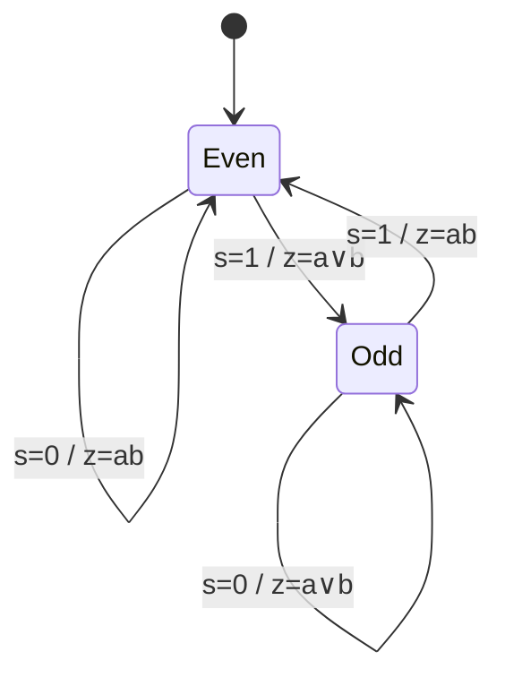
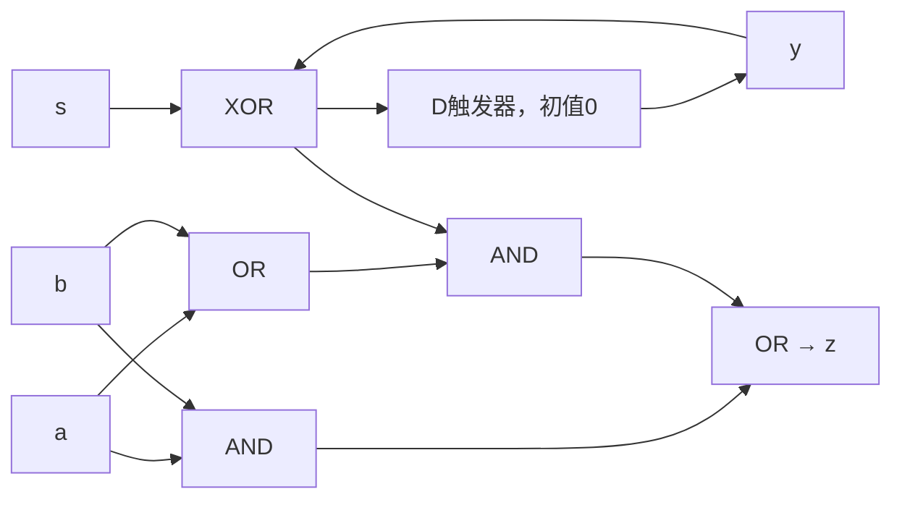
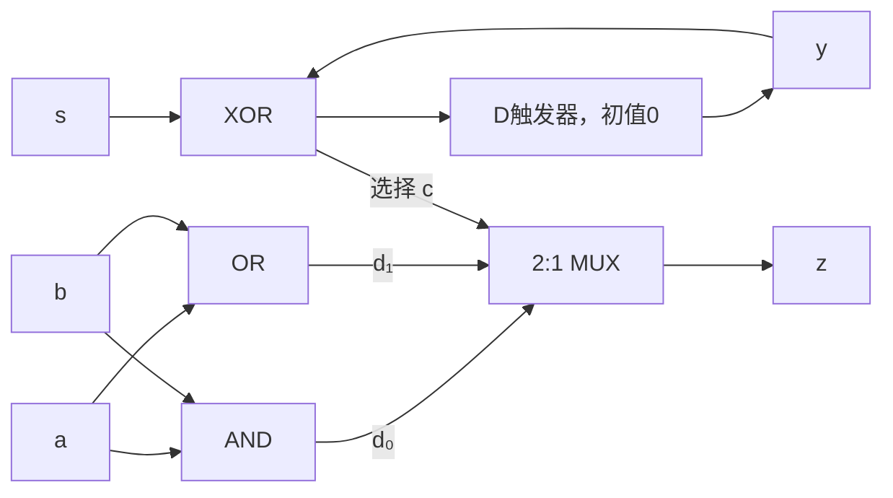

# 東北大学 工学研究科 電気・情報系 2018年3月実施 専門科目 問題4 計算機1

## **Author**

祭音Myyura (co-authored with GPT 5.6 SOL)

## **Description**

### 日本語版

クロックに同期して、各時刻 $t=1,2,\ldots$ に $1$ ビット信号 $a_t,b_t,s_t\in\{0,1\}$ を受け取り、$1$ ビット信号 $z_t\in\{0,1\}$ を出力する順序回路を考える。本順序回路において、入力系列 $s_ts_{t-1}\cdots s_2s_1$ に含まれる $1$ の個数が偶数のとき、本順序回路の出力 $z_t$ は入力 $a_t$ と入力 $b_t$ の論理積となり、$1$ の個数が奇数のとき、出力 $z_t$ は $a_t$ と $b_t$ の論理和となる。また、論理積、論理和、排他的論理和、論理否定演算子をそれぞれ $\cdot$、$+$、$\oplus$、$\overline{\phantom{x}}$ とする。以下の問に答えよ。

(1) 入力系列 $a_4a_3a_2a_1=1010$、$b_4b_3b_2b_1=1100$、$s_4s_3s_2s_1=0110$ に対する出力系列 $z_4z_3z_2z_1$ を示せ。

(2) 本順序回路の Mealy 型状態遷移図を示せ。ただし、その状態数は $2$ とせよ。

(3) 本順序回路の励起式（状態式）および出力式を最簡積和形の論理式で示せ。ただし、$a,b,s$ を入力信号、$z$ を出力信号とする。また、$y\in\{0,1\}$ および $Y\in\{0,1\}$ をそれぞれ現在の状態を表す状態信号、および次の状態を表す状態信号とする。

(4) D フリップフロップ、$2$ 入力論理積ゲート、$2$ 入力論理和ゲートおよび $2$ 入力排他的論理和ゲートを用いて、本順序回路を図示せよ。

(5) $1$ ビット信号 $c,d_0,d_1\in\{0,1\}$ を入力とするマルチプレクサは、$c=0$ のとき $d_0$ を出力し、$c=1$ のとき $d_1$ を出力する回路である。マルチプレクサの動作を表す論理関数を示せ。

(6) マルチプレクサ、D フリップフロップ、および任意の $2$ 入力論理ゲートを用いて、本順序回路を図示せよ。マルチプレクサの表記には適当な記号を用いよ。

### 题目描述

同步时序电路每拍接收 $a_t,b_t,s_t\in\{0,1\}$，输出 $z_t$。若 $s_1,\ldots,s_t$ 中的 $1$ 数量为偶数，则 $z_t=a_tb_t$；若为奇数，则 $z_t=a_t\lor b_t$。

1. 当 $a_4a_3a_2a_1=1010,b_4b_3b_2b_1=1100,s_4s_3s_2s_1=0110$ 时求 $z_4z_3z_2z_1$。
2. 画两状态 Mealy 状态图。
3. 以 $y,Y$ 分别表示当前、下一状态，给出最简与或式的状态方程和输出方程。
4. 用 D 触发器与二输入 AND、OR、XOR 门画电路。
5. 多路选择器在 $c=0$ 时输出 $d_0$，$c=1$ 时输出 $d_1$，写出其逻辑函数。
6. 用多路选择器、D 触发器和任意二输入逻辑门画上述时序电路。

## **Kai**

### (1)

按 $t=1,2,3,4$，累计奇偶为 $0,1,0,0$，输出为 $0,1,0,1$，所以 $\boxed{z_4z_3z_2z_1=1010}$。

### (2)、(3)

令 $y=0,1$ 分别表示此前读入 $s$ 的偶、奇校验，初态为 $0$。本拍奇偶为 $q=y\oplus s$。

状态最简与或式为

$$
\boxed{Y=\bar ys+y\bar s}.
$$

输出为 $z=ab+q(a+b)$，展开为最简与或式：

$$
\boxed{z=ab+a\bar ys+b\bar ys+ay\bar s+by\bar s}.
$$

### (4)

利用因式分解 $q=y\oplus s$、$z=ab\lor(q\land(a\lor b))$：

### (5)、(6)

多路选择器函数为 $\boxed{M(c,d_0,d_1)=\bar c d_0+cd_1}$。选 $c=q,d_0=ab,d_1=a+b$：

