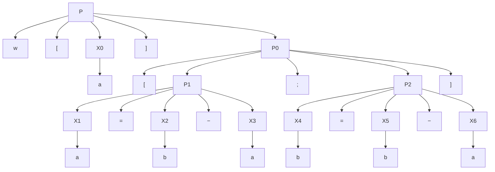

# 東北大学 工学研究科 電気・情報系 2018年3月実施 専門科目 問題5 計算機2

## **Author**

祭音Myyura (co-authored with GPT 5.6 SOL)

## **Description**

### 日本語版

以下の手続き型プログラミング言語を考える。

$$
\begin{aligned}P&::=\mathtt{x=x-x}\mid[P;P]\mid\mathtt{w[x]}P\\x&::=\mathtt a\mid\mathtt b\end{aligned}
$$

ここで、$P$ および $x$ はプログラムおよび変数をそれぞれ表す非終端記号であり、$\mathtt a,\mathtt b,\mathtt w,=,-,[,;,]$ は終端記号である。変数 $\mathtt a$ と $\mathtt b$ は整数の値を保持する。変数の初期値はプログラムの外から実行前に与えられる。各構文の意味は以下の通りである。$x_1=x_2-x_3$ は、$x_2$ の値から $x_3$ の値を引いた数で $x_1$ の値を置き換える。$[P_1;P_2]$ は、$P_1$ と $P_2$ をこの順に続けて実行する。$\mathtt{w[x]}P$ は、$x$ の値が $0$ 以下になるまで $P$ の実行を繰り返す。

$A$ および $B$ を変数の値に関する条件とする。$P$ の実行前に $A$ が成り立つならば $P$ が停止したときに $B$ が成り立つことを $\{A\}P\{B\}$ と書く。以下の規則の組み合わせのみから $\{A\}P\{B\}$ が得られることを $\vdash\{A\}P\{B\}$ と書く。

**規則 1**　$P$ が $x_1=x_2-x_3$ という形のとき、$B$ に現れる全ての $x_1$ を式 $x_2-x_3$ に置き換えて得られた条件が $A$ と文字通り一致するならば、$\{A\}P\{B\}$ である。

**規則 2**　$P$ が $[P_1;P_2]$ という形のとき、ある条件 $C$ が存在し $\{A\}P_1\{C\}$ かつ $\{C\}P_2\{B\}$ ならば、$\{A\}P\{B\}$ である。

**規則 3**　$P$ が $\mathtt{w[x]}P'$ という形のとき、$\{A\text{ かつ }x>0\}P'\{A\}$ ならば、$\{A\}P\{A\text{ かつ }x\le0\}$ である。

**規則 4**　ある条件 $C,D$ が存在し、$C$ は $A$ の必要条件、$D$ は $B$ の十分条件であるとき、$\{C\}P\{D\}$ ならば、$\{A\}P\{B\}$ である。

例えば、$\vdash\{a\ge0\}\mathtt{w[a]\,[a=a-a]}\{a=0\}$ である。なぜならば、

1. $\{a-a\ge0\}\mathtt{a=a-a}\{a\ge0\}$（規則 1）
2. $\{a\ge0\text{ かつ }a>0\}\mathtt{a=a-a}\{a\ge0\}$（規則 4）
3. $\{a\ge0\}\mathtt{w[a]\,[a=a-a]}\{a\ge0\text{ かつ }a\le0\}$（規則 3）
4. $\{a\ge0\}\mathtt{w[a]\,[a=a-a]}\{a=0\}$（規則 4）

だからである。

$\mathcal F$ をプログラム $\mathtt{w[a]\,[a=b-a;b=b-a]}$ とする。以下の問に答えよ。

(1) $\mathcal F$ の構文木を、$\mathcal F$ の全ての終端記号が葉として現れる木構造として図示せよ。

(2) 初期値を $(a,b)=(23,41)$ として $\mathcal F$ を実行し、$\mathcal F$ が停止したときの $a$ と $b$ の値を求めよ。

(3) $\vdash\{\text{ある整数 }i\text{ が存在し、}i\ge0\text{ かつ }\binom ab=\left(\begin{smallmatrix}0&1\\1&1\end{smallmatrix}\right)^i\binom01\}\mathcal F\{b=1\}$ を示せ。

(4) $a$ および $b$ の任意の初期値に対して $\mathcal F$ が停止するかどうか判定せよ。その根拠を示せ。

### 题目描述

命令式语言的语法为

$$
P::=x=x-x\mid[P;P]\mid\mathrm w[x]P,\qquad x::=\mathrm a\mid\mathrm b.
$$

变量 $\mathrm a,\mathrm b$ 存放整数。赋值 $x_1=x_2-x_3$ 以右边计算值替换 $x_1$；$[P_1;P_2]$ 顺序执行；$\mathrm w[x]P$ 在 $x>0$ 时反复执行 $P$，直到 $x\le0$。

Hoare 三元组 $\{A\}P\{B\}$ 表示：若执行前满足 $A$，则程序终止时满足 $B$。符号 $\vdash$ 表示仅由以下规则可导出：

1. 赋值规则：若 $A$ 正好是将 $B$ 中 $x_1$ 替换为 $x_2-x_3$ 后的命题，则 $\vdash\{A\}\,x_1=x_2-x_3\,\{B\}$。
2. 顺序规则：从 $\vdash\{A\}P_1\{C\}$ 与 $\vdash\{C\}P_2\{B\}$ 得 $\vdash\{A\}[P_1;P_2]\{B\}$。
3. 循环规则：从 $\vdash\{A\land x>0\}P\{A\}$ 得 $\vdash\{A\}\mathrm w[x]P\{A\land x\le0\}$。
4. 后果规则：若 $A\Rightarrow C,D\Rightarrow B$ 且 $\vdash\{C\}P\{D\}$，则 $\vdash\{A\}P\{B\}$。

令 $\mathcal F=\mathrm w[a][a=b-a;b=b-a]$。

1. 画语法树，使全部终结符出现在叶子上。
2. 初值 $(a,b)=(23,41)$ 时执行程序，求终止值。
3. 证明
   

$$
\vdash\left\{\exists i\in\mathbb Z_{\ge0},\ \binom ab=\begin{pmatrix}0&1\\1&1\end{pmatrix}^{i}\binom01\right\}\mathcal F\{b=1\}.
$$

4. 对任意整数初值，$\mathcal F$ 是否都终止？说明理由。

## **Kai**

### (1)

### (2)

注意第二次赋值使用更新后的 $a$，因此每轮映射为 $(a,b)\mapsto(b-a,a)$。

$$
(23,41)\to(18,23)\to(5,18)\to(13,5)\to(-8,13).
$$

此时 $a\le0$，所以 $\boxed{(a,b)=(-8,13)}$。

### (3)

令 $M=\begin{pmatrix}0&1\\1&1\end{pmatrix}$，$I(a,b)$ 表示题设前置条件。$M^i(0,1)^T=(F_i,F_{i+1})^T$，其中 $F_0=0,F_1=1$；故 $I\land a>0$ 蕴含 $i\ge1$。

循环体对应矩阵 $M^{-1}=\begin{pmatrix}-1&1\\1&0\end{pmatrix}$，于是

$$
I(a,b)\land a>0\ \Longrightarrow\ I(b-a,a).
$$

取中间断言 $J(a,b)=I(a,b-a)$。由两次赋值规则，

$$
\vdash\{I(b-a,a)\}\ a=b-a\ \{J(a,b)\},
$$

$$
\vdash\{J(a,b)\}\ b=b-a\ \{I(a,b)\}.
$$

应用后果规则与顺序规则，得到 $\vdash\{I\land a>0\}[a=b-a;b=b-a]\{I\}$。由循环规则，退出时满足 $I\land a\le0$；而 $F_i>0$ 对 $i\ge1$ 成立，故只能 $i=0$，于是 $(a,b)=(0,1)$。最后用后果规则即得所证三元组。

### (4)

对所有整数初值都终止。若初始 $a\le0$，立即退出。若反设无限执行，记各轮起始值为 $a_n,b_n$，则所有 $a_n$ 为正整数，且

$$
a_{n+1}=b_n-a_n,\quad b_{n+1}=a_n,\quad
 a_{n+2}=a_n-a_{n+1}>0.
$$

因此 $a_{n+1}<a_n$，构成无限严格递减的正整数序列，矛盾。
