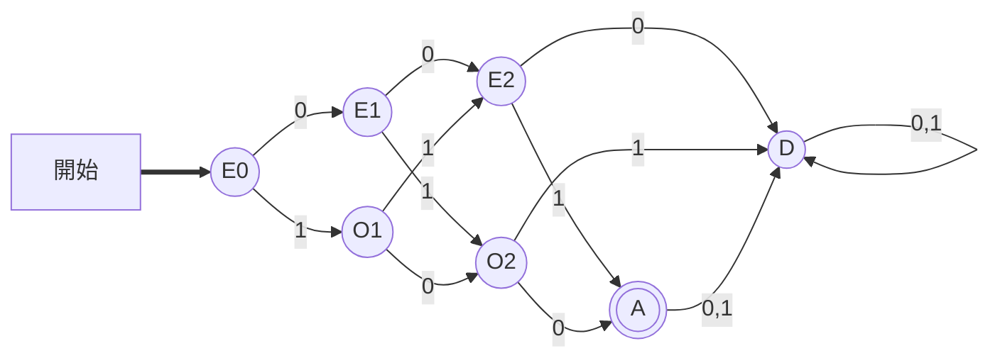
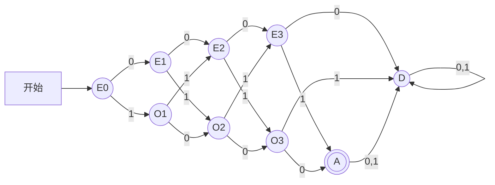
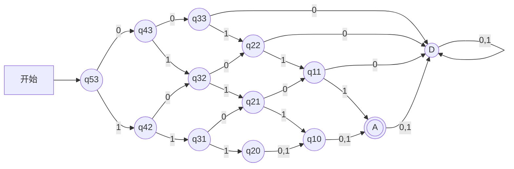

# 東北大学 工学研究科 電気・情報系 2018年8月実施 基礎科目 問題3 情報基礎1

## **Author**
祭音Myyura (co-authored with GPT 5.6 SOL)

## **Description**

### 日本語原文

ブール関数 $f:\{0,1\}^n\to\{0,1\}$ を、選言標準形（DNF）論理式と決定性有限状態機械（DFA）で表現することを考える。以下では、論理式中の論理積、論理和、論理否定は、それぞれ、$\land,\lor,\overline{\phantom{x}}$ で表すものとする。また、DNF 論理式のサイズとは式中のリテラルの出現数を指す。ブール関数 $f$ を表現する DFA とは、言語

$$
L_f=\{x_1\cdots x_n\in\{0,1\}^n\mid f(x_1,\ldots,x_n)=1\}
$$

を受理する DFA である。なお、DFA の遷移関数は全域関数であるものとする。次の問に答えよ。なお、解答にあたっては証明は要さない。

(1) パリティ関数 $P_n$ とは、$n$ 個の引数 $x_1,\ldots,x_n\in\{0,1\}$ のうち、$x_i=1$ となる引数 $x_i$ の個数が奇数のとき、かつそのときに限り、返り値が $1$ となるブール関数である。たとえば、$P_3$ は、次の DNF 論理式

$$
(x_1\land\bar x_2\land\bar x_3)\lor(\bar x_1\land x_2\land\bar x_3)\lor(\bar x_1\land\bar x_2\land x_3)\lor(x_1\land x_2\land x_3)
$$

および下図の DFA で表現される。ここで、二重矢印で開始状態を示し、二重丸で受理状態を示している。

(a) $P_4$ を表現する最小サイズの DNF 論理式を書け。

(b) $P_4$ を表現する状態数最小の DFA を図示せよ。

(c) 自然数 $n\ge1$ に対して $P_n$ を表現する DNF 論理式の最小サイズを求めよ。

(d) 自然数 $n\ge1$ に対して $P_n$ を表現する DFA の最小状態数を求めよ。

(2) 多数決関数 $M_n$ とは、$n$ 個の引数 $x_1,\ldots,x_n\in\{0,1\}$ のうち、$n/2$ 個以上が $1$ のとき、かつそのときに限り、返り値が $1$ となるブール関数である。

(a) $M_5$ を表現する最小サイズの DNF 論理式を書け。

(b) $M_5$ を表現する状態数最小の DFA を図示せよ。

(c) 自然数 $m\ge1$ に対して $M_{2m+1}$ を表現する DNF 論理式の最小サイズを求めよ。

(d) 自然数 $m\ge1$ に対して $M_{2m+1}$ を表現する DFA の最小状態数を求めよ。

### 题目描述

用析取范式（DNF）和转移函数完备的 DFA 表示布尔函数 $f:\{0,1\}^n\to\{0,1\}$。公式大小是其中文字（变量或其否定）的出现总次数；DFA 必须恰好接受 $L_f=\{x_1\cdots x_n:f(x_1,\ldots,x_n)=1\}$。

(1) 奇偶函数 $P_n$ 在且仅在输入中有奇数个 $1$ 时取 $1$。求：

- (a) $P_4$ 的最小 DNF；(b) 表示 $P_4$ 的最少状态 DFA；
- (c) $P_n$ 最小 DNF 大小；(d) 其最少 DFA 状态数（$n\ge1$）。

(2) 多数函数 $M_n$ 在且仅在至少 $n/2$ 个输入为 $1$ 时取 $1$。求：

- (a) $M_5$ 的最小 DNF；(b) 表示 $M_5$ 的最少状态 DFA；
- (c) $M_{2m+1}$ 的最小 DNF 大小；(d) 其最少 DFA 状态数（$m\ge1$）。

各问不要求证明。

## **Kai**

### (1)

(a) 记 $\ell_i(1)=x_i,\ \ell_i(0)=\bar x_i$，则

$$
P_4=\bigvee_{a\in\{1000,0100,0010,0001,1110,1101,1011,0111\}}\ \bigwedge_{i=1}^4\ell_i(a_i).
$$

(b) 下图共 $9$ 个状态；$A$ 是唯一接受状态，$D$ 为死状态。$E_i,O_i$ 分别表示已读 $i$ 位且 $1$ 的个数为偶数、奇数。

(c) 每个蕴含项必须固定全部 $n$ 位，共 $2^{n-1}$ 个最小项，故最小大小为

$$
\boxed{n2^{n-1}}.
$$

(d) 初态一个，中间 $n-1$ 层各两个状态，再加接受态和死状态：

$$
\boxed{2n+1}.
$$

### (2)

(a) 取所有三变量乘积：

$$
\boxed{M_5=\bigvee_{1\le i<j<k\le5}(x_i\land x_j\land x_k)}.
$$

(b) $q_{r,t}$ 表示还须读恰好 $r$ 位且至少需要 $t$ 个 $1$；当需求已满足时记 $t=0$。$A=q_{0,0}$，$D$ 是死状态，共 $13$ 个状态。

(c) 最小 DNF 为全部 $m+1$ 元正文字合取项之析取，大小为

$$
\boxed{(m+1)\binom{2m+1}{m+1}}.
$$

(d) 各不同非空剩余语言恰对应一个状态。计数得到

$$
\boxed{(m+1)(m+2)+1},
$$

其中最后的 $1$ 是共用死状态。
