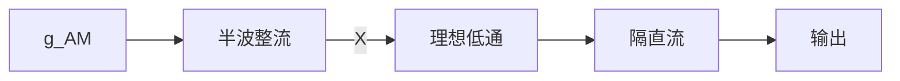

# 東北大学 工学研究科 電気・情報系 2018年8月実施 専門科目 問題2 通信工学

## **Author**
祭音Myyura (co-authored with GPT 5.6 SOL)

## **Description**

### 日本語原文

変調信号を $s(t)$ とし、搬送波 $A_c\cos(2\pi f_ct)$ により生成される振幅変調波

$$
g_{AM}(t)=A_c[1+m\cdot s(t)]\cos(2\pi f_ct)
$$

を考える。ただし、$|s(t)|\le1$ であるとする。また、$m$ は変調指数で $0<m\le1$ を満たす。この変調波を Fig. 2 に示す検波器で復調する。Fig. 2 の点 X における電圧波形 $\widetilde g_{AM}(t)$ は次式で与えられるものとする。

$$
\widetilde g_{AM}(t)=\begin{cases}g_{AM}(t)&g_{AM}(t)\ge0\text{ のとき}\\0&\text{上記以外のとき}\end{cases}
$$

また、検波器中の LPF は理想低域通過フィルタを表し、その周波数応答は次式で与えられる。

$$
H(f)=\begin{cases}1&-f_0\le f\le f_0\text{ のとき}\\0&\text{上記以外のとき}\end{cases}
$$

このとき、以下の問に答えよ。

(1) 検波器中の理想低域通過フィルタの単位インパルス応答 $h(t)$ を求め、$h(t)$ の概形を図示せよ。

(2) 任意の時刻 $t$ において $s(t)=0$ であるとする。

(a) 点 X における波形 $\widetilde g_{AM}(t)$ の概形を図示せよ。

(b) $\widetilde g_{AM}(t)$ を基本周波数 $f_c$ のフーリエ級数で表せ。

(3) 変調信号 $s(t)$ が $|f|\le f_m$ に帯域制限されているとき、問 (2)(b) の結果を用いて検波器で変調信号が復調できることを説明せよ。ただし、$0<f_m<f_0\ll f_c$ とする。

### 题目描述

调幅波为 $g_{AM}(t)=A_c[1+ms(t)]\cos(2\pi f_ct)$，其中 $|s(t)|\le1,\ 0<m\le1$。信号依次经过半波整流器、理想低通滤波器及隔直流器。

整流器输出 $\widetilde g_{AM}(t)=\max\{g_{AM}(t),0\}$，低通响应为 $H(f)=1$（$|f|\le f_0$），其余为 $0$。

(1) 求并画出低通滤波器的单位冲激响应 $h(t)$。

(2) 令 $s(t)=0$：(a) 画整流输出波形；(b) 以 $f_c$ 为基频求其 Fourier 级数。

(3) 当 $s(t)$ 的频带限制为 $[-f_m,f_m]$，且 $0<f_m<f_0\ll f_c$ 时，利用(2)(b)解释解调原理。

## **Kai**

### (1)

取 $h(t)=\int H(f)e^{i2\pi ft}\,df$，则

$$
\boxed{h(t)=\frac{\sin(2\pi f_0t)}{\pi t}=2f_0\operatorname{sinc}(2f_0t)},\qquad h(0)=2f_0,
$$

其中 $\operatorname{sinc}u=\sin(\pi u)/(\pi u)$。其为偶函数，非零整数 $n$ 对应的零点为 $t=n/(2f_0)$。

### (2)

(a) $\widetilde g_{AM}=A_c\max(\cos(2\pi f_ct),0)$，保留余弦的正半周，负半周为零。

(b) 令 $\theta=2\pi f_ct$。偶函数 $q(\theta)=\max(\cos\theta,0)$ 的常数项为 $1/\pi$，一次谐波系数为 $1/2$；对 $n\ge1$，

$$
a_{2n}=\frac1\pi\int_{-\pi/2}^{\pi/2}\cos\theta\cos(2n\theta)\,d\theta=\frac{2(-1)^{n-1}}{\pi(4n^2-1)}.
$$

故

$$
\boxed{\widetilde g_{AM}(t)=A_c\left[\frac1\pi+\frac12\cos(2\pi f_ct)+\frac2\pi\sum_{n=1}^\infty\frac{(-1)^{n-1}\cos(4\pi nf_ct)}{4n^2-1}\right]}.
$$

### (3)

因 $1+ms(t)\ge0$，整流后为 $A_c[1+ms(t)]q(2\pi f_ct)$。与 $q$ 的常数项相乘得到基带，其余频谱位于载频及谐波附近。由频带分离，低通输出

$$
\frac{A_c}{\pi}[1+ms(t)].
$$

隔去直流后为 $\boxed{A_cm[s(t)-\bar s]/\pi}$，其中 $\bar s$ 是信号直流分量。特别地，$s$ 零均值时，输出为 $A_cms(t)/\pi$，恢复原调制信号的波形。
