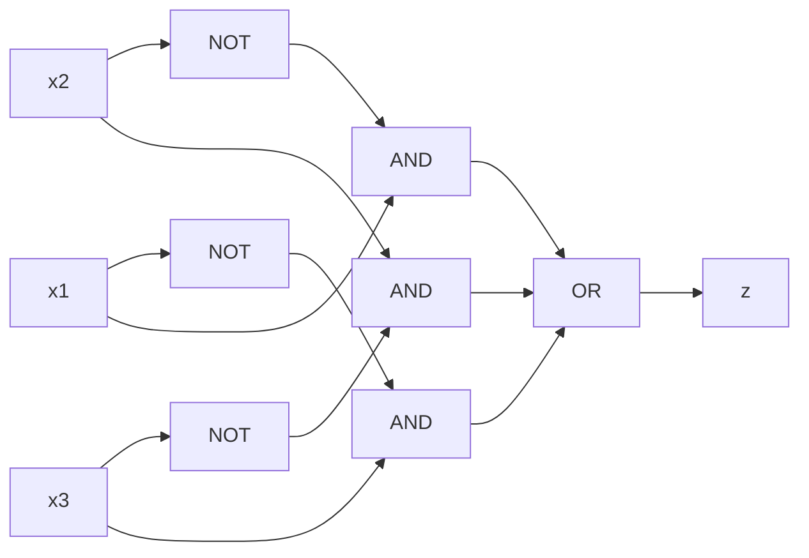
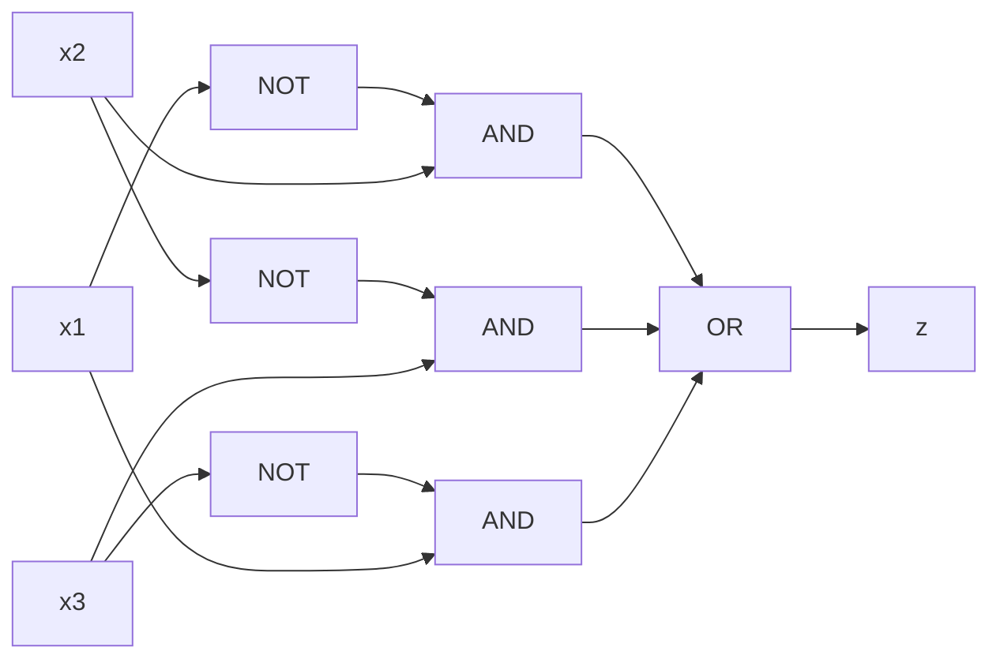
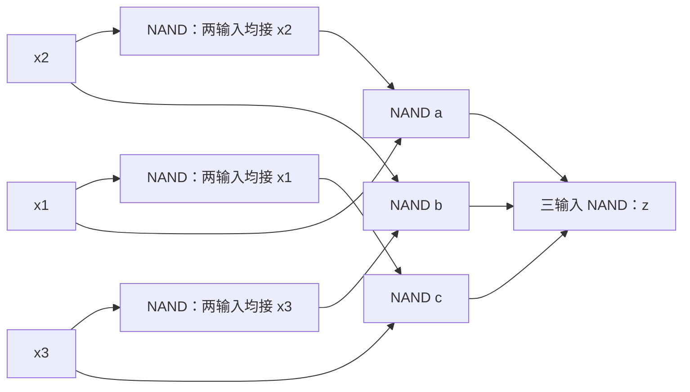

# 東北大学 工学研究科 電気・情報系 2018年8月実施 専門科目 問題4 計算機1

## **Author**
祭音Myyura (co-authored with GPT 5.6 SOL)

## **Description**

### 日本語原文

3つの1ビット信号 $x_1,x_2,x_3\in\{0,1\}$ を入力として受け取り、1ビット信号 $z\in\{0,1\}$ を出力する組合せ回路について考える。本回路においては、3つの入力のうち2つのみが一致する時には $1$ を出力し、それ以外の時には $0$ を出力する。ここでは、論理積（AND）、論理和（OR）、論理否定（NOT）の各演算子にはそれぞれ $\cdot,+,\overline{\phantom{x}}$ の記号を用いるものとする。以下の問に答えよ。

(1) この回路の真理値表（組合せ表）を示せ。

(2) Table 4 の形式に従ってこの回路のカルノー図を完成させ、このカルノー図に対する最簡積和形論理式をすべて示せ。また、最小数の AND ゲート、1つの OR ゲート、3つの NOT ゲートを用いて、それぞれの最簡積和形論理式に対応する回路図を1つずつ示せ。なお、ここで用いる AND ゲートは2つの入力端子を有するが、OR ゲートは3つ以上の入力端子を有していてもよい。

Table 4：行を $x_3=0,1$、列を $x_1x_2=00,01,11,10$ とする。

(3) NAND ゲートのみを用いて、この回路に対応する回路図を1つ示せ。なお、ここでは3つ以上の入力端子を有する NAND ゲートを1個のみ使用してもよいが、それ以外は2つの入力端子を有する NAND ゲートを用いる。

### 题目描述

三输入组合逻辑电路仅在三个输入不全相同时输出 $1$，即恰有两个输入相同、另一个不同。

(1) 写出真值表。

(2) 以 $x_3$ 为行、$x_1x_2$ 为列画 Karnaugh 图，写出全部最简积之和式。对每个式子，用最少的二输入 AND 门、一个 OR 门及三个 NOT 门画出电路；OR 门允许三个以上输入。

(3) 仅用 NAND 门实现该函数；最多一个 NAND 门可有三个以上输入，其余均为二输入。

## **Kai**

### (1)

| $x_1x_2x_3$ | $z$ |
|---|---:|
| 000 | 0 |
| 001 | 1 |
| 010 | 1 |
| 011 | 1 |
| 100 | 1 |
| 101 | 1 |
| 110 | 1 |
| 111 | 0 |

### (2)

| $x_3\backslash x_1x_2$ | 00 | 01 | 11 | 10 |
|---|---:|---:|---:|---:|
| 0 | 0 | 1 | 1 | 1 |
| 1 | 1 | 1 | 0 | 1 |

每个最大分组包含两个相邻的 $1$。六个 $1$ 构成环，恰有两种用三个分组覆盖全部 $1$ 的方法，故全部最简式为

$$
\boxed{z=x_1\bar x_2+x_2\bar x_3+x_3\bar x_1}
$$

和

$$
\boxed{z=\bar x_1x_2+\bar x_2x_3+\bar x_3x_1}.
$$

每个式子均需 $3$ 个二输入 AND 门、$1$ 个三输入 OR 门、$3$ 个 NOT 门。

第一式的电路：

第二式的电路：

### (3)

记 $N(a,b)=\overline{ab}$，用 $N(x_i,x_i)=\bar x_i$ 产生反相信号。取

$$
a=N(x_1,\bar x_2),\quad b=N(x_2,\bar x_3),\quad c=N(x_3,\bar x_1),\quad z=\overline{abc}.
$$

由 De Morgan 律，输出等于第一种最简式。仅末级为三输入 NAND，其余六个均为二输入 NAND。

