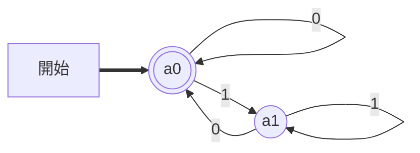
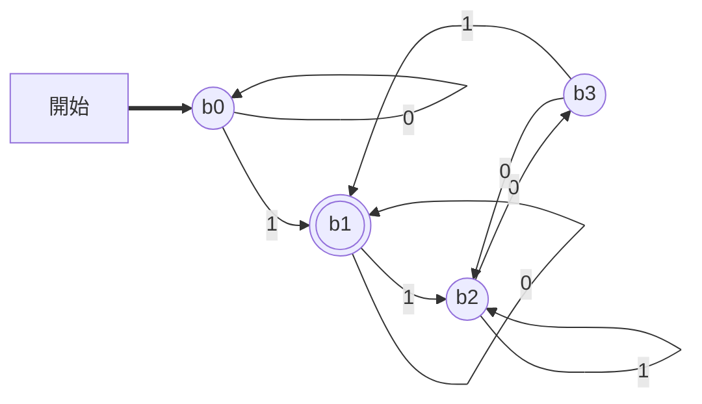
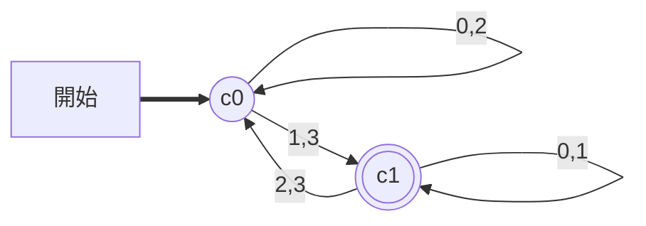
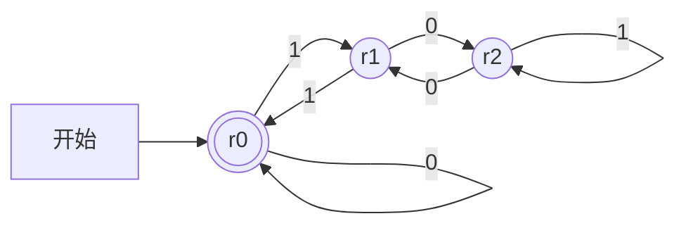
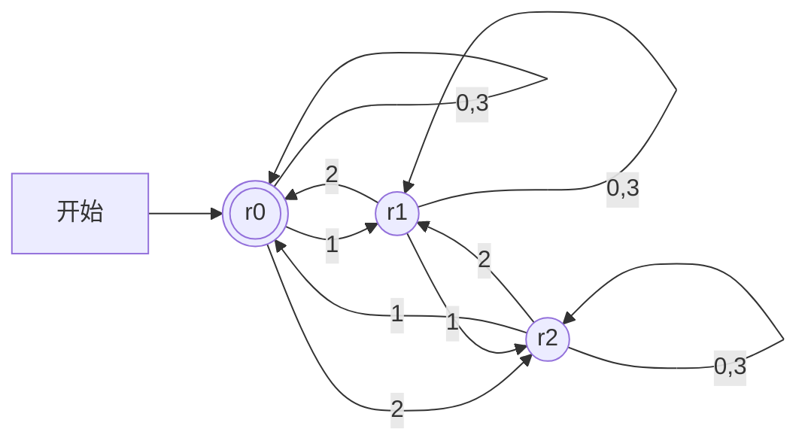
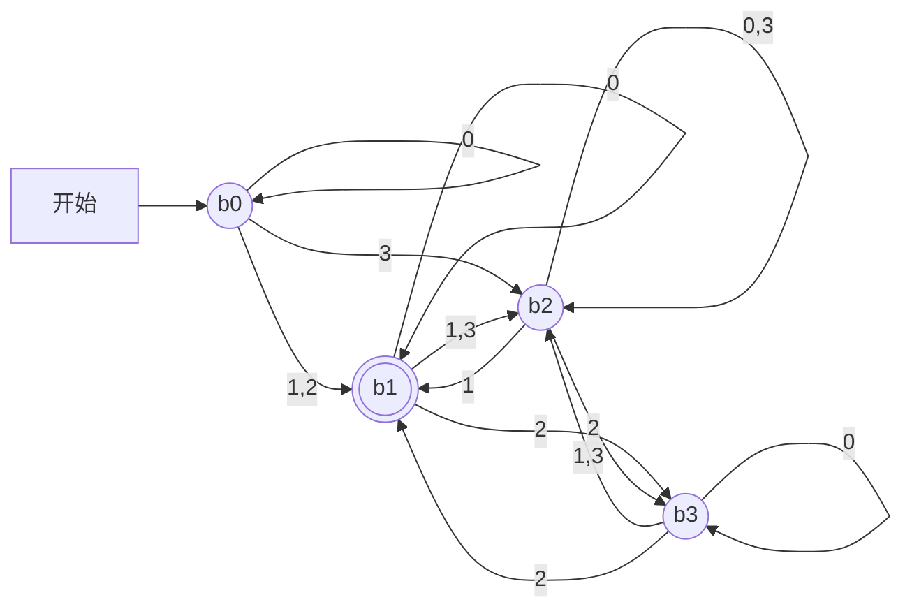
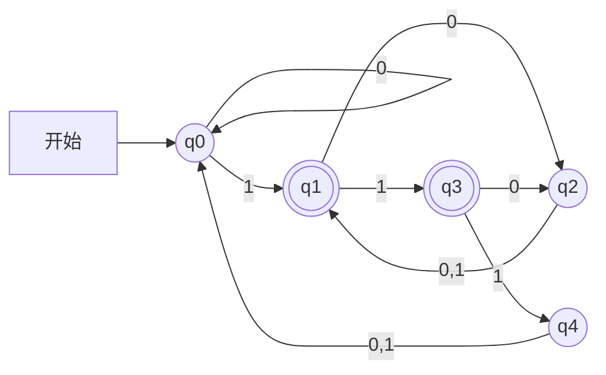

# 東北大学 工学研究科 電気・情報系 2019年3月実施 基礎科目 問題3 情報基礎1

## **Author**
祭音Myyura (co-authored with GPT 5.6 SOL)

## **Description**

### 日本語原文

以下では非負整数の集合を $\mathbb N$ で表すものとする。アルファベット $\Sigma_k=\{0,\ldots,k-1\}$ 上の任意の文字列 $a_1\cdots a_n\in\Sigma_k^n$ を非負整数として解釈する関数 $\phi_k:\Sigma_k^*\to\mathbb N$ を

$$
\phi_k(a_1\cdots a_n)=\sum_{i=0}^{n-1}a_{n-i}k^i
$$

と定義する。例えば，$\phi_2(1001)=\phi_2(001001)=9$ である。また，この関数を拡張し，任意の言語 $L\subseteq\Sigma_k^*$ に対して $\phi_k(L)=\{\phi_k(w)\in\mathbb N\mid w\in L\}$ と定義する。例えば，Fig. 3(a) に示す決定性有限状態オートマトン（DFA）の受理する $\Sigma_2$ 上の言語を $L_a$ とすると，$\phi_2(L_a)$ は偶数非負整数全体の集合である。本問中の図において，太い矢印で開始状態を指し，二重丸で受理状態を表す。また，ある DFA より状態数の少ない他のいかなる DFA も同じ言語を受理しないとき，その DFA を最簡形 DFA と呼ぶ。

(1) 等式 $\phi_2(11001110100)=\phi_4(w)$ を満たす文字列 $w\in\Sigma_4^*$ をひとつ与えよ。

(2) 等式 $\phi_2(w)=\phi_4(130321)$ を満たす文字列 $w\in\Sigma_2^*$ をひとつ与えよ。

(3) 言語 $\{w\in\Sigma_2^*\mid\phi_2(w)\text{ は }3\text{ の倍数}\}$ を受理する最簡形 DFA を描け。

(4) 言語 $\{w\in\Sigma_4^*\mid\phi_4(w)\text{ は }3\text{ の倍数}\}$ を受理する最簡形 DFA を描け。

(5) Fig. 3(b) に示す DFA の受理する $\Sigma_2$ 上の言語を $L_b$ とする。等式 $\phi_4(L)=\phi_2(L_b)$ を満たす言語 $L\subseteq\Sigma_4^*$ を受理する最簡形 DFA を描け。

(6) Fig. 3(c) に示す DFA の受理する $\Sigma_4$ 上の言語を $L_c$ とする。等式 $\phi_2(L)=\phi_4(L_c)$ を満たす言語 $L\subseteq\Sigma_2^*$ を受理する最簡形 DFA を描け。

Fig. 3(a)–(c)：

Fig. 3(a)

Fig. 3(b)

Fig. 3(c)

### 题目描述

记 $\Sigma_k=\{0,\ldots,k-1\}$，$\phi_k:\Sigma_k^*\to\mathbb N$ 将字符串解释为 $k$ 进制非负整数，空串取值 $0$，允许前导零。对语言 $L$，记 $\phi_k(L)=\{\phi_k(w):w\in L\}$。DFA 的转移函数须完备。

(1) 求 $w\in\Sigma_4^*$，使 $\phi_2(11001110100)=\phi_4(w)$。

(2) 求 $w\in\Sigma_2^*$，使 $\phi_2(w)=\phi_4(130321)$。

(3)(4) 分别画接受数值为 $3$ 的倍数的二进制、四进制串的最小 DFA。

(5) 二进制 DFA $L_b$ 的转移表如下；$b_0$ 初始，$b_1$ 唯一接受。画最小 DFA 接受某个 $L\subseteq\Sigma_4^*$，满足 $\phi_4(L)=\phi_2(L_b)$。

| 状态 | 0 | 1 |
|---|---|---|
| $b_0$ | $b_0$ | $b_1$ |
| $b_1$ | $b_1$ | $b_2$ |
| $b_2$ | $b_3$ | $b_2$ |
| $b_3$ | $b_2$ | $b_1$ |

(6) 四进制 DFA $L_c$ 的转移表如下；$c_0$ 初始，$c_1$ 唯一接受。画最小 DFA 接受某个 $L\subseteq\Sigma_2^*$，满足 $\phi_2(L)=\phi_4(L_c)$。

| 状态 | 0 | 1 | 2 | 3 |
|---|---|---|---|---|
| $c_0$ | $c_0$ | $c_1$ | $c_0$ | $c_1$ |
| $c_1$ | $c_1$ | $c_1$ | $c_0$ | $c_0$ |

## **Kai**

### (1)(2)

二进制从右起每两位对应一位四进制：

$$
\boxed{11001110100_2=121310_4},\qquad\boxed{130321_4=011100111001_2}.
$$

第二式去掉最前的 $0$ 也可。

### (3)

用 $r_j$ 表示目前数值模 $3$ 的余数 $j$，读入 $a$ 后按 $j\mapsto(2j+a)\bmod3$ 转移。$r_0$ 初始且接受，共 $3$ 状态。

### (4)

此时 $j\mapsto(4j+a)\bmod3=(j+a)\bmod3$，仍为 $3$ 状态。

两图中不同余数均可用后缀区分，因此状态数最少。

### (5)

取 $L=\{w:\phi_4(w)\in\phi_2(L_b)\}$。把每位 $0,1,2,3$ 分别替换为 $00,01,10,11$，在原 DFA 连走两步，即得到下面的四状态最小 DFA。

$b_1$ 由空后缀与其他状态区分；在其余三态上，后缀 $1,2$ 的接受结果分别为 $(1,1),(1,0),(0,1)$，故四态不能合并。

### (6)

取 $L=\{w:\phi_2(w)\in\phi_4(L_c)\}$。将四进制边展开为两条二进制边，并同时允许输入前补一个 $0$，以处理奇数长度；确定化、最小化后为下列五状态 DFA。$q_0$ 初始，$q_1,q_3$ 接受。

五态均可达，且按后缀 $\varepsilon,0,1,01$ 的接受结果依次为

$$
\begin{array}{c|cccc} &\varepsilon&0&1&01\\q_0&0&0&1&1\\q_1&1&0&1&1\\q_2&0&1&1&1\\q_3&1&0&0&1\\q_4&0&0&0&1\end{array}
$$

各行不同，故此 DFA 最小。
