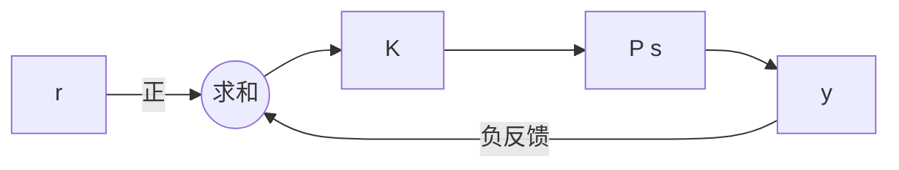

# 東北大学 工学研究科 電気・情報系 2019年3月実施 専門科目 問題1 電気工学（制御）

## **Author**

祭音Myyura (co-authored with GPT 5.6 SOL)

## **Description**

### 日本語版

(1) Fig. 1(a) のような制御系を考える。同図において、$r(t)$、$e(t)$、$y(t)$ はそれぞれ目標値、偏差、制御量を表す。次の問に答えよ。ただし、$K$ は定数（$K>0$）である。

(a) 目標値 $r(t)$ から制御量 $y(t)$ への伝達関数 $G(s)$ を考える。$G(s)$ を求めよ。

(b) 開ループ伝達関数 $G_0(s)$ を求めよ。

(c) 問 (1)(b) を用いて、位相交差角周波数 $\omega_{cp}$ を求めよ。

(d) 問 (1)(b) と問 (1)(c) を用いて、$-\infty<\omega<\infty$ の範囲でナイキスト線図の概略図を描け。

(e) 問 (1)(d) の結果を用いて制御系が安定である $K$ の値の範囲を求めよ。

(f) ラウス・フルビッツの安定判別法を用いて問 (1)(e) で求めた $K$ の値の範囲を確かめよ。

(2) Fig. 1(b) のような制御系を考える。同図において、$r(t)$、$e(t)$、$y(t)$ はそれぞれ目標値、偏差、制御量を表す。次の問に答えよ。ただし、$K$ は定数（$K>0$）である。

(a) ナイキスト線図を示せ。ただし、$-\infty<\omega<\infty$、$K=0.5$ とする。また、この制御系が安定であるかどうかを説明せよ。

(b) 制御系が安定である $K$ の範囲をナイキストの安定判別法で求めよ。

### 题目描述

两个系统均为比例增益 $K>0$ 和对象 $P(s)$ 构成的单位负反馈系统。

(1) $P(s)=1/[s(s^2+s+9)]$。求 (a) 闭环传递函数 $G(s)$；(b) 开环传递函数 $G_0(s)$；(c) 相位交越频率 $\omega_{cp}$；(d) $-\infty<\omega<\infty$ 的 Nyquist 图；(e) 由图求稳定的 $K$ 范围；(f) 用 Routh–Hurwitz 判据确认。

(2) $P(s)=1/(s-1)$。(a) 取 $K=0.5$，画 Nyquist 图并判断稳定性；(b) 用 Nyquist 判据求稳定的 $K$ 范围。

## **Kai**

### (1)

(a)(b)

$$
\boxed{G(s)=\frac K{s^3+s^2+9s+K},\qquad G_0(s)=\frac K{s(s^2+s+9)}}.
$$

(c)(d) 对 $\omega\ne0$，

$$
\operatorname{Re}G_0(i\omega)=-\frac K{\omega^2+(9-\omega^2)^2},\quad
\operatorname{Im}G_0(i\omega)=-\frac{K(9-\omega^2)}{\omega[\omega^2+(9-\omega^2)^2]}.
$$

故 $\boxed{\omega_{cp}=3}$，交越点为 $G_0(3i)=-K/9$。正频率支从 $-K/81-i\infty$ 出发，经过 $-K/9$，再从上半平面趋向原点；负频率支为其共轭。原点极点须以右侧小半圆绕开，其映射是右侧无穷大半圆。

(e) 采用顺时针围绕右半平面的 Nyquist 围道，并以逆时针环绕 $-1$ 为正。原点极点被避开，开环右半平面极点数为 $0$。当负实轴交点位于 $-1$ 右侧时无净环绕，闭环稳定：

$$
\boxed{0<K<9}.
$$

(f) Routh 表首列为 $1,1,9-K,K$，全部为正恰等价于 $0<K<9$。$K=9$ 时多项式为 $(s+1)(s^2+9)$，不渐近稳定。

### (2)

(a) 开环频率响应为

$$
G_0(i\omega)=\frac{-K-iK\omega}{1+\omega^2},\qquad
\left(\operatorname{Re}G_0+\frac K2\right)^2+(\operatorname{Im}G_0)^2=\frac{K^2}4.
$$

当 $\omega$ 从 $-\infty$ 增至 $+\infty$，轨迹逆时针走一周。$K=0.5$ 时是圆心 $(-0.25,0)$、半径 $0.25$ 的圆，不包围 $-1$；开环有一个右半平面极点，故闭环也有一个，系统不稳定。

(b) 稳定要求逆时针环绕 $-1$ 一次以抵消该开环极点。因此圆必须包围 $-1$，即

$$
\boxed{K>1}.
$$

也可由唯一闭环极点 $s=1-K$ 检查。$K=1$ 时极点在原点，不渐近稳定。
