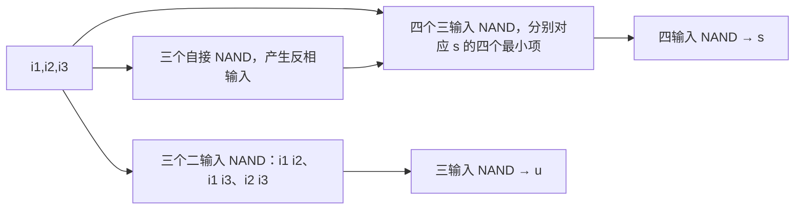

# 東北大学 工学研究科 電気・情報系 2019年3月実施 専門科目 問題4 計算機1

## **Author**

祭音Myyura (co-authored with GPT 5.6 SOL)

## **Description**

### 日本語版

Fig. 4(a) に示す順序回路形乗算回路について考える。この回路は $1$ 個の全加算器（full adder；実線四角）と $4$ 個の回路ブロック $B_1,B_2,B_3,B_4$（破線四角）で構成され、$2$ つの入力 $X$ と $Y$ の乗算結果 $Z$ が出力される。この乗算において桁上げ数の系列 $C$ が生じ、$X,Y,Z,C$ はそれぞれ $3$ ビット、$2$ ビット、$5$ ビット、$3$ ビットの $2$ 進非負整数であり、$X=(x_2x_1x_0)_2$、$Y=(y_1y_0)_2$、$Z=(z_4z_3z_2z_1z_0)_2$、$C=(c_2c_1c_0)_2$ とする。Fig. 4(b) は、クロック (clock) に同期して、各時刻 $t=0,1,2,\ldots$ に入出力される $1$ ビット信号 $p,q,u,v,s$ を示す。以下の問に答えよ。ただし、論理積 (AND)、論理和 (OR)、論理否定 (NOT) の各演算子にはそれぞれ $\cdot$、$+$、$\overline{\phantom{x}}$ の記号を用いるものとする。

(1) (a) この全加算器の $3$ つの入力 $(i_1,i_2,i_3)$ と $2$ つの出力 $(s,u)$ について、真理値表（組合せ表）を示せ。

(b) $2$ つの出力 $(s,u)$ の最簡積和形論理式をそれぞれ示せ。

(c) この全加算器に対応する回路図を NAND ゲートのみを用いて示せ。なお、$3$ つ以上の入力端子を有する NAND ゲートを使用してよいものとする。

(2) $Z$ の各ビット $z_0,z_1,z_2,z_3,z_4$ の論理式を、$x_0,x_1,x_2,y_0,y_1,c_0,c_1,c_2$ を用いて表せ。

(3) Fig. 4(a) の $4$ 個の回路ブロック $B_1,B_2,B_3,B_4$ のそれぞれに当てはまる適切な名称を以下の中から選べ。

\{AND ゲート、OR ゲート、NOT ゲート、NAND ゲート、NOR ゲート、D フリップフロップ、シフトレジスタ、マルチプレクサ\}

### 题目描述

用一个全加器和四个模块 $B_1,B_2,B_3,B_4$ 组成时序电路，实现三位非负整数 $X=(x_2x_1x_0)_2$ 与两位非负整数 $Y=(y_1y_0)_2$ 相乘，输出五位结果 $Z=(z_4z_3z_2z_1z_0)_2$。全加器输入 $i_1,i_2,i_3$，输出和 $s$ 与进位 $u$；中间进位 $C=(c_2c_1c_0)_2$。

连接关系：$p$ 经 $B_1$ 输出 $q$；$(p,y_0)$ 经 $B_2$ 输入全加器 $i_1$；$(q,y_1)$ 经 $B_3$ 输入 $i_2$；进位 $u$ 经 $B_4$ 输出 $v$，反馈至 $i_3$。$B_1,B_4$ 均接时钟。时序表为

| $t$ | $p$ | $q$ | $u$ | $v$ | $s$ |
|---|---|---|---|---|---|
| 0 | 0 | 0 | 0 | 0 | 0 |
| 1 | $x_0$ | 0 | 0 | 0 | $z_0$ |
| 2 | $x_1$ | $x_0$ | $c_0$ | 0 | $z_1$ |
| 3 | $x_2$ | $x_1$ | $c_1$ | $c_0$ | $z_2$ |
| 4 | 0 | $x_2$ | $c_2$ | $c_1$ | $z_3$ |
| 5 | 0 | 0 | 0 | $c_2$ | $z_4$ |

(1) 给出全加器的 (a) 真值表；(b) 两输出的最小积之和式；(c) 只使用 NAND 门的实现，允许多输入 NAND。

(2) 用 $x_0,x_1,x_2,y_0,y_1,c_0,c_1,c_2$ 表示各输出位 $z_j$。

(3) 从 AND、OR、NOT、NAND、NOR、D 触发器、移位寄存器、多路选择器中，选出四模块名称。

## **Kai**

### (1)

(a)

| $i_1i_2i_3$ | $s$ | $u$ |
|---|---:|---:|
| 000 | 0 | 0 |
| 001 | 1 | 0 |
| 010 | 1 | 0 |
| 011 | 0 | 1 |
| 100 | 1 | 0 |
| 101 | 0 | 1 |
| 110 | 0 | 1 |
| 111 | 1 | 1 |

(b)

$$
\boxed{s=\bar i_1\bar i_2i_3+\bar i_1i_2\bar i_3+i_1\bar i_2\bar i_3+i_1i_2i_3},\quad
\boxed{u=i_1i_2+i_1i_3+i_2i_3}.
$$

(c) 每个反相输入由两输入接在一起的 NAND 产生。各乘积项先经 NAND 得其否定，再经末级 NAND 实现求和：

### (2)

由全加器的和位等于三输入异或，

$$
\boxed{\begin{aligned}
z_0&=x_0y_0,\\
z_1&=(x_1y_0)\oplus(x_0y_1),\\
z_2&=(x_2y_0)\oplus(x_1y_1)\oplus c_0,\\
z_3&=(x_2y_1)\oplus c_1,\\
z_4&=c_2.
\end{aligned}}
$$

其中 $c_0=(x_1y_0)(x_0y_1)$，$c_1$ 为 $x_2y_0,x_1y_1,c_0$ 的多数值，$c_2=(x_2y_1)c_1$。

### (3)

$$
\boxed{B_1,B_4:\ \text{D 触发器};\qquad B_2,B_3:\ \text{AND 门}}.
$$

$B_1$ 将串行输入延迟一拍，$B_4$ 将进位延迟一拍；两个 AND 门分别生成两行部分积。
