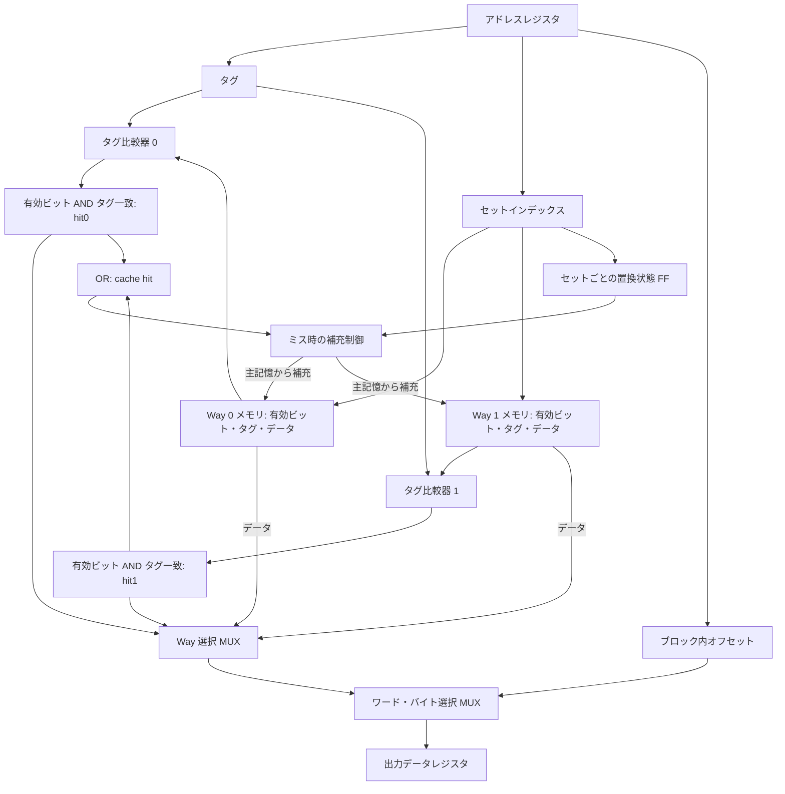

# 東京大学 情報理工学系研究科 創造情報学専攻 2005年8月実施 筆記試験 第2問
## **Author**
[itsuitsuki](https://github.com/itsuitsuki)

## **Description**

出典：[大学公式問題冊子の保存版](https://web.archive.org/web/20151118065613id_/http://i-web.i.u-tokyo.ac.jp/edu/course/ci/pdf/2005_8_ci_istmajor_all.pdf)（日本語版の設問・図を確認）。

### 日本語

プロセッサのキャッシュメモリに関する以下の問いに解答せよ．

(1) キャッシュメモリにより，プログラムの実行が高速化する理由を 5 行以内で述べよ．

(2) プロセッサは，命令キャッシュとデータキャッシュを別個に持ち，おのおののキャッシュのブロックサイズは 32 バイトであると仮定する．十分に大きい整数 $N$ に対して，32 ビットのデータを構成要素とするベクトル $A$ の各要素を定数倍するプログラムを実行するときの，データキャッシュのヒット率を求めよ．

プログラム例 (C 言語で記述する場合)
```c
for(i = 0; i < N; i = i + 1)
    A[i] = k * A[i];
```

(3) メモリ，比較器，マルチプレクサ，レジスタ (flip-flop) などを用いて，2 way set associative のキャッシュメモリのブロック図を示せ．

(4) キャッシュメモリのヒット率を向上させるハードウェア技術およびプログラミング技法を合わせて 5 個示し，おのおのを 2 行以内で記述せよ．

### English
Answer the following questions about a cache memory in a processor.

(1) Describe the reason within five lines why cache memory increases execution speed of programs.

(2) Suppose that the processor has an instruction cache and a data cache, the size of a cache block is 32 bytes. Calculate the cache hit ratio of a program that multiplies each element of a vector $A$ whose size is sufficiently large $N$ and whose elements are 32-bit long.

Example of the program (written in C programming language)
```c
for(i=0; i < N; i = i + 1)
    A[i] = k * A[i];
```

(3) Show a block-diagram of a 2-way set associative cache memory, using memories, comparators, multiplexers, registers (flop-flops) etc.

(4) Describe five methods to increase cache hit ratio both in hardware technology and programming techniques. Each item should be described within two lines.

### 题目描述

回答以下关于处理器高速缓存的问题。

1. 在五行以内说明高速缓存能够加快程序执行的原因。
2. 假设处理器分别设有指令缓存与数据缓存，两者的缓存块大小均为 32 字节。向量 $A$ 的元素是 32 位数据，长度 $N$ 足够大；运行下面的 C 程序，把每个元素乘以常数 $k$。求该程序的数据缓存命中率。

```c
for(i = 0; i < N; i = i + 1)
    A[i] = k * A[i];
```

3. 使用存储器、比较器、多路选择器、寄存器（触发器）等部件，画出二路组相联高速缓存的框图。
4. 合计列出五种提高缓存命中率的硬件技术或编程方法，每种方法用不超过两行说明。

## **Kai**

### (1)

プログラムのメモリアクセスには、最近使った場所を再利用する時間的局所性と、その近隣を使う空間的局所性がある。
小容量で高速なキャッシュに最近使ったブロックを保持すると、多くのアクセスを低速な主記憶へ送らずに処理できる。
その結果、平均アクセス時間とメモリ待ち時間が減る。[局所性とキャッシュの解説（Cornell）](https://www.cs.cornell.edu/courses/cs3410/2026sp/notes/caches.html)

### (2)

32 バイトのブロックには $32/4=8$ 要素が入る。初めは対象データがキャッシュに存在せず、読み出しミスでブロック全体を取り込み、同じブロックへの後続アクセスまで追い出されないとする。

**読み出しだけを数える**と、8 回につき最初の 1 回がミス、残る 7 回がヒットなので、$N$ が十分大きいとき

$$
\boxed{H_{\mathrm{read}}\simeq\frac78=87.5\%}.
$$

一方、このプログラムは読み出した各要素に書き込みも行う。通常のキャッシュに書き込む場合、直前の読み出しでブロックが存在するため、8 回の書き込みはすべてヒットする。**読み出しと書き込みの両方を数える**なら

$$
\boxed{H_{\mathrm{all}}\simeq\frac{7+8}{8+8}=\frac{15}{16}=93.75\%}.
$$

題文はヒット率の分母と書き込み方式を指定していないため、この区別を明示する必要がある。端数ブロックや先頭の位置による誤差は $O(1/N)$ である。

### (3)

以下は読み出し経路を中心としたブロック図である。各 way はタグ、有効ビット、データを保持し、同じ set index で二つの way を同時に参照する。



$hit_i=valid_i\land(tag_i=tag)$、全体のヒット信号は $hit_0\lor hit_1$ である。両方が偽なら空き way、または置換状態で選んだ way に主記憶からブロックを補充する。書き戻し方式なら dirty bit と追い出すデータの書き戻し経路も必要となる。[2-way の並列タグ比較と置換（Cornell）](https://www.cs.cornell.edu/~tomf/notes/cps104/cache.html)

### (4)

1. **容量を増やす**：作業集合を保持できる範囲を広げ、容量ミスを減らす。
2. **連想度を増やす**：同じセットへ写る複数ブロックを同時に保持し、競合ミスを減らす。
3. **適切なブロック長を選ぶ**：連続アクセスでは空間的局所性を利用できる。長すぎるブロックによる容量浪費には注意する。
4. **配列の格納順に走査する**：例えば行優先配列では行内を連続して読み、取り込んだブロックを使い切る。
5. **ループをブロック化する**：行列計算などをキャッシュに収まる小領域に分け、データの再利用までの間隔を短くする。[ブロック化の教材（Cornell）](https://www.cs.cornell.edu/courses/cs3410/2025sp/assignments/cacheblock/instructions.html)
