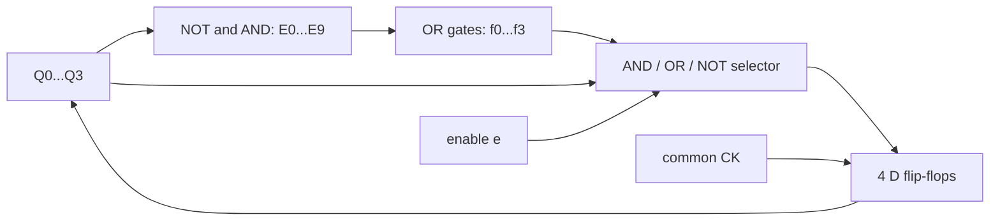

# 東京大学 情報理工学系研究科 創造情報学専攻 2008年8月実施 筆記試験 第2問
## **Author**
[itsuitsuki](https://github.com/itsuitsuki)

## **Description**
Consider an $N$ digit decimal counter specified as follows:

a. A one digit decimal is represented by 4 bits.

b. The counter is synchronous and has a clock CK, $4N$ bit outputs $Z_i$ where $i=0,\dots,4N-1$.

c. The initial value of the counter is 0, namely, $Z_i=0$ where $i=0,\dots,4N-1$.

d. The value of the counter increases by 1 at every input of the clock. When the value of the counter reaches the maximum value, the next clock input sets the output to be 0.

For example, the following figure depicts the input (the clock CK) and the output ($Z_0\sim Z_{15}$) representing a decimal number with $N=4$ digits.

<figure style="text-align:center;">
  
</figure>

(1) Draw a table or a diagram showing the state-transition for the case $N=1$.

(2) Construct the logic circuit of the counter for the case $N=1$ using AND, OR, NOT gates and D flip-flops.

(3) Construct the logic circuit of the counter for the case $N=4$ using 4 counters based on (2) with AND, OR and NOT gates.

(4) For a given $N$, describe a method to construct the logic circuit of the counter whose delay time is $O(\log N)$. Approximate the delay time by the number of AND, OR and NOT gates between the output and the input of D flip-flops.

### 题目描述

设计一个满足下列规格的 $N$ 位十进制计数器。

- 每一位十进制数用 4 位二进制表示。
- 计数器为同步电路，输入为时钟 $CK$，输出为 $4N$ 位 $Z_i$（$i=0,\ldots,4N-1$）。
- 初值为 0，即所有 $Z_i=0$。
- 每输入一个时钟，计数值加 1；达到最大值后，下一个时钟使输出回到 0。

原文图示给出了 $N=4$ 时的时钟输入与 $Z_0\sim Z_{15}$ 输出。

1. 对 $N=1$ 画出状态转移表或状态转移图。
2. 仅用与门、或门、非门和 D 触发器构造 $N=1$ 的计数器逻辑电路。
3. 使用四个由第 2 问得到的计数器模块，再配合与门、或门、非门，构造 $N=4$ 的计数器逻辑电路。
4. 对一般的 $N$，说明如何构造延迟为 $O(\log N)$ 的计数器逻辑电路。延迟以 D 触发器输出到输入之间经过的与、或、非门数量近似衡量。


## **Kai**

各桁は8421 BCDとし、第 $j$ 桁の4ビットを $q_{j,0}=Z_{4j}$（重み1）から $q_{j,3}=Z_{4j+3}$（重み8）までと定める。$j=0$ が十進の最下位桁である。全Dフリップフロップは同じ $CK$ の有効エッジで更新し、初期値0に設定されているものとする。

### (1)

1桁について $q_3q_2q_1q_0$ の順に書く。

| 現在の十進値 | 現状態 | 次状態 |
|---|---|---|
| 0 | 0000 | 0001 |
| 1 | 0001 | 0010 |
| 2 | 0010 | 0011 |
| 3 | 0011 | 0100 |
| 4 | 0100 | 0101 |
| 5 | 0101 | 0110 |
| 6 | 0110 | 0111 |
| 7 | 0111 | 1000 |
| 8 | 1000 | 1001 |
| 9 | 1001 | 0000 |

1010〜1111は初期状態0からは到達しない。以下の回路では、計数を許可した場合にこれらを0000へ戻すよう定義する。

### (2)

$E_d(q)$ を「4ビット $q$ が整数 $d$ のBCDと一致する」信号とする。例えば

$$
E_0=\bar q_3\bar q_2\bar q_1\bar q_0,\quad
E_7=\bar q_3q_2q_1q_0,\quad E_9=q_3\bar q_2\bar q_1q_0.
$$

各 $E_d$ は必要なビットをNOTで反転し、4入力AND（または2入力ANDの木）で構成できる。状態表の次ビットが1になる行をORして、

$$
\begin{aligned}
f_0&=E_0\lor E_2\lor E_4\lor E_6\lor E_8,\\
f_1&=E_1\lor E_2\lor E_5\lor E_6,\\
f_2&=E_3\lor E_4\lor E_5\lor E_6,\\
f_3&=E_7\lor E_8
\end{aligned}
$$

を得る。4個のD入力へ $D_i=f_i(q)$ をつなげばよい。これはAND・OR・NOTだけの組合せ回路である。

多桁への連結用に、計数許可信号 $e$ を備えた一般形を示す。各D入力の前に

$$\boxed{D_i=(e\land f_i(q))\lor(\bar e\land q_i)}$$

というAND/OR/NOTの選択回路を置く。**本問の1桁カウンタでは $e=1$ に固定する**。$e=0$ なら同じ状態を保持する。



### (3)

第 $j$ 桁が9である信号を

$$T_j=q_{j,3}\bar q_{j,2}\bar q_{j,1}q_{j,0}$$

とする。4桁の許可信号を

$$\boxed{e_0=1,\quad e_1=T_0,\quad e_2=T_0T_1,\quad e_3=T_0T_1T_2}$$

とし、(2)の許可付きカウンタ4個へそれぞれ入力する。全16個のDフリップフロップのクロックは同じ $CK$ に接続する。桁上がり信号を次の桁のクロックにしてはならない。

```text
current digit0 -- is9 --> T0 ------------------------> enable digit1
current digit1 -- is9 --> T1 -- AND(T0,T1) ----------> enable digit2
current digit2 -- is9 --> T2 -- AND(T0,T1,T2) --------> enable digit3
constant 1 -----------------------------------------> enable digit0
common CK ------------------------------------------> all four digit counters
```

ある桁を増やすのは、現在値でそれより下位の全桁が9のときだけである。例えば0099では下位2桁が0に戻り、第2桁だけが0から1になって0100となる。9999では全桁が同時に0へ戻る。すべての判定は更新前の状態に基づく。

### (4)

一般には $e_j=\bigwedge_{k=0}^{j-1}T_k$ である。このANDを直列に並べると $O(N)$ 段になるので、2入力ANDの並列接頭辞回路で計算する。まず $P_j^{(0)}=T_j$ とし、$r=0,\ldots,\lceil\log_2N\rceil-1$ で

$$
P_j^{(r+1)}=\begin{cases}
P_j^{(r)}\land P_{j-2^r}^{(r)},&j\ge2^r,\\
P_j^{(r)},&j<2^r
\end{cases}
$$

とする。各段は同時に計算し、段を進むごとに扱う下位桁数が倍になる。最後には $P_j=\bigwedge_{k=0}^{j}T_k$ が得られるので、$e_0=1$, $e_j=P_{j-1}$ と接続する。

9の検出、1桁の次状態関数、許可選択器はいずれも定数段であり、接頭辞回路は $\lceil\log_2N\rceil$ 段である。従ってDFF出力から入力までの遅延は $\boxed{O(1+\log N)}$（$N\ge2$ なら $O(\log N)$）。この構成のゲート数は $O(N\log N)$ である。全桁の許可信号を別々の平衡AND木で作る方法でも、ゲート数は増えるが同じ遅延の条件を満たせる。
