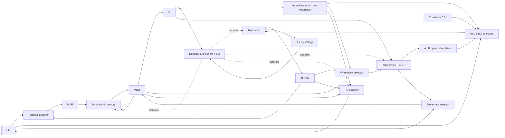

# 東京大学 情報理工学系研究科 創造情報学専攻 2010年8月実施 筆記試験 第2問
## **Author**
[itsuitsuki](https://github.com/itsuitsuki)

## **Description**

出典：[大学公式問題冊子の保存版](https://web.archive.org/web/20151118065628id_/http://i-web.i.u-tokyo.ac.jp/edu/course/ci/pdf/2010_8_ci_istmajor_ja.pdf)。
(1) Selection of the number of operands in a $2$-input arithmetic instruction and selection of the method to access memory are important in designing the format of instructions of a processor. Answer the following questions on the instruction format.

1) Describe the pros and cons of $2$-operand instruction format and $3$-operand instruction format for a $2$-input arithmetic instruction.

| | |
| :--- | :--- |
| Example of $2$-operand instruction format | ADD _operand $1$_, _operand $2$_ |
| Example of $3$-operand instruction format | ADD _operand $1$_, _operand $2$_, _operand $3$_ |

2) Describe the pros and cons of an instruction format where an arithmetic instruction has a memory operand and an instruction format where an arithmetic instruction does not have a memory operand, and instead LOAD and STORE instructions are used to access memory. Note that $r$ denotes a register operand.

| | |
| :--- | :--- |
| Example of an instruction format where an arithmetic instruction has a memory operand | ADD $r$, _operand to specify memory address_ |
| Example of an instruction format where an arithmetic instruction does not have a memory operand and instead LOAD and STORE instructions are used to access memory | LOAD $r$, _operand to specify memory address_<br>STORE $r$, _operand to specify memory address_<br>ADD _two or three register operands_ |

(2) Consider a program that calculates the maximum value and the minimum value of $100$ $16$-bit integers. The instruction set must have sufficient kinds of instructions to write this program. Design an instruction format (bit division of an instruction) and instruction set for a processor whose instruction-width is $16$-bit and the data-width is $16$-bit. Provide a short description of each instruction. The description of an instruction should be a line or two. Note that the instruction set must have subroutine call and return operations.

(3) Using the instruction set designed in (2), write a program that calculates the maximum value and the minimum value of $100$ $16$-bit integers.

(4) Draw a block-diagram of a processor that has the instruction set designed in (2). Then explain the operation of the arithmetic instruction on the processor from the beginning of the instruction execution (just before the instruction fetch from the memory) to the end of execution. Functional blocks such as ALU (Arithmetic Logic Unit) and registers should be used to draw the block-diagram.

### 题目描述

1. 处理器指令格式设计需要决定双输入算术运算的操作数个数以及访存方式。
   1. 比较双操作数格式 `ADD operand1, operand2` 与三操作数格式 `ADD operand1, operand2, operand3` 的优缺点。
   2. 比较两种体系：一种允许算术指令直接带内存操作数，如 `ADD r, 内存地址操作数`；另一种算术指令只操作寄存器，必须用 `LOAD r, 内存地址操作数` 和 `STORE r, 内存地址操作数` 访问内存，再用含两个或三个寄存器操作数的 `ADD` 运算。说明二者的优缺点，其中 $r$ 表示寄存器操作数。
2. 考虑一个计算 100 个 16 位整数中最大值与最小值的程序。为指令宽度和数据宽度均为 16 位的处理器设计足以编写该程序的指令格式（即一条指令各位如何划分）与指令集；每条指令用一至两行简述。指令集必须支持子程序调用和返回。
3. 使用第 2 问设计的指令集，编写求这 100 个 16 位整数最大、最小值的程序。
4. 画出实现该指令集的处理器框图，图中应包含 ALU、寄存器等功能模块；再从取指前开始，说明一条算术指令经过取指、译码、取操作数、运算直至执行结束的全过程。


## **Kai**

以下に条件を満たす設計の一例を示す。命令セットは一意に決まるものではない。

### (1)

**1)** 2オペランド形式を `ADD d,s: R[d] <- R[d]+R[s]` とすれば、指定するレジスタが少なく短い形式にしやすいが、一方の入力を上書きする。元の値を残すにはコピー命令が必要になることがある。3オペランド形式 `ADD d,s,t: R[d] <- R[s]+R[t]` は出力先を独立に選べるので入力を保存しやすく、不要なコピーを減らせるが、レジスタ番号を指定するビット数が増える。固定長の命令なら、即値・アドレスのビット数などとの配分を考える必要がある。

**2)** 算術命令にメモリオペランドを含めると、明示的なロード命令を減らしてコードを短くできる一方、アドレス計算・可変なメモリ遅延・演算を一つの命令で扱う必要がある。ロード／ストア方式ではレジスタ演算の動作が均一でパイプラインや命令のスケジューリングを設計しやすく、読み込んだ値をレジスタ内で再利用できる。ただし明示的なロード・ストアが増え、レジスタが足りなければ退避も必要となる。どちらが常に速いというものではない。

### (2)

8本の16ビット汎用レジスタ $R0,\ldots,R7$、16ビットのPCとメモリ語を持つ。アドレスは**16ビット語単位**であり、通常PCは1ずつ増える。$R7$ は下向きに伸びるスタックのSPとして使用する。整数の比較は16ビット2の補数の符号付き比較とし、算術の結果は $2^{16}$ を法とする。どのレジスタも定数0専用ではない。

`op` は上位4ビット、`d,s,t` は3ビットのレジスタ番号である。符号付き即値・変位は16ビットへ符号拡張し、下表の未使用ビットは0とする。`PC_next` は現在命令の次の語アドレスである。

| op（16進） | ビット配分（上位から、計16ビット） | 命令と動作 |
|---|---|---|
| 0 | `op:4 d:3 s:3 t:3 000:3` | `ADD Rd,Rs,Rt`：`Rd <- Rs+Rt` |
| 1 | `op:4 d:3 s:3 000000:6` | `MOV Rd,Rs`：レジスタをコピー |
| 2 | `op:4 d:3 imm:9` | `LDI Rd,imm`：9ビット符号付き即値を設定 |
| 3 | `op:4 d:3 imm:9` | `ADDI Rd,imm`：`Rd <- Rd+imm` |
| 4 | `op:4 d:3 s:3 off:6` | `LD Rd,[Rs+off]`：メモリを読む |
| 5 | `op:4 d:3 s:3 off:6` | `ST Rd,[Rs+off]`：`Rd` をメモリへ書く |
| 6 | `op:4 s:3 t:3 000000:6` | `CMP Rs,Rt`：`Rs-Rt` によって下記フラグだけを更新 |
| 7 | `op:4 disp:12` | `BGE label`：直前の比較が以上なら `PC <- PC_next+disp` |
| 8 | `op:4 disp:12` | `BLE label`：直前の比較が以下なら同様に分岐 |
| 9 | `op:4 disp:12` | `BNE label`：直前の比較が不等なら同様に分岐 |
| A | `op:4 disp:12` | `BRA label`：無条件の相対分岐 |
| B | `op:4 addr:12` | `CALL addr`：`SP <- SP-1; M[SP] <- PC_next; PC <- zero_extend(addr)` |
| C | `op:4 000000000000:12` | `RET`：`PC <- M[SP]; SP <- SP+1` |
| F | `op:4 000000000000:12` | `HALT`：停止 |

比較フラグはゼロ $Z$、差の符号 $N$、符号付きオーバーフロー $V$ とする。$L=N\oplus V$ が「小さい」を表すので、BGEは $\neg L$、BLEは $Z\lor L$、BNEは $\neg Z$ で判定する。符号付き比較を $N$ だけで判定すると、$-32768$ と $32767$ のような組で誤る。ここではCMP以外の命令は比較フラグを変更しないと定義する。CALLは12ビットで指定できる先頭4096語へ呼び出せ、スタックに戻り先を積むので入れ子の呼出しも可能である。

### (3)

入力はメモリ128〜227番地の100語、出力は232番地に最小値、233番地に最大値とする。コードは0番地から順に配置され、1命令1語である。初期SPを127に置くので、最初の戻り先は126番地に保存され、入力配列と重ならない。

```asm
main:
    LDI  R7, 127
    LDI  R0, 128
    CALL find_minmax
    ST   R1, [R0+4]
    ST   R2, [R0+5]
    HALT

find_minmax:
    LD   R1, [R0+0]
    MOV  R2, R1
    ADDI R0, 1
    LDI  R4, 99
    LDI  R5, 0
loop:
    LD   R3, [R0+0]
    CMP  R3, R1
    BGE  skip_min
    MOV  R1, R3
skip_min:
    CMP  R3, R2
    BLE  skip_max
    MOV  R2, R3
skip_max:
    ADDI R0, 1
    ADDI R4, -1
    CMP  R4, R5
    BNE  loop
    RET
```

最初の要素で最小・最大の両方を初期化し、残る99要素を1回ずつ処理する。各反復の終了時に、$R1,R2$ は読み終わった範囲の最小・最大という不変条件を満たす。終了時の $R0=228$ なので、`[R0+4]` と `[R0+5]` はそれぞれ232、233である。ラベルは `find_minmax=6`, `loop=11`, `skip_min=15`, `skip_max=18` となり、条件分岐の12ビット変位は順に $1,1,-11$ で全て符号付き範囲に収まる。

### (4)

多サイクル実行の一例を示す。MARはメモリアドレス、MDRはメモリとのデータ、IRは現在命令、A/Bは演算入力、ALUoutは演算結果のレジスタである。図の選択器は制御器が選択する。



制御器は図中のレジスタ書込み許可・選択器・メモリ読書きも制御する。PCの加算、分岐先、スタックアドレスの計算はALUを異なるサイクルで共有する。

`ADD Rd,Rs,Rt` の動作は次の順序になる。

1. `MAR <- PC` として命令を読み、`MDR <- M[MAR]`、`IR <- MDR` と取り込む。同時または別サイクルでALUを使い、`PC <- PC+1` とする。
2. IRをデコードし、指定された $R_s,R_t$ をA、Bへ読み出す。
3. ALUで `ALUout <- (A+B) mod 65536` を計算する。
4. 書戻し選択器からALUoutを $R_d$ へ書き、次の命令の取出し状態へ戻る。この命令では比較フラグとデータメモリは変更しない。

LOAD/STOREではALUのアドレス計算結果をMARへ送り、MDRとレジスタファイルの間でデータを移す。CALLでは更新済みPCを戻り先としてスタックへ保存し、RETではMDRからPCへ戻す経路を使うため、表で定義した呼出し・復帰も同じデータパスで実現できる。
