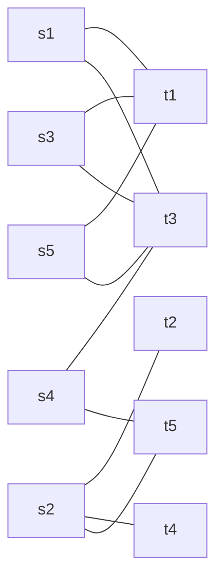

# 東京大学 情報理工学系研究科 創造情報学専攻 2012年8月実施 筆記試験 第1問
## **Author**
[itsuitsuki](https://github.com/itsuitsuki)

## **Description**

[Official examination, archived Japanese PDF](https://web.archive.org/web/20151118065535id_/http://i-web.i.u-tokyo.ac.jp/edu/course/ci/pdf/2012-8-exam.pdf).
An English conversation school plans to make pairs of students and teachers for private lessons. Given a set $S = \{s_1, s_2, \dots, s_n\}$ of students and a set $T = \{t_1, t_2, \dots, t_n\}$ of teachers, we make disjoint $n$ pairs of a student and a teacher, which we call a $p$-match. Answer the following questions:

(1) How many $p$-matches exist?

(2) For $n = 5$, given a list of preferable teachers by students (Table 1)
$$V = S \cup T$$
$$E = \{xy \mid x \in S, y \in T, x \text{ prefers } y.\}$$
draw a graph $G = (V, E)$, and show a $p$-match which maximizes the number of students who are fulfilled.

| Student | Teachers |
| :--- | :--- |
| $s_1$ | $t_1, t_3$ |
| $s_2$ | $t_2, t_4, t_5$ |
| $s_3$ | $t_1, t_3$ |
| $s_4$ | $t_3, t_5$ |
| $s_5$ | $t_1, t_3$ |

Table 1: List of Preferences

(3) Let the size of a set $|E| = m$. Show an algorithm to get a $p$-match which maximizes the number of students who are fulfilled and its complexity.

(4) For $n = 7$, given a ranked list of teachers by students (Table 2), show a $p$-match which minimizes the total sum of ranks.

(5) In addition to the ranked list of teachers by students, consider a ranked list of students by teachers. Given a $p$-match, if there exists no pair of student and teacher who would both get the higher rank than that of the current partner of the given $p$-match, then, this $p$-match is called an $s$-match. For $n = 7$, given a ranked list of students by teachers (Table 3) in addition to the Table 2, show an $s$-match.

| Ranking | 1 | 2 | 3 | 4 | 5 | 6 | 7 |
| :--- | :--- | :--- | :--- | :--- | :--- | :--- | :--- |
| $s_1$ | $t_7$ | $t_1$ | $t_2$ | $t_6$ | $t_5$ | $t_4$ | $t_3$ |
| $s_2$ | $t_7$ | $t_1$ | $t_2$ | $t_3$ | $t_4$ | $t_5$ | $t_6$ |
| $s_3$ | $t_7$ | $t_5$ | $t_2$ | $t_6$ | $t_1$ | $t_4$ | $t_3$ |
| $s_4$ | $t_1$ | $t_4$ | $t_3$ | $t_6$ | $t_2$ | $t_5$ | $t_7$ |
| $s_5$ | $t_7$ | $t_3$ | $t_1$ | $t_2$ | $t_4$ | $t_5$ | $t_6$ |
| $s_6$ | $t_3$ | $t_7$ | $t_2$ | $t_1$ | $t_5$ | $t_4$ | $t_6$ |
| $s_7$ | $t_7$ | $t_3$ | $t_2$ | $t_6$ | $t_5$ | $t_4$ | $t_1$ |

Table 2: Rank of teachers by students

| Ranking | 1 | 2 | 3 | 4 | 5 | 6 | 7 |
| :--- | :--- | :--- | :--- | :--- | :--- | :--- | :--- |
| $t_1$ | $s_1$ | $s_2$ | $s_3$ | $s_4$ | $s_5$ | $s_6$ | $s_7$ |
| $t_2$ | $s_1$ | $s_2$ | $s_4$ | $s_3$ | $s_7$ | $s_6$ | $s_5$ |
| $t_3$ | $s_3$ | $s_2$ | $s_1$ | $s_5$ | $s_6$ | $s_4$ | $s_7$ |
| $t_4$ | $s_2$ | $s_3$ | $s_1$ | $s_7$ | $s_4$ | $s_6$ | $s_5$ |
| $t_5$ | $s_1$ | $s_3$ | $s_4$ | $s_2$ | $s_5$ | $s_6$ | $s_7$ |
| $t_6$ | $s_1$ | $s_5$ | $s_3$ | $s_4$ | $s_2$ | $s_6$ | $s_7$ |
| $t_7$ | $s_3$ | $s_5$ | $s_1$ | $s_4$ | $s_2$ | $s_7$ | $s_6$ |

Table 3: Rank of students by teachers

(6) For $n$, show an algorithm to get an $s$-match and its complexity.

(7) We will develop a real software system for private lessons for an English conversation school. List possible study items (example: web reservation), and describe each item in two lines.

### 题目描述

某英语会话学校要为一对一课程把学生和教师配对。给定学生集合 $S=\{s_1,\ldots,s_n\}$ 与教师集合 $T=\{t_1,\ldots,t_n\}$，把每名学生与每名教师各使用一次，组成 $n$ 个互不相交的学生—教师对；称这样的完整配对为 $p$-匹配。

1. 一共有多少种 $p$-匹配？
2. 当 $n=5$ 时，学生可接受的教师如下。令

   $$
   V=S\cup T,\qquad
   E=\{xy\mid x\in S,\ y\in T,\ x\text{ 喜欢 }y\}.
   $$

   画出图 $G=(V,E)$，并给出一个让“分配到可接受教师”的学生人数最多的 $p$-匹配。

   | 学生 | 可接受教师 |
   | :--- | :--- |
   | $s_1$ | $t_1,t_3$ |
   | $s_2$ | $t_2,t_4,t_5$ |
   | $s_3$ | $t_1,t_3$ |
   | $s_4$ | $t_3,t_5$ |
   | $s_5$ | $t_1,t_3$ |

3. 设 $|E|=m$。给出求上述满意学生数最大的 $p$-匹配的算法，并分析复杂度。
4. 当 $n=7$ 时，学生对教师的完整名次如下。给出一个使所有学生所得教师名次之和最小的 $p$-匹配。

   | 学生 \ 名次 | 1 | 2 | 3 | 4 | 5 | 6 | 7 |
   | :--- | :--- | :--- | :--- | :--- | :--- | :--- | :--- |
   | $s_1$ | $t_7$ | $t_1$ | $t_2$ | $t_6$ | $t_5$ | $t_4$ | $t_3$ |
   | $s_2$ | $t_7$ | $t_1$ | $t_2$ | $t_3$ | $t_4$ | $t_5$ | $t_6$ |
   | $s_3$ | $t_7$ | $t_5$ | $t_2$ | $t_6$ | $t_1$ | $t_4$ | $t_3$ |
   | $s_4$ | $t_1$ | $t_4$ | $t_3$ | $t_6$ | $t_2$ | $t_5$ | $t_7$ |
   | $s_5$ | $t_7$ | $t_3$ | $t_1$ | $t_2$ | $t_4$ | $t_5$ | $t_6$ |
   | $s_6$ | $t_3$ | $t_7$ | $t_2$ | $t_1$ | $t_5$ | $t_4$ | $t_6$ |
   | $s_7$ | $t_7$ | $t_3$ | $t_2$ | $t_6$ | $t_5$ | $t_4$ | $t_1$ |

5. 再给出教师对学生的名次表。若某个 $p$-匹配中不存在这样一对尚未配在一起的学生与教师：二者都比起当前搭档更偏好对方，则称该匹配为 $s$-匹配。结合上表和下表，为 $n=7$ 给出一个 $s$-匹配。

   | 教师 \ 名次 | 1 | 2 | 3 | 4 | 5 | 6 | 7 |
   | :--- | :--- | :--- | :--- | :--- | :--- | :--- | :--- |
   | $t_1$ | $s_1$ | $s_2$ | $s_3$ | $s_4$ | $s_5$ | $s_6$ | $s_7$ |
   | $t_2$ | $s_1$ | $s_2$ | $s_4$ | $s_3$ | $s_7$ | $s_6$ | $s_5$ |
   | $t_3$ | $s_3$ | $s_2$ | $s_1$ | $s_5$ | $s_6$ | $s_4$ | $s_7$ |
   | $t_4$ | $s_2$ | $s_3$ | $s_1$ | $s_7$ | $s_4$ | $s_6$ | $s_5$ |
   | $t_5$ | $s_1$ | $s_3$ | $s_4$ | $s_2$ | $s_5$ | $s_6$ | $s_7$ |
   | $t_6$ | $s_1$ | $s_5$ | $s_3$ | $s_4$ | $s_2$ | $s_6$ | $s_7$ |
   | $t_7$ | $s_3$ | $s_5$ | $s_1$ | $s_4$ | $s_2$ | $s_7$ | $s_6$ |

6. 对一般 $n$，给出求 $s$-匹配的算法及其复杂度。
7. 若要真正开发英语会话学校的一对一课程软件系统，列出可能需要研究或实现的项目（例如 Web 预约），每项用两行说明。

## **Kai**

### (1) Number of complete pairings

Choose a distinct teacher for each student in order: there are $n(n-1)\cdots1=\boxed{n!}$ possible $p$-matches. The empty instance has $0!=1$ pairing.

### (2) Maximum number of fulfilled students

The following bipartite graph contains exactly the preferred pairs in Table 1; its edges do not include the nonpreferred pairs that can still be used to complete a $p$-match.

The three students $s_1,s_3,s_5$ collectively prefer only $t_1,t_3$. At least one of these students must therefore receive a nonpreferred teacher, so at most four students can be fulfilled. The complete pairing

$$
\boxed{\{(s_1,t_1),(s_2,t_2),(s_3,t_3),(s_4,t_5),(s_5,t_4)\}}
$$

fulfills the first four students and attains that upper bound.

### (3) Algorithm and complexity

Find a maximum-cardinality matching $M$ in the bipartite preference graph. Start with no matched edges; repeatedly search for a path that alternates unmatched and matched edges, beginning at an unmatched student and ending at an unmatched teacher. Reverse the membership of every edge on that augmenting path, increasing $|M|$ by one. When no augmenting path exists, the matching is maximum: otherwise the symmetric difference with a larger matching would contain an augmenting path.

There are at most $n$ augmentations. A straightforward search scans $O(n+m)$ vertices and edges each time, giving $O(n(n+m))$ time and $O(n+m)$ space; with isolated vertices handled separately, the common edge-based implementation takes $O(nm+n)$ time. Hopcroft–Karp improves this to $O((n+m)\sqrt n)$.

Finally pair the remaining unmatched students and teachers arbitrarily to obtain a complete $p$-match. This preserves all $|M|$ preferred pairs. A preferred edge between any two unmatched vertices would augment $M$, so no extra fulfilled pair has been missed. Conversely, the fulfilled pairs of any complete pairing form a matching in the preference graph and cannot exceed $|M|$.

### (4) Minimum total rank

One optimal complete pairing, listed in student order, is

$$
\boxed{(t_1,t_2,t_5,t_4,t_7,t_3,t_6)}.
$$

Its ranks are $(2,3,2,2,1,1,4)$, with sum $\boxed{15}$.

To prove optimality, minimize each teacher's assigned rank independently. For teachers $t_1,\ldots,t_7$, these column minima are $(1,3,1,2,2,4,1)$, summing to 14. However, the minimum for both $t_1$ and $t_4$ is attained only by $s_4$. A complete pairing cannot use $s_4$ twice, so at least one of these ranks must exceed its column minimum by at least one. Thus every $p$-match has total rank at least 15, attained above. A Hungarian or min-cost-flow algorithm can solve the general minimum-rank assignment problem.

### (5) A stable matching

Student-proposing deferred acceptance gives

$$
\boxed{\{(s_1,t_1),(s_2,t_2),(s_3,t_7),(s_4,t_4),
(s_5,t_3),(s_6,t_5),(s_7,t_6)\}}.
$$

For example, choosing free students in queue order, the proposals made by each student are:

| Student | Teachers proposed to, in order | Final teacher |
| --- | --- | --- |
| $s_1$ | $t_7,t_1$ | $t_1$ |
| $s_2$ | $t_7,t_1,t_2$ | $t_2$ |
| $s_3$ | $t_7$ | $t_7$ |
| $s_4$ | $t_1,t_4$ | $t_4$ |
| $s_5$ | $t_7,t_3$ | $t_3$ |
| $s_6$ | $t_3,t_7,t_2,t_1,t_5$ | $t_5$ |
| $s_7$ | $t_7,t_3,t_2,t_6$ | $t_6$ |

Every teacher to whom a student would prefer to move has already rejected that student or subsequently replaced them with a preferred student. Teachers only improve their held partner. Therefore no student-teacher pair blocks this matching. For instance $s_6$ prefers $t_3,t_7,t_2,t_1$ to $t_5$, but these teachers prefer their current partners $s_5,s_3,s_2,s_1$, respectively, to $s_6$. Stability is a different objective from the total-rank minimum in (4).

### (6) Deferred acceptance

Initially everyone is free. While a student is free, they propose to their most preferred teacher not yet proposed to. A free teacher holds the proposal; an already engaged teacher keeps the more preferred of the current and new students and rejects the other. Engagements are provisional until no student remains free.

There are at most $n^2$ distinct proposals. Precompute each teacher's inverse ranking table for constant-time comparisons; total time and input/ranking storage are $O(n^2)$. The working queue, next-proposal indices and partners use $O(n)$ additional space. Because the preference lists are complete and both sides have size $n$, the algorithm ends with all students paired. If a student preferred some teacher to their final partner, that teacher rejected them and ends with a partner preferred to that student, proving stability.

### (7) Software design items

| Item | Main consideration |
| --- | --- |
| Web reservation | Show available time slots and allow booking, cancellation and rescheduling; commit a booking atomically to prevent double booking. |
| Scheduling constraints | Match teacher availability, student availability, classroom capacity and lesson duration before optimizing preferences. |
| Preference management | Collect ranked choices and distinguish mandatory constraints from preferences; explain whether the chosen objective is satisfaction, total rank or stability. |
| Accounts and permissions | Authenticate students, teachers and administrators and restrict which schedules and personal records each role can access. |
| Payments and cancellation rules | Record fees, refunds and deadlines consistently with booking changes; make retries idempotent so payments are not duplicated. |
| Notifications | Send confirmations and reminders with the correct time zone, and track failed delivery without treating it as a cancelled reservation. |
| Operations and recovery | Keep audit records and backups, monitor service failures, and support recovery of bookings without losing their transaction history. |
