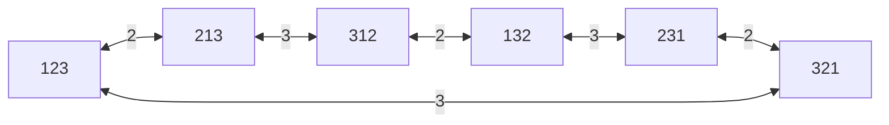

# 東京大学 情報理工学系研究科 創造情報学専攻 2014年8月実施 筆記試験 第1問
## **Author**
[itsuitsuki](https://github.com/itsuitsuki)

## **Description**


[Official examination, archived Japanese PDF](https://web.archive.org/web/20151118065621id_/http://i-web.i.u-tokyo.ac.jp/edu/course/ci/pdf/2014-8-exam.pdf).
Let a stack of $n$ pancakes with different sizes be given. A spatula is a tool to flip over pancakes. If you put the spatula under the $k$-th pancake from the top, all top to the $k$-th pancakes are flipped over and placed in the reverse order (Fig.1). Let us rearrange the stack using a spatula so that the smallest pancake appears on the top of the stack, monotonically increasing the size, and the largest at the bottom, which we call "ordered-state". We assume that both sides of each pancake are identical and we know which pancake is the $k$-th smallest in advance. From now, we use this pancake-number $k$ to identify the pancake. A "stack-state" is denoted by the sequence of pancake-numbers from the top to the bottom. For example, using our notation, state transitions in Fig. 1 are described as in Fig. 2. Answer the following questions.

<figure style="text-align:center;">
  
  
  
</figure>

(1) For $n=3$, draw a state transition graph, whose vertices are "stack-states" and arcs are transitions by a spatula. Fig. 3 shows one example of the state transition graph for $n=2$.

(2) For $n=3$, give an example of "stack-state" which requires the maximum number of flips to reach "ordered-state", and the corresponding number of flips.

(3) For $n=4$, give an example of "stack-state" which requires the maximum number of flips to reach "ordered-state", and the corresponding number of flips.

(4) For general $n$, describe an algorithm for rearrangement to reach "ordered-state" and give its time complexity.

### 题目描述

给定 $n$ 张大小互异的煎饼叠成的一摞。把锅铲插到从顶端数第 $k$ 张下方，可把最上面的 $k$ 张整体翻转并逆序放回。目标是使最小煎饼在最上方、大小向下单调增加、最大煎饼在最下方，称为“有序状态”。假设煎饼两面相同，且预先知道每张煎饼是第 $k$ 小，直接以该编号标识；“堆叠状态”用从上到下的编号序列表示。翻转示例见原文图 1、2。

1. 对 $n=3$，画状态转移图：顶点为所有堆叠状态，弧表示一次锅铲翻转。图 3 给出 $n=2$ 的示例。
2. 对 $n=3$，给出一个到有序状态所需最少翻转次数达到最大值的初始状态，并给出该次数。
3. 对 $n=4$ 完成同样任务。
4. 对一般 $n$，说明一种把任意状态变为有序状态的算法，并给出其时间复杂度。


## **Kai**

Let $F_k$ reverse the first $k$ entries. Each flip is its own inverse. The ordered state is $12\cdots n$, because the numbering increases with size. As in the original $n=2$ graph, omit the unhelpful $k=1$ self-loops.

### (1) State graph for $n=3$

There are $3!=6$ states. The graph is a six-cycle; each displayed bidirectional edge represents both directed transitions and is labelled by the flip length:



### (2) Maximum distance for $n=3$

The opposite vertex $132$ is three edges from $123$:

$$
\boxed{132\xrightarrow{F_2}312\xrightarrow{F_3}213\xrightarrow{F_2}123.}
$$

No vertex on the six-cycle is farther away, and no path from $132$ to $123$ uses fewer than three edges. The maximum required minimum number of flips is therefore $\boxed{3}$.

### (3) Maximum distance for $n=4$

The maximum minimum number is $\boxed{4}$, attained by $4231$, $2413$ and $3142$. For example,

$$
\boxed{4231\xrightarrow{F_4}1324\xrightarrow{F_2}3124
\xrightarrow{F_3}2134\xrightarrow{F_2}1234.}
$$

To verify minimality and the global maximum, breadth-first search from $1234$ gives the following complete partition of all 24 states. Every new state is reached by one flip from the preceding level, and no earlier level contains it.

| Minimum flips | States |
| --- | --- |
| 0 | 1234 |
| 1 | 2134, 3214, 4321 |
| 2 | 3124, 4312, 2314, 4123, 3421, 2341 |
| 3 | 1324, 4213, 3412, 1342, 4132, 1423, 2143, 2431, 1243, 3241, 1432 |
| 4 | 4231, 2413, 3142 |

### (4) General sorting algorithm

For $m=n,n-1,\ldots,2$, locate pancake $m$ in the first $m$ positions. If it is already at position $m$, do nothing. Otherwise, if it is not at the top, flip the prefix ending at its position to bring it to the top; then flip the first $m$ pancakes to put it at position $m$. Later flips use only smaller prefixes, so this correct suffix is preserved. Induction on decreasing $m$ proves that the final state is ordered.

```python
def pancake_sort(values):
    a = list(values)
    flips = []
    for m in range(len(a), 1, -1):
        k = a.index(m, 0, m) + 1
        if k == m:
            continue
        if k > 1:
            a[:k] = a[:k][::-1]
            flips.append(k)
        a[:m] = a[:m][::-1]
        flips.append(m)
    return a, flips
```

The input is a permutation of $1,\ldots,n$. Locating and reversing prefixes of length at most $m$ costs $O(m)$ in an array, so total computational time is $\boxed{O(n^2)}$. The number of spatula operations is at most $2n-3$ for $n\ge2$ (at most two for each $m\ge3$ and one for $m=2$). Thus the number of physical flips is linear even though this straightforward array implementation takes quadratic time. It is a sorting algorithm, not a claim to find a shortest flip sequence for every input.
