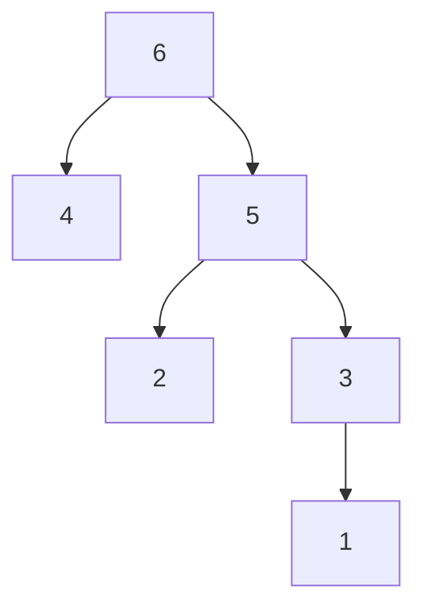

# 東京大学 情報理工学系研究科 創造情報学専攻 2015年8月実施 筆記試験 第2問

## **Author**
[itsuitsuki](https://github.com/itsuitsuki)

## **Description**

[Official examination, archived Japanese PDF](https://web.archive.org/web/20170611141448id_/http://www.i.u-tokyo.ac.jp/edu/course/ci/pdf/2015-8-exam.pdf).

### 日本語

点(ノード)と線(エッジ)から構成される小包の配送ネットワークにおける小包の配送経路を、以下のアルゴリズムに従って計算するシステムを考える。

経路計算アルゴリズムP：
各ノードは、各ノードがエッジで接続されているすべての隣接ノードに、\{宛先ノード, 宛先ノードに到達するまでのホップ数, 次に転送されるべき隣接ノード\}を行ベクトルとする経路表を1分ごとに通知する。通知されたノードは、隣接ノードから通知された経路表を使って自身の経路表を再計算する。図1に、ある時点でのノード1の経路表の例を示す。なお、ホップ数$h(i,j)$は、次の計算式にしたがって計算され、自ノード$i$から宛先ノード$j$に到達するために必要な最小ホップ数を示している。

$h(i,j) = \min\{h(i,k) + h(k,j)\}, \quad h(i,i)=0, \quad h(i,k)=1, \quad k$ はノード$i$のすべての隣接ノード

なお、同じコストの経路が存在する時には、ノードの番号がより大きい値を持つ隣接ノードを経由する経路が選択されるものとする。また、各ノードの経路表の初期状態は、自ノード宛の行だけがある表である。

| 宛先ノード | 宛先ノードに到達 するまでのホップ数 | 次に転送される べき隣接ノード |
| :---: | :---: | :---: |
| 1 | $h(1,1)=0$ | - |
| 2 | $h(1,2)=3$ | 3 |
| 3 | $h(1,3)=1$ | 3 |
| $\mid$ | $\mid$ | $\mid$ |
| $\mid$ | $\mid$ | $\mid$ |
| 9 | $h(1,9)=6$ | 2 |

図1

(1) 図2の配送ネットワークにおいて、経路表が収束するまでに必要な時間と、収束するまでのノード6の経路表を、1分ごとに示しなさい。なお、図中の○(丸)がノードを表しその中の数字がノード番号を示しているものとする。ノードを接続するエッジは線で示されており、Li ($i$は整数)でエッジを表現している。

(2) 各ノードの経路表の情報から、ノード6を根とする残りのすべてのノード(1,2,3,4,5)への転送経路を示す木(tree)が作成される。この木を図示しなさい。

<figure style="text-align:center;">
  
  <figcaption>図2
</figure>

次に、図2の配送ネットワークにおいて、任意の大きさのデジタルビットの小包(以下、パケット)が配送されるデジタル通信ネットワークを考える。なお、ノード6からノード2へのパケット配送のみが行われる場合を考える。また、L5とL6の2つのエッジが衛星回線(遅延 500[ms]、帯域幅 1[Mbps])、L4とL7が広域地上線(遅延 50[ms]、帯域幅 100[Mbps])、その他のエッジがローカル網線(遅延 1[ms]、帯域幅 1[Gbps])とする。

(3) 8メガビットの大きさのファイルを、ノード6からノード2へ、8キロビットの同じ大きさのパケット1,000個に分割して転送する場合を考える。この際、ノード6は、$i$番目$(1 \leqq i \leqq 1,000)$に転送されるべきパケット$(S_i)$を送出したあと、ノード2がパケット$(S_i)$を受信し、その受信を知らせるパケット$(R_i)$をノード2がノード6に送信し、そのパケット$(R_i)$をノード6が受け取ったら、次のパケット$(S_{i+1})$を送信するものとする。ノード6がファイルの送信を開始して、ノード2が受信を終了するまでのファイルの転送時間$T$を示しなさい。なお、各ノードでのパケットの受信終了から送信開始までの遅延時間、および、各パケットに付加される宛先ノードを示すラベルなど送信されるファイル以外に転送されなければならないデータの転送に必要な時間は、無視可能であり、さらに、パケットは、転送中に紛失・廃棄されることはないものとする。

(4) 設問(3)で示したパケットの転送方法を修正することでノード6からノード2へのファイルの転送時間$T$を小さくすることができる。その具体的な方法を示しなさい。

(5) ノード間で交換される行ベクトルの構成の変更や経路の計算アルゴリズムの変更など、経路計算アルゴリズムPに修正を加えることでノード6からノード2へのファイルの転送時間$T$を小さくすることも可能である。その具体的な方法を、パケットの転送経路がどのように変化するかも示しながら、2つ提案しなさい。

### English (AI translated)

Consider a system that calculates the delivery route of a parcel in a parcel delivery network composed of points (nodes) and lines (edges) according to the following algorithm.

Route Calculation Algorithm P:
Every minute, each node notifies all adjacent nodes connected by edges of a routing table containing \{Destination Node, Number of hops to reach the destination node, Next neighbor node to forward to\} as a row vector. The notified node recalculates its own routing table using the routing tables notified by its adjacent nodes. Figure 1 shows an example of Node 1's routing table at a certain point in time. Note that the number of hops $h(i,j)$ is calculated according to the following formula and indicates the minimum number of hops required to reach the destination node $j$ from its own node $i$.

$h(i,j) = \min\{h(i,k) + h(k,j)\}, \quad h(i,i)=0, \quad h(i,k)=1, \quad k$ is all adjacent nodes of node $i$.

When paths with the same cost exist, the path via the adjacent node with the larger node number is selected. Also, the initial state of the routing table for each node is a table containing only the row for the node itself.

| Destination Node | Hops to reach destination node | Next neighbor node to be forwarded to |
| :---: | :---: | :---: |
| 1 | $h(1,1)=0$ | - |
| 2 | $h(1,2)=3$ | 3 |
| 3 | $h(1,3)=1$ | 3 |
| $\mid$ | $\mid$ | $\mid$ |
| $\mid$ | $\mid$ | $\mid$ |
| 9 | $h(1,9)=6$ | 2 |

Figure 1

(1) In the delivery network of Figure 2, show the time required for the routing tables to converge and the routing table of Node 6 every minute until convergence. Note that the circles in the figure represent nodes, and the numbers inside them indicate the node numbers. Edges connecting nodes are shown as lines, and edges are represented by Li ($i$ is an integer).

(2) Based on the information in the routing table of each node, a tree indicating the forwarding routes to all remaining nodes (1, 2, 3, 4, 5) rooted at Node 6 is created. Illustrate this tree.

Next, consider a digital communication network in the delivery network of Figure 2 where parcels of digital bits of arbitrary size (hereinafter referred to as packets) are delivered. Consider the case where only packet delivery from Node 6 to Node 2 takes place. Also, assume that the two edges L5 and L6 are satellite links (Delay 500 [ms], Bandwidth 1 [Mbps]), L4 and L7 are wide-area terrestrial lines (Delay 50 [ms], Bandwidth 100 [Mbps]), and other edges are local network lines (Delay 1 [ms], Bandwidth 1 [Gbps]).

<figure style="text-align:center;">
  
  <figcaption>Figure 2
</figure>

(3) Consider a case where a file of 8 Megabits is transferred from Node 6 to Node 2 by dividing it into 1,000 packets of the same size of 8 Kilobits. In this case, after Node 6 sends the $i$-th ($1 \leqq i \leqq 1,000$) packet ($S_i$) to be transferred, Node 2 receives packet ($S_i$), sends a packet ($R_i$) notifying the receipt from Node 2 to Node 6, and upon Node 6 receiving that packet ($R_i$), it transmits the next packet ($S_{i+1}$). Show the file transfer time $T$ from when Node 6 starts transmitting the file until Node 2 finishes receiving it. Note that the delay time from the end of packet reception to the start of transmission at each node, and the time required to transfer data other than the transmitted file, such as labels indicating the destination node attached to each packet, are negligible. Furthermore, assume that packets are not lost or discarded during transfer.

(4) The file transfer time $T$ from Node 6 to Node 2 can be reduced by modifying the packet transfer method shown in question (3). Show the specific method.

(5) It is also possible to reduce the file transfer time $T$ from Node 6 to Node 2 by modifying the route calculation algorithm P, such as changing the configuration of row vectors exchanged between nodes or changing the route calculation algorithm. Propose two specific methods while also showing how the packet transfer route changes.

### 题目描述

考虑一个由结点和边构成的包裹配送网络，按路由算法 P 计算路径。每个结点每分钟向所有相邻结点通告自己的路由表；每行是三元组“目的结点、到目的结点的跳数、下一跳相邻结点”。收到通告后，结点用相邻结点的路由表重新计算自身路由表。最小跳数满足

$$
h(i,j)=\min_k\{h(i,k)+h(k,j)\},\qquad h(i,i)=0,\qquad h(i,k)=1,
$$

其中 $k$ 遍历结点 $i$ 的所有邻居。若存在同成本路径，选下一跳编号更大的路径。每个结点的初始路由表只含到自身的一行。原文图 1 给出结点 1 路由表示例。

1. 对图 2 的网络，求路由表收敛所需时间，并逐分钟列出收敛前结点 6 的路由表。图中圆圈及其数字表示结点，标为 $L_i$ 的线表示边。
2. 根据各结点路由表，画出以结点 6 为根、到其余结点 $1,2,3,4,5$ 的转发路径树。

再把图 2 视为传送任意位数数字分组的通信网络，且只从结点 6 向结点 2 传输。$L5,L6$ 是卫星链路，时延 $500\,\mathrm{ms}$、带宽 $1\,\mathrm{Mbps}$；$L4,L7$ 是广域地面链路，时延 $50\,\mathrm{ms}$、带宽 $100\,\mathrm{Mbps}$；其他边是局域链路，时延 $1\,\mathrm{ms}$、带宽 $1\,\mathrm{Gbps}$。

3. 把 8 兆比特文件分成 1000 个等长的 8 千比特分组。结点 6 发送第 $i$ 个分组 $S_i$ 后，必须等结点 2 收到它并返回确认分组 $R_i$，且结点 6 收到 $R_i$ 后才发送 $S_{i+1}$（$1\le i\le1000$）。求从结点 6 开始发送到结点 2 收完文件的时间 $T$。忽略各结点从收完到开始转发的处理延迟，以及目的标签等文件以外数据的传输时间；传输中无丢失或丢弃。
4. 修改第 3 问的分组传输方式以减小 $T$，给出具体方法。
5. 也可修改算法 P，例如改变结点交换的行向量字段或路由计算准则。提出两种减小结点 6 到结点 2 文件传输时间 $T$ 的具体修改，并分别说明分组转发路径如何改变。

## **Kai**

### (1) Routing-table convergence

Use synchronous notification rounds, with the initial tables at time 0 and the first exchange at 1 minute. After $t$ rounds, each node knows shortest paths of at most $t$ hops. The graph has diameter 3, so the complete tables converge after **3 minutes**.

For node 6, each cell below is `(hops, next hop)`; a dash means no route is known yet.

| Destination | 0 min | 1 min | 2 min | 3 min |
|---|---|---|---|---|
| 1 | — | — | — | (3, 5) |
| 2 | — | — | (2, 5) | (2, 5) |
| 3 | — | — | (2, 5) | (2, 5) |
| 4 | — | (1, 4) | (1, 4) | (1, 4) |
| 5 | — | (1, 5) | (1, 5) | (1, 5) |
| 6 | (0, —) | (0, —) | (0, —) | (0, —) |

In particular, destinations 2 and 3 have equal-hop alternatives through 4 and 5, so the larger next hop 5 is selected. At node 5, the route to 1 similarly selects next hop 3 instead of 2.

### (2) Forwarding tree

These are forwarding paths under each intermediate node's table: for example, $6\to5\to3\to1$.

### (3) Stop-and-wait transfer time

The data route is $6\to5\to2$, using local link L10 and satellite link L5. The ACK returns through $2\to5\to6$ under the same hop-count rule. Use decimal kilo/mega/giga units. The one-way propagation time and one-packet serialization time are

$$
P=0.001+0.500=0.501\ \mathrm{s},\qquad
S=\frac{8000}{10^9}+\frac{8000}{10^6}=0.008008\ \mathrm{s}.
$$

Store-and-forward delivery takes $P+S$ for one data packet. ACK serialization is negligible, but ACK propagation still takes $P$. There are 1000 data deliveries and only 999 ACK waits before the receiver finishes the file. Therefore

$$\boxed{T=1000(P+S)+999P=1009.507\ \mathrm{s}.}$$

### (4) Pipeline several packets

Allow multiple packets to be outstanding, using sequence numbers and a sliding window. Pace packets to the satellite bottleneck's 8 ms serialization time, so new data can cross it while ACKs are still in flight. A window of at least

$$\left\lceil\frac{2P+S}{0.008}\right\rceil=127$$

packets supports this pacing. The first packet still takes $P+S$, and the remaining 999 arrive at 8 ms intervals, giving

$$\boxed{T_{\rm pipeline}=P+S+999(0.008)=8.501008\ \mathrm{s}.}$$

The per-packet ACK no longer stops every subsequent transmission. This calculation assumes sufficient buffering and no additional traffic or processing delay, as in the model.

### (5) Two changes to the routing metric

**Minimize propagation delay.** Replace hop count in the advertisements by the cumulative propagation delay, and add the current link's delay during relaxation. Alternatively, flood the link delays and run Dijkstra's algorithm. The minimum-delay path is $6\to4\to2$ over L9 and L4, whose propagation delay is 51 ms, replacing the 501 ms path through L5.

**Minimize packet serialization time.** Advertise the cumulative cost $\sum_{e\in\text{path}}\ell/B_e$ for packet size $\ell$, and use this additive cost for route calculation. This chooses $6\to4\to2$ too: its cost for 8000 bits is $0.000008+0.000080=0.000088$ seconds, compared with $0.008008$ seconds through L5. These are two different metrics; both select the same improved path in this particular graph.

For comparison, path $6\to5\to3\to2$ has delay 52 ms and serialization time 0.096 ms, so it is inferior under either metric. Using the improved path while retaining (3)'s stop-and-wait rule gives

$$T=1999(0.051)+1000(0.000088)=\boxed{102.037\ \mathrm{s}}.$$
