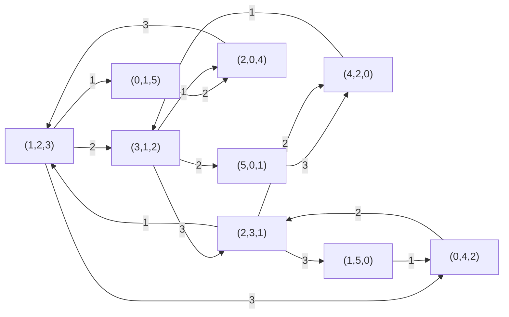

# 東京大学 情報理工学系研究科 コンピュータ科学専攻 2015年8月実施 専門科目II 問題2

## **Author**
祭音Myyura (co-authored with GPT 5.6 SOL)

## **Description**

Let $\mathbb N$ be the set of all nonnegative integers. Let $Q$ be a set of states defined by $Q=\mathbb N\times\mathbb N\times\mathbb N$, and let a transition relation $\longrightarrow$ on $Q$ be defined as follows.

$$
\begin{aligned}
(a,b,c)&\longrightarrow(a-1,b-1,c+2)
&&\text{(if }a>0\text{ and }b>0\text{)},\\
(a,b,c)&\longrightarrow(a+2,b-1,c-1)
&&\text{(if }b>0\text{ and }c>0\text{)},\\
(a,b,c)&\longrightarrow(a-1,b+2,c-1)
&&\text{(if }c>0\text{ and }a>0\text{)}.
\end{aligned}
\qquad(\dagger)
$$

Let $\longrightarrow^*$ denote the reflexive transitive closure of $\longrightarrow$.

Answer the following questions.

(1) Enumerate all states $q\in Q$ such that $(1,2,3)\longrightarrow^*q$, and draw a state transition graph.

(2) A state $(a,b,c)$ is called a deadlock state if there exists no state $q$ such that $(a,b,c)\longrightarrow q$.
Give a necessary and sufficient condition for a state $(a,b,c)$ to be a deadlock state.

(3) Give a necessary and sufficient condition for a state $(a,b,c)$ to have a deadlock state $q$ such that $(a,b,c)\longrightarrow^*q$.

(4) Assume that, at each state $(a,b,c)$, one out of the three transitions defined in the above $(\dagger)$ is chosen to take place, with the following probabilities.

$$
\begin{aligned}
(a,b,c)&\longrightarrow(a-1,b-1,c+2)
&&\text{with probability }ab/(ab+bc+ca),\\
(a,b,c)&\longrightarrow(a+2,b-1,c-1)
&&\text{with probability }bc/(ab+bc+ca),\\
(a,b,c)&\longrightarrow(a-1,b+2,c-1)
&&\text{with probability }ca/(ab+bc+ca).
\end{aligned}
$$

Now let an initial state be $(1,2,3)$, and consider repeating the above probabilistic transitions for sufficiently many times. Compute the probability with which, after such transitions, the current state is either $(1,2,3)$, $(3,1,2)$ or $(2,3,1)$.

### 题目描述

令 $\mathbb N$ 为非负整数集，状态空间 $Q=\mathbb N^3$。定义转移

$$
\begin{aligned}
(a,b,c)&\to(a-1,b-1,c+2) &&(a>0,b>0),\\
(a,b,c)&\to(a+2,b-1,c-1) &&(b>0,c>0),\\
(a,b,c)&\to(a-1,b+2,c-1) &&(c>0,a>0).
\end{aligned}
$$

以 $\to^*$ 表示自反传递闭包。

（1）列出所有满足 $(1,2,3)\to^*q$ 的状态 $q$，并画出状态转移图。

（2）若不存在 $(a,b,c)\to q$，称 $(a,b,c)$ 为死锁状态。给出死锁的充要条件。

（3）给出从 $(a,b,c)$ 可达某个死锁状态的充要条件。

（4）在每个状态按权重 $ab,bc,ca$ 选择上述三种可行转移，即相应概率为
$ab/(ab+bc+ca)$、$bc/(ab+bc+ca)$、$ca/(ab+bc+ca)$。从 $(1,2,3)$ 出发，求充分多次转移后，当前状态属于

$$
\{(1,2,3),(3,1,2),(2,3,1)\}
$$

的概率。

## **Kai**

### (1)

全部可达状态（含初态自身）为

$$
\begin{aligned}
\{&(1,2,3),(3,1,2),(2,3,1),\\
&(0,4,2),(4,2,0),(2,0,4),\\
&(0,1,5),(1,5,0),(5,0,1)\}.
\end{aligned}
$$

下图的边标 $1,2,3$ 对应题中的三种转移。图中九态均从初态可达，且对所有可行转移封闭，故没有其他可达状态。

### (2)

只要至少两个坐标为正，这两个坐标对应的某一种转移就可执行。因此

$$
\boxed{(a,b,c)\text{ 为死锁状态}\iff a,b,c\text{ 中至少两个为 }0.}
$$

### (3)

答案为

$$
\boxed{a\equiv b\pmod3\quad\text{或}\quad
b\equiv c\pmod3\quad\text{或}\quad
c\equiv a\pmod3.}
$$

每种转移都保持 $a-b,b-c,c-a$ 的模 $3$ 余数不变。若可达死锁，例如 $(s,0,0)$，则原状态必有 $b\equiv c\pmod3$；其余两类死锁同理，故该条件必要。

下面证明充分性。不妨设 $a\equiv b\pmod3$。连续执行第一种转移，直到 $a,b$ 中至少一个变为 $0$。若二者同时为 $0$，已经到达死锁；否则得到 $(0,3k,C)$ 或 $(3k,0,C)$。若 $C=0$ 也已死锁。若 $C>0$，则

$$
\begin{aligned}
(0,3k,C)&\to(2,3k-1,C-1)\\
&\to(1,3k-2,C+1)\\
&\to(0,3k-3,C+3).
\end{aligned}
$$

这三步使 $k$ 减少 $1$。重复即可到达 $(0,0,C+3k)$。另一种形状 $(3k,0,C)$ 对称处理，故条件充分。

### (4)

从初态可达的九个状态可按循环置换分成三类：

$$
\begin{aligned}
A&=\{(1,2,3),(3,1,2),(2,3,1)\},\\
B&=\{(0,4,2),(4,2,0),(2,0,4)\},\\
C&=\{(0,1,5),(1,5,0),(5,0,1)\}.
\end{aligned}
$$

从 $A$ 出发，以 $6/11,3/11,2/11$ 的概率分别进入 $A,B,C$；从 $B$ 必然进入 $A$，从 $C$ 必然进入 $B$。故聚合链的转移矩阵为

$$
P=
\begin{pmatrix}
6/11&3/11&2/11\\
1&0&0\\
0&1&0
\end{pmatrix}.
$$

该链不可约，且 $A$ 有自环，故分布收敛到唯一平稳分布。设其为 $(\pi_A,\pi_B,\pi_C)$，则

$$
\pi_C=\frac2{11}\pi_A,\qquad
\pi_B=\frac3{11}\pi_A+\pi_C=\frac5{11}\pi_A.
$$

归一化后得到

$$
(\pi_A,\pi_B,\pi_C)=\left(\frac{11}{18},\frac5{18},\frac19\right).
$$

题目所求即 $\boxed{11/18}$。
