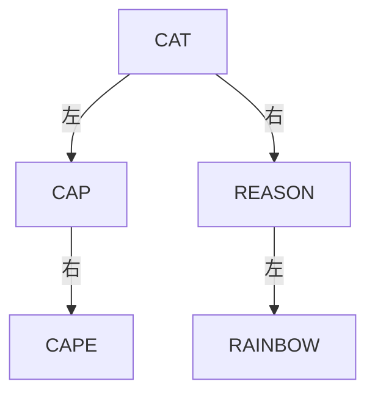
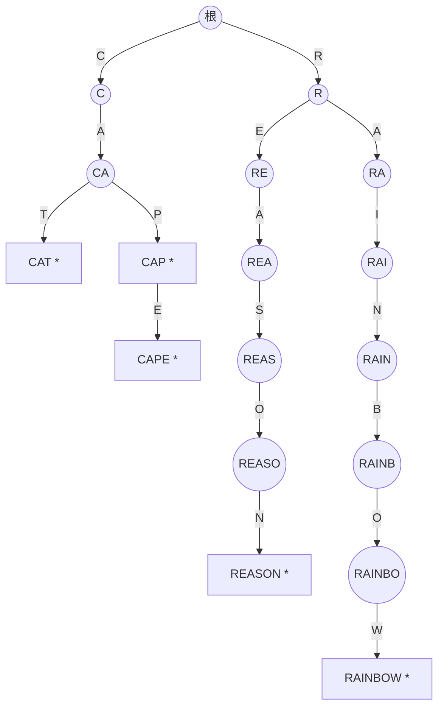

# 東京大学 情報理工学系研究科 コンピュータ科学専攻 2015年8月実施 専門科目II 問題3

## **Author**
祭音Myyura (co-authored with GPT 5.6 SOL)

## **Description**

Let $\Sigma$ be a finite set of characters. Let $S=\{w_1,w_2,\ldots,w_n\}$ be a set of strings over $\Sigma$; we consider representing $S$ on a computer and solving its membership problem. That is, given an input string $w$, we would like to answer “yes” if $w\in S$, and “no” if $w\notin S$. Here let $m$ be the number of characters (i.e. the size of $\Sigma$); and $\ell$ be the average length of the strings $w_1,w_2,\ldots,w_n$. We assume that the average length of an input string $w$ is $\ell$, too. Recall that $n$ is the number of strings in the set $S$.

In case you need other parameters answering the questions below, introduce suitable variables for those parameters and use them in your answers. In illustration of your answers, use the following set $S_0$ as an example: $S_0=\{\mathrm{CAT,CAP,CAPE,REASON,RAINBOW}\}$.

Answer the following questions.

(1) A naive approach is to represent the set $S$ as a linked list of basic string objects (i.e. arrays of characters). Answer the amount of memory needed, and the average complexity of the membership problem, in this setting. Give a brief explanation of your answer.

(2) Let us now consider representing the set $S$ using hashing (with open addressing). Answer the amount of memory needed, and the average complexity of the membership problem. Give a brief explanation of your answer; you can choose and fix further details, like the definition of a hash function.

(3) Let us consider representing the set $S$ using a binary search tree. Here each node of the tree stores a string; and strings are compared with respect to the lexicographic order. Answer the amount of memory needed, and the average complexity of the membership problem. Give a brief explanation of your answer.

Illustrate the data structure that represents the above example $S_0$. Assume here that the tree is constructed by inserting each element of $S_0$ in the order shown above.

(4) A trie is a tree structure that is often used to represent a set of strings. In a trie, one path from the root to a leaf corresponds to one string; and each internal node has an array, of size $m$ (the number of characters), that stores pointers to its children nodes.

Answer the amount of memory needed, and the average complexity of the membership problem, in this setting. Give a brief explanation of your answer. Illustrate the data structure that represents the above example $S_0$.

(5) One potential disadvantage of using a trie is that, in case $\ell\gg n$, memory usage can be excessive. Describe a countermeasure, and explain how it works with an example.

(6) Another potential disadvantage of using a trie is that, in case $m$ is large, memory usage can be excessive. Describe a countermeasure, and explain how it works with an example.

### 题目描述

设字符集 $\Sigma$ 的大小为 $m$，字符串集合 $S=\{w_1,\ldots,w_n\}$ 中字符串的平均长度为 $\ell$；输入查询串 $w$ 的平均长度也为 $\ell$。需要判断 $w\in S$。必要时可自行引入参数。以下用

$$
S_0=\{\mathrm{CAT,CAP,CAPE,REASON,RAINBOW}\}
$$

作为例子。

（1）用字符串对象的链表表示 $S$，给出内存量和平均查询复杂度。

（2）用开放寻址哈希表表示 $S$，给出内存量、平均查询复杂度，并定义一种哈希函数。

（3）用按字典序比较字符串的二叉搜索树表示 $S$，回答同样问题；按给定顺序插入 $S_0$ 并画出树。

（4）用 trie 表示 $S$。根到叶的路径对应一个字符串，每个内部结点保存含 $m$ 个子指针的数组。回答同样问题并画出 $S_0$ 的 trie。

（5）当 $\ell\gg n$ 时，trie 可能浪费内存。给出改进方法并举例说明。

（6）当 $m$ 很大时，trie 也可能浪费内存。给出改进方法并举例说明。

## **Kai**

以下把一次字符比较或一次机器字访问计为 $O(1)$，并保留字符串本身的存储量。

### (1)

字符串共占 $\Theta(n\ell)$，链表指针占 $\Theta(n)$，故总内存为
$\boxed{\Theta(n\ell+n)}$。顺序查询平均检查 $\Theta(n)$ 个字符串，每次比较至多检查 $\Theta(\ell)$ 个字符，故一般上界为
$\boxed{O(n\ell)}$；最坏情况也为 $\Theta(n\ell)$。

### (2)

假设使用均匀散列模型。取表长 $T=\Theta(n)$ 并保持负载因子 $\alpha=n/T\lt1$ 为常数。可从合适的随机哈希族中选择多项式哈希

$$
h(w)=\left(\sum_{j=0}^{|w|-1}\operatorname{code}(w_j)p^j\right)\bmod T,
$$

冲突时按线性探测寻找下一个槽。内存为字符串的 $\Theta(n\ell)$ 加表槽的 $\Theta(n)$，即
$\boxed{\Theta(n\ell+n)}$。计算哈希需 $\Theta(\ell)$，期望探测次数为 $O(1)$，所以平均查询时间为
$\boxed{\Theta(\ell)}$。

### (3)

内存仍为 $\boxed{\Theta(n\ell+n)}$。树高为 $h$ 时查询需 $O(\ell h)$；树平衡或插入次序随机时平均为
$\boxed{O(\ell\log n)}$，退化时最坏为 $O(n\ell)$。

按题给顺序插入得到：

### (4)

trie 至多有 $1+n\ell$ 个结点；每个内部结点含 $m$ 个指针，因此内存上界为
$\boxed{O(mn\ell)}$。查询只沿输入字符串走一遍，平均为
$\boxed{O(\ell)}$。为处理一个字符串是另一个字符串前缀的情形，在结点上另设“单词结束”标记。

星号表示单词结束。

### (5)

使用**压缩 trie（radix tree / Patricia trie）**：把没有分支的连续结点压成一条带字符串标签的边。例如上图从根到 `REASON` 的长链可压成边 `R` 后接边 `EASON`，到 `RAINBOW` 的分支压成 `AINBOW`。

压缩后分支结点和边均为 $O(n)$ 个；边标签可用“原字符串引用 + 起止下标”表示，只需 $O(1)$ 附加空间。于是除保存原字符串的 $\Theta(n\ell)$ 外，树结构不再含 $\ell$ 倍的结点开销。

### (6)

把每个结点的长度为 $m$ 的稠密指针数组改为只保存现有边的稀疏字典，例如哈希表、平衡树或短有序表。根结点在本例中只保存
$\{\mathrm C\mapsto C,\mathrm R\mapsto R\}$，而不是 $m$ 个槽。

这样全部子指针数与实际边数同阶，即 $O(n\ell)$；用哈希字典时查询仍为期望 $O(\ell)$，用平衡树时为 $O(\ell\log m)$。
