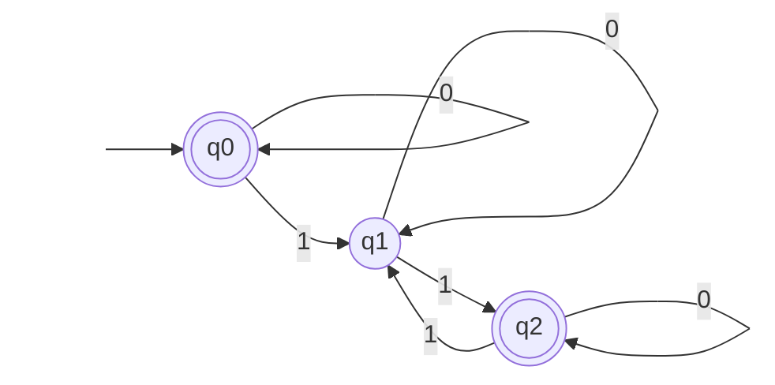

# 東京大学 情報理工学系研究科 コンピュータ科学専攻 2015年8月実施 専門科目I 問題2

## **Author**
祭音Myyura (co-authored with GPT 5.6 SOL)

## **Description**

Let $\mathbb N=\{0,1,2,\ldots\}$ denote the set of all nonnegative integers.
Let $\mathcal A=(Q,\Sigma,\delta,q_0,F)$ be a deterministic finite automaton (DFA). Here $Q$ is a finite set of states; $\Sigma$ is a finite alphabet; $\delta:Q\times\Sigma\to Q$ is a transition function; $q_0\in Q$ is an initial state; and $F\subseteq Q$ is the set of accepting states. In what follows we let $\Sigma^*$ denote the set of finite words over $\Sigma$ (that is, $\Sigma^*=\bigcup_{n\in\mathbb N}\Sigma^n$), and $\varepsilon$ denote the empty word.

Let us consider the following construction that minimizes DFAs. We define a sequence $R_0,R_1,R_2,\ldots$ of binary relations over $Q$ (hence $R_n\subseteq Q\times Q$ for each $n\in\mathbb N$), in the following inductive way.

$$
R_0=Q\times Q,\qquad R_{n+1}=\Phi(R_n).
\qquad(\dagger)
$$

Here $\Phi$ is the function that, given $R\subseteq Q\times Q$, returns the following binary relation $\Phi(R)\subseteq Q\times Q$.

$$
(q,q')\in\Phi(R)
\iff
\left(
\begin{array}{l}
q\in F\iff q'\in F;\\
\text{and for each }a\in\Sigma,\quad
(\delta(q,a),\delta(q',a))\in R.
\end{array}
\right)
$$

Answer the following questions.

(1) Let a DFA $\mathcal A$ be the one depicted below. Describe the binary relation $R_n$ for each $n\in\mathbb N$.
Here $\Sigma=\{0,1\}$, and a double circle ◎ designates an accepting state.

(2) It is straightforward to see that the function $\Phi$ is monotone, that is, $R\subseteq R'$ implies $\Phi(R)\subseteq\Phi(R')$. Use this fact, and the fact that $R_0$ is the greatest binary relation over $Q$, in showing the following: the sequence $R_0,R_1,R_2,\ldots$ defined in $(\dagger)$ satisfies

$$
R_0\supseteq R_1\supseteq R_2\supseteq\cdots.
\qquad(\ddagger)
$$

(3) Let $R_\omega$ be the limit $\bigcap_{n\in\mathbb N}R_n$ of the descending chain $(\ddagger)$. Answer whether the chain $(\ddagger)$ reaches its limit within finitely many steps, that is, whether there is a nonnegative integer $n\in\mathbb N$ such that $R_n=R_{n+1}=R_{n+2}=\cdots=R_\omega$. Give a proof or a counterexample, too.

(4) We extend the transition function $\delta$ to finite words and define the function $\delta^*:Q\times\Sigma^*\to Q$ by: for $q\in Q$, $a\in\Sigma$ and $w\in\Sigma^*$,

$$
\delta^*(q,\varepsilon)=q,\qquad
\delta^*(q,aw)=\delta^*(\delta(q,a),w).
$$

Prove, by induction, that the following holds for each integer $n$ such that $n\ge1$.

If two states $q,q'\in Q$ satisfy $(q,q')\in R_n$, then for any word $w\in\Sigma^{n-1}$ of length $n-1$ we have

$$
\delta^*(q,w)\in F\iff\delta^*(q',w)\in F.
$$

(5) Let $\approx$ be the binary relation between states that they “accept the same language.” That is,

$$
(q,q')\in\approx
\iff
\left(\text{for each word }w\in\Sigma^*,\
\delta^*(q,w)\in F\iff\delta^*(q',w)\in F\right).
$$

Prove that, between the two binary relations $R_\omega$ and $\approx$, we have inclusion $R_\omega\subseteq\approx$.

(6) Prove that the converse holds, that is, $\approx\subseteq R_\omega$. Here you can use that $\Phi$ is monotonic. You can also use the following fact (that is easily verified): between the two binary relations $\approx$ and $\Phi(\approx)$, we have inclusion $\approx\subseteq\Phi(\approx)$.

### 题目描述

设 $\mathcal A=(Q,\Sigma,\delta,q_0,F)$ 为 DFA。对 $Q$ 上的二元关系定义

$$
R_0=Q\times Q,\qquad R_{n+1}=\Phi(R_n),
$$

其中

$$
(q,q')\in\Phi(R)
\iff
\begin{cases}
q\in F\iff q'\in F,\\
(\delta(q,a),\delta(q',a))\in R & (\forall a\in\Sigma).
\end{cases}
$$

（1）对 $\Sigma=\{0,1\}$、$F=\{q_0,q_2\}$ 且转移如下的 DFA，求每个 $R_n$。

| 状态 | 输入 $0$ | 输入 $1$ |
|---|---|---|
| $q_0$ | $q_0$ | $q_1$ |
| $q_1$ | $q_1$ | $q_2$ |
| $q_2$ | $q_2$ | $q_1$ |

（2）利用 $\Phi$ 的单调性证明 $R_0\supseteq R_1\supseteq R_2\supseteq\cdots$。

（3）令 $R_\omega=\bigcap_{n\in\mathbb N}R_n$。判断该下降链是否必在有限步内稳定，并证明结论。

（4）将 $\delta$ 扩张为 $\delta^*:Q\times\Sigma^*\to Q$。证明：若 $(q,q')\in R_n$ 且 $n\ge1$，则对任意长度为 $n-1$ 的词 $w$，

$$
\delta^*(q,w)\in F\iff\delta^*(q',w)\in F.
$$

（5）令 $q\approx q'$ 表示从两状态出发接受相同语言。证明 $R_\omega\subseteq\approx$。

（6）证明反向包含关系 $\approx\subseteq R_\omega$。

## **Kai**

### (1)

$R_1$ 只区分“接受态”和“非接受态”，所以

$$
R_1=\{q_0,q_2\}^2\cup\{(q_1,q_1)\}.
$$

$q_0,q_2$ 在输入 $0$ 后仍分别到达 $q_0,q_2$，在输入 $1$ 后都到达 $q_1$，故二者在下一轮仍不被区分。因此

$$
\boxed{R_0=Q^2,\qquad R_n=\{q_0,q_2\}^2\cup\{(q_1,q_1)\}\quad(n\ge1).}
$$

### (2)

$R_1=\Phi(R_0)\subseteq R_0$。若 $R_n\subseteq R_{n-1}$，由 $\Phi$ 单调可得

$$
R_{n+1}=\Phi(R_n)\subseteq\Phi(R_{n-1})=R_n.
$$

归纳即得下降链。

### (3)

必在有限步内稳定。因为 $Q^2$ 只有 $|Q|^2$ 个有序对；若 $R_{n+1}\subsetneq R_n$，至少删除一个有序对。因此严格下降至多发生 $|Q|^2$ 次，随后存在 $N$ 使

$$
R_N=R_{N+1}=\cdots=R_\omega.
$$

### (4)

对 $n$ 归纳。$n=1$ 时 $w=\varepsilon$，结论正是 $R_1=\Phi(R_0)$ 对接受性的要求。

设命题对 $n$ 成立。若 $(q,q')\in R_{n+1}$，将任意 $|w|=n$ 的词写成 $w=av$。由定义

$$
(\delta(q,a),\delta(q',a))\in R_n.
$$

再对长度为 $n-1$ 的 $v$ 使用归纳假设，并利用
$\delta^*(q,av)=\delta^*(\delta(q,a),v)$，即得结论。

### (5)

若 $(q,q')\in R_\omega$，则它属于每个 $R_n$。对任意词 $w$，在（4）中取 $n=|w|+1$，便有

$$
\delta^*(q,w)\in F\iff\delta^*(q',w)\in F.
$$

故 $q\approx q'$，即 $R_\omega\subseteq\approx$。

### (6)

若 $q\approx q'$，取空词可知 $q,q'$ 的接受性相同；对任意 $a\in\Sigma$ 和 $w\in\Sigma^*$，

$$
\delta^*(\delta(q,a),w)=\delta^*(q,aw),
$$

故 $\delta(q,a)\approx\delta(q',a)$。因此 $\approx\subseteq\Phi(\approx)$。

又 $\approx\subseteq R_0$。若 $\approx\subseteq R_n$，利用单调性得到

$$
\approx\subseteq\Phi(\approx)\subseteq\Phi(R_n)=R_{n+1}.
$$

归纳知 $\approx\subseteq R_n$ 对所有 $n$ 成立，从而 $\approx\subseteq R_\omega$。
