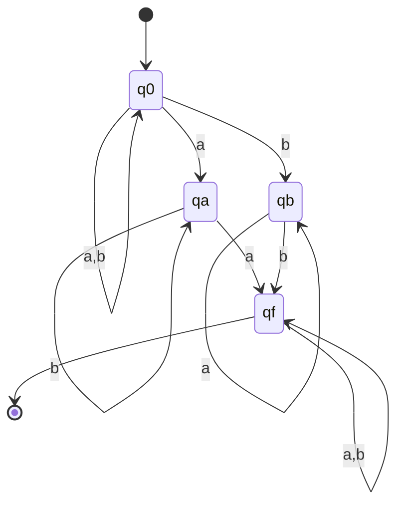
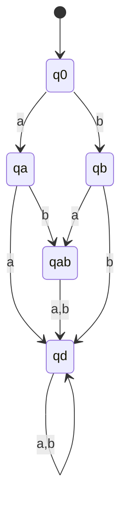

# 東京大学 情報理工学系研究科 コンピュータ科学専攻 2016年8月実施 専門科目I 問題1

## **Author**
祭音Myyura (co-authored with GPT 5.6 SOL)

## **Description**
A language $L\subseteq\Sigma^*$ over a finite alphabet $\Sigma$ is said to be *regular* if there exists a finite automaton $\mathcal A$ such that $L=\mathcal L(\mathcal A)$. Here

$$
\mathcal L(\mathcal A)=\{w\in\Sigma^*\mid w\text{ is accepted by }\mathcal A\}.
$$

Answer the following questions.

(1) We fix an alphabet $\Sigma$ by $\Sigma=\{a,b\}$. For the language $L_1$ below, present a *nondeterministic finite automaton* (NFA) $\mathcal A_1$ such that: $\mathcal L(\mathcal A_1)=L_1$, and the number of states of $\mathcal A_1$ is not greater than $4$.

$$
L_1=\{w\in\Sigma^*\mid\text{there is a character }l\in\Sigma\text{ that occurs more than once in }w\}.
$$

(2) Assume that $\Sigma$ is a finite alphabet. Prove the following: any finite language $L=\{w_1,\ldots,w_n\}\subseteq\Sigma^*$ is regular. Here $n$ is a nonnegative integer.

(3) We fix an alphabet $\Sigma$ by $\Sigma=\{a,b\}$. For the language $L_1$ in Question (1), present a *deterministic finite automaton* (DFA) $\mathcal A_2$ such that: $\mathcal L(\mathcal A_2)=\Sigma^*\setminus L_1$, and the number of states of $\mathcal A_2$ is not greater than $5$. Here $\Sigma^*\setminus L_1$ denotes the complement of $L_1\subseteq\Sigma^*$.

(4) Give a decision procedure for the following problem, and explain it briefly.

- **Input** nondeterministic finite automaton $\mathcal A$.
- **Output** whether the language $\mathcal L(\mathcal A)$ is an infinite set or not.

### 题目描述

有限字母表 $\Sigma$ 上的语言 $L\subseteq\Sigma^*$ 称为正则语言，是指存在有限自动机 $\mathcal A$ 使

$$
L=\mathcal L(\mathcal A)=\{w\in\Sigma^*\mid w\text{ 被 }\mathcal A\text{ 接受}\}.
$$

（1）令 $\Sigma=\{a,b\}$。对

$$
L_1=\{w\in\Sigma^*\mid w\text{ 中至少有一种字符出现两次以上}\},
$$

构造状态数不超过 $4$ 的 NFA $\mathcal A_1$，使 $\mathcal L(\mathcal A_1)=L_1$。

（2）证明有限字母表上的任意有限语言 $L=\{w_1,\ldots,w_n\}$ 都是正则语言，其中 $n$ 可为 $0$。

（3）构造状态数不超过 $5$ 的 DFA $\mathcal A_2$，使
$\mathcal L(\mathcal A_2)=\Sigma^*\setminus L_1$。

（4）给出判定 NFA $\mathcal A$ 的语言 $\mathcal L(\mathcal A)$ 是否为无限集的算法，并简述理由。

## **Kai**
### (1)
取初态 $q_0$、终态 $q_f$，构造如下。未画出的转移均为空。

自动机可在第一次读到某个字符时猜测它，并在再次读到同一字符时进入 $q_f$，故恰好接受 $L_1$。

### (2)
以 $L$ 中所有单词的前缀（含空串）为状态，读入字符 $c$ 时从前缀 $u$ 转到前缀 $uc$；若 $uc$ 不是任何 $w_i$ 的前缀，则转入非接受的陷阱状态。把每个完整单词 $w_i$ 对应的状态标为接受态。所得前缀树 DFA 状态有限，且恰好接受 $L$。当 $n=0$ 时，一个非接受的陷阱状态即可接受空语言。

### (3)
补语言为 $\{\varepsilon,a,b,ab,ba\}$。下图中 $q_0,q_a,q_b,q_{ab}$ 为接受态，$q_d$ 为陷阱态。

这里 $q_{ab}$ 表示两个字符各出现一次，与先后次序无关。

### (4)
把 NFA 看成有向转移图。语言无限，当且仅当存在状态 $q$ 同时满足：

1. $q$ 从初态可达；
2. $q$ 位于一个有向环上；
3. 某个接受态从 $q$ 可达。

分别对原图和反图做可达性搜索，再用强连通分量找环即可判定。若三条件成立，可重复该环而得到任意长的接受串；反之，任意长度不少于状态数的接受路径必重复状态，因而含有满足三条件的环。
