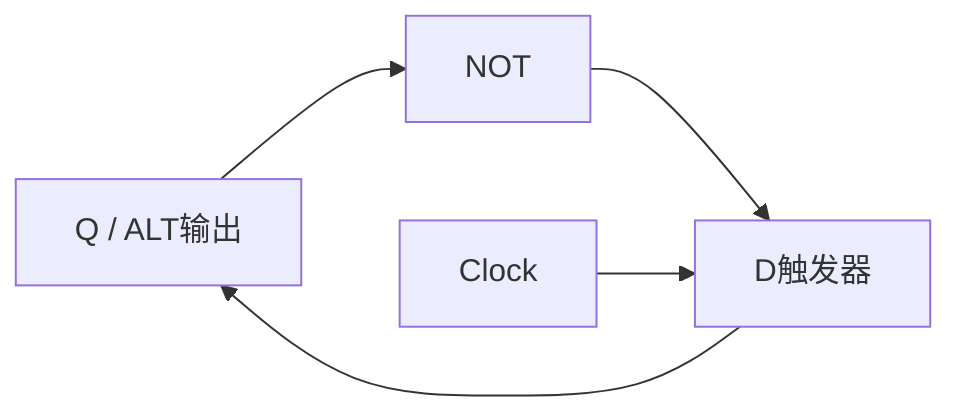
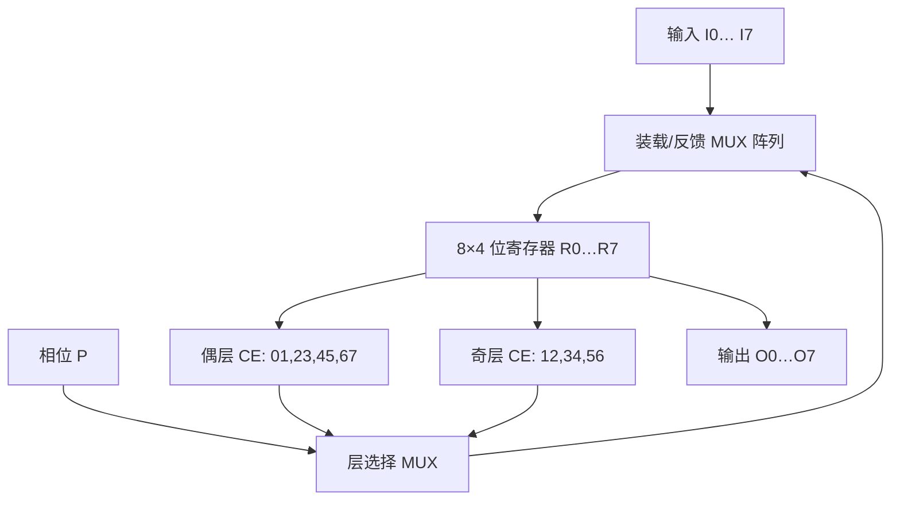

# 東京大学 情報理工学系研究科 コンピュータ科学専攻 2016年8月実施 専門科目I 問題3

## **Author**
祭音Myyura (co-authored with GPT 5.6 SOL)

## **Description**
回答有关时序逻辑电路的问题。设时钟为无偏斜的理想矩形波，门延迟相对时钟周期足够短。

（1）从 D、JK、T 触发器中任选一种，说明时钟、输入和内部状态如何决定其输出。

（2）设计电路 ALT，使输出每个时钟周期在 $0,1$ 间翻转。可用第（1）问所选触发器及 AND、OR、NOT 门。

（3）设计用冒泡排序将 $8$ 个 4 位无符号整数排序的电路。输入为 $I_0,\ldots,I_7$ 和 1 位装载信号 $L$；输出为 $O_0,\ldots,O_7$ 和 1 位完成信号 $V$。$L=1$ 时用 32 个触发器保存输入，记为 $v_0,\ldots,v_7$。$L$ 变为 $0$ 后，奇偶交替地比较交换

$$
(v_0,v_1),(v_2,v_3),(v_4,v_5),(v_6,v_7)
$$

和

$$
(v_1,v_2),(v_3,v_4),(v_5,v_6).
$$

若连续两个周期均无交换则令 $V=1$，否则令 $V=0$。可使用所选触发器、ALT、4 位比较器 CMP、4 位 2 选 1 MUX 及基本逻辑门。

## **Kai**
### (1)
选择上升沿触发的 D 触发器。在每个上升沿，

$$
Q(t^+)=D(t),
$$

其余时间输出保持原内部状态 $Q$。

### (2)
把反相输出反馈到输入，即令 $D=\overline Q$，并以 $Q$ 为 ALT 输出。每个有效时钟沿都有 $Q^+=\overline Q$，故输出逐周期翻转；初始化 $Q=0$。

### (3)
先定义比较交换单元 $\operatorname{CE}(x,y)$：CMP 产生 $c=[x>y]$，两个 MUX 输出

$$
(x',y')=
\begin{cases}
(y,x),&c=1,\\
(x,y),&c=0.
\end{cases}
$$

用 8 个 4 位寄存器 $R_0,\ldots,R_7$ 保存 $v_i$。控制位 $P$ 在装载时置 $0$；$L=0$ 后每周期翻转。$P=0$ 时启用偶数边界的四个 CE，$P=1$ 时启用奇数边界的三个 CE；未启用边界上的寄存器保持原值。最外层 MUX 在 $L=1$ 时选择 $I_i$，在 $L=0$ 时选择本轮 CE 的结果。

令 $s$ 为当前启用的各 CMP 交换信号之 OR，即“本周期发生过交换”。再设 1 位寄存器 $H$ 记录上一周期是否无交换，并用 1 位寄存器输出 $V$：

$$
\begin{aligned}
L=1:&\quad P^+=0,\ H^+=0,\ V^+=0,\\
L=0:&\quad P^+=\overline P,\ H^+=\overline s,\ V^+=H\land\overline s.
\end{aligned}
$$

因此 $V$ 恰在连续一个偶层和一个奇层均无交换后变为 $1$。此时所有相邻对均有序，故 $O_0\le\cdots\le O_7$；若随后发生交换，$V$ 在该周期清零。
