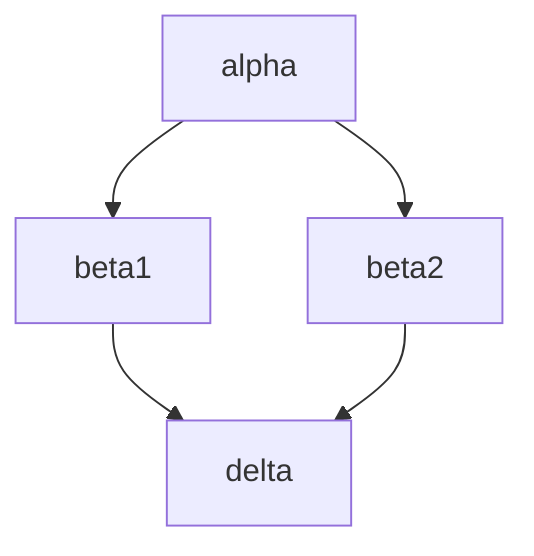

# 東京大学 情報理工学系研究科 コンピュータ科学専攻 2017年8月実施 専門科目II 問題2

## **Author**
祭音Myyura (co-authored with GPT 5.6 SOL)

## **Description**

Let $V$ be a finite set of symbols denoting variables, $F_0$ a finite set of constant symbols, $F_2$ a finite set of binary function symbols, and $T$ the set of terms constructed from symbols in $V$, $F_0$ and $F_2$. Let $G$ be a finite set of rewrite rules of the form $x\to c$ or of the form $x\to f(y,z)$, where $x,y,z\in V$, $c\in F_0$ and $f\in F_2$, and each $x\in V$ appears in the left-hand side of exactly one rewrite rule in $G$. For $\alpha,\beta\in T$, the relation $\alpha\Rightarrow\beta$ is defined as follows:

> $\beta$ is obtained by applying a rule $x\to\gamma$ ($\gamma$ is $c$ or $f(y,z)$) in $G$ to one occurrence of $x\in V$ in $\alpha$ and replacing the occurrence with $\gamma$.

The relation $\Rightarrow^*$ is defined as the reflexive and transitive closure of $\Rightarrow$, and the relation $\Leftrightarrow^*$ is defined as the reflexive, transitive and symmetric closure of $\Rightarrow$.

Answer the following questions.

(1) Show that if $\alpha,\beta\in T$ and $\alpha\Leftrightarrow^*\beta$, then there exists $\delta\in T$ such that $\alpha\Rightarrow^*\delta$ and $\beta\Rightarrow^*\delta$.

(2) Give an algorithm that judges $\alpha\Leftrightarrow^*\beta$ for $\alpha,\beta\in T$, and explain its correctness.

For $\alpha\in T$ and $w\in\{L,R\}^*$, the operation $\alpha.w\in T$ that extracts a subterm of $\alpha$ is inductively defined as follows:

$$
\begin{aligned}
\alpha.\epsilon&=\alpha,\\
\alpha.Lw&=
\begin{cases}
\alpha_1.w&\text{if }\alpha=f(\alpha_1,\alpha_2),\\
\text{undefined}&\text{otherwise},
\end{cases}\\
\alpha.Rw&=
\begin{cases}
\alpha_2.w&\text{if }\alpha=f(\alpha_1,\alpha_2),\\
\text{undefined}&\text{otherwise}.
\end{cases}
\end{aligned}
$$

Here $\epsilon$ is an empty word. For $\alpha,\beta\in T$, the relation $\alpha\approx\beta$ is then defined as follows:

> for any $\alpha',\beta'\in T$ and $w\in\{L,R\}^*$, if $\alpha\Leftrightarrow^*\alpha'$ and $\beta\Leftrightarrow^*\beta'$, and $\alpha'.w$ and $\beta'.w$ are both defined and their first symbols belong to $F_0\cup F_2$, then those symbols are identical.

Answer the following question.

(3) Give an algorithm that judges $\alpha\approx\beta$ for $\alpha,\beta\in T$, and explain its correctness.

### 题目描述

设 $V$ 是有限变量符号集，$F_0$ 是有限常量符号集，$F_2$ 是有限二元函数符号集，$T$ 是由它们构成的项集。有限重写规则集 $G$ 中每条规则形如

$$
x\to c\quad\text{或}\quad x\to f(y,z),
$$

且每个 $x\in V$ 恰在一条规则的左侧出现。若在项 $\alpha$ 的某个 $x$ 处应用其规则得到 $\beta$，记 $\alpha\Rightarrow\beta$；其自反传递闭包记为 $\Rightarrow^*$，其自反、对称、传递闭包记为 $\Leftrightarrow^*$。

（1）证明：若 $\alpha\Leftrightarrow^*\beta$，则存在 $\delta\in T$，使
$\alpha\Rightarrow^*\delta$ 且 $\beta\Rightarrow^*\delta$。

（2）给出判定 $\alpha\Leftrightarrow^*\beta$ 的算法并说明正确性。

对 $w\in\{L,R\}^*$，以 $\alpha.w$ 表示沿 $w$ 指定的左右孩子路径取得的子项。定义 $\alpha\approx\beta$：对任意 $\alpha\Leftrightarrow^*\alpha'$、$\beta\Leftrightarrow^*\beta'$ 及任意路径 $w$，只要 $\alpha'.w,\beta'.w$ 均存在且其根符号属于 $F_0\cup F_2$，两个根符号就相同。

（3）给出判定 $\alpha\approx\beta$ 的算法并说明正确性。

## **Kai**

### （1）

一个变量本身是叶结点，所以两个不同的可重写位置必不相交；在两个位置分别重写时，先后次序可以交换。若两次选择同一位置，由于每个变量恰有一条规则，两次结果相同。因此 $\Rightarrow$ 满足菱形性质：

由菱形性质归纳可得 $\Rightarrow^*$ 的合流性；再对
$\alpha\Leftrightarrow^*\beta$ 的有限正向、反向步骤数归纳，即得共同后继 $\delta$。

### （2）

把 $V$ 中的变量也暂看成零元符号。建立一个 DAG，包含 $\alpha,\beta$、所有规则右端以及它们的全部子项，然后作**基项合同闭包**：

1. 用并查集合并每个 $x$ 与其唯一规则右端；
2. 反复执行：若已有结点 $f(s_1,s_2)$ 与 $f(t_1,t_2)$ 的对应孩子已经分别同类，则合并这两个父结点；
3. 闭包稳定后，当且仅当 $\alpha,\beta$ 的根结点同类时回答“是”。

$\Leftrightarrow^*$ 正是包含各等式“$x=$ 规则右端”的最小合同关系。上述算法计算的正是有限基项等式的合同闭包，故判定正确且必然终止。

### （3）

在（2）的有限项图上做不带 occurs-check 的**有理树合一**：先加入所有等式“$x=$ 规则右端”，再加入待检验等式 $\alpha=\beta$，并用工作队列反复执行：

- 若同一等价类中出现不同常量、不同函数符号，或一个常量与一个函数符号，则报告冲突；
- 若同类中有 $f(s_1,s_2)$ 与 $f(t_1,t_2)$，则继续合并 $s_1,t_1$ 以及 $s_2,t_2$。

队列稳定且没有冲突时回答“是”，否则回答“否”。允许循环而不作 occurs-check 是必要的，例如规则 $x\to f(x,c)$ 本身是合法的。

沿路径分解同根函数，恰好把 $\alpha$ 与 $\beta$ 在该路径上能够暴露的构造符号放入同一类。因此出现冲突当且仅当题目定义中的某条路径能观察到两个不同的 $F_0\cup F_2$ 符号。有限图上的每次操作只合并等价类，故算法终止并且判定恰为 $\alpha\approx\beta$。
