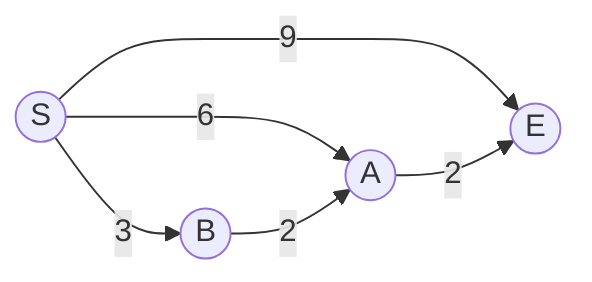
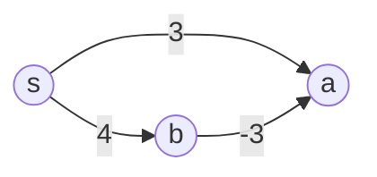

# 東京大学 情報理工学系研究科 コンピュータ科学専攻 2017年8月実施 専門科目I 問題1

## **Author**
祭音Myyura (co-authored with GPT 5.6 SOL)

## **Description**

在带权有向图 $G=(V,E)$ 上用 Dijkstra 算法求从起点 $s$ 出发的最短路，边 $(u,v)$ 的长度为 $d(u,v)$。

（1）给出一个 $|V|=3$、Dijkstra 算法不能正确求出最短路的输入。

（2）补全下列伪代码中的松弛操作 $a$。

```text
c[v] = infinity (v in V); c[s] = 0; Q = V
while Q is not empty:
    choose v in Q minimizing c[v]       (i)
    remove v from Q                     (i)
    for each endpoint u of an edge leaving v:
        a                                (ii)
```

（3）对下图从 $S$ 开始运行算法，写出每轮 `while` 循环中数组 $c$ 的变化。



（4）若（i）每次耗时 $O(|V|)$，分别求（i）、（ii）在整个运行过程中的总耗时。

（5）若用二叉堆优先队列实现 $Q$，再次求（i）、（ii）的总耗时。

## **Kai**

### （1）

例如：



Dijkstra 会先确定 $c[a]=3$；但真正的最短路为 $s\to b\to a$，长度 $4-3=1$。

### （2）

```text
if u is in Q and c[u] > c[v] + d(v,u):
    c[u] = c[v] + d(v,u)
```

### （3）

各行依次表示初始化以及取出 $S,B,A,E$ 后的结果：

| 时刻 | $c[S]$ | $c[B]$ | $c[A]$ | $c[E]$ |
|---|---:|---:|---:|---:|
| 初始化 | $0$ | $\infty$ | $\infty$ | $\infty$ |
| 取出 $S$ | $0$ | $3$ | $6$ | $9$ |
| 取出 $B$ | $0$ | $3$ | $5$ | $9$ |
| 取出 $A$ | $0$ | $3$ | $5$ | $7$ |
| 取出 $E$ | $0$ | $3$ | $5$ | $7$ |

### （4）

（i）执行 $|V|$ 次，故总耗时为 $O(|V|^2)$。（ii）对每条边至多执行一次，每次为常数时间，故总耗时为 $O(|E|)$。

### （5）

二叉堆的取最小并删除操作每次为 $O(\log |V|)$，所以（i）总计
$O(|V|\log |V|)$。每次成功松弛还需执行 `decrease-key`，故（ii）总计
$O(|E|\log |V|)$。
