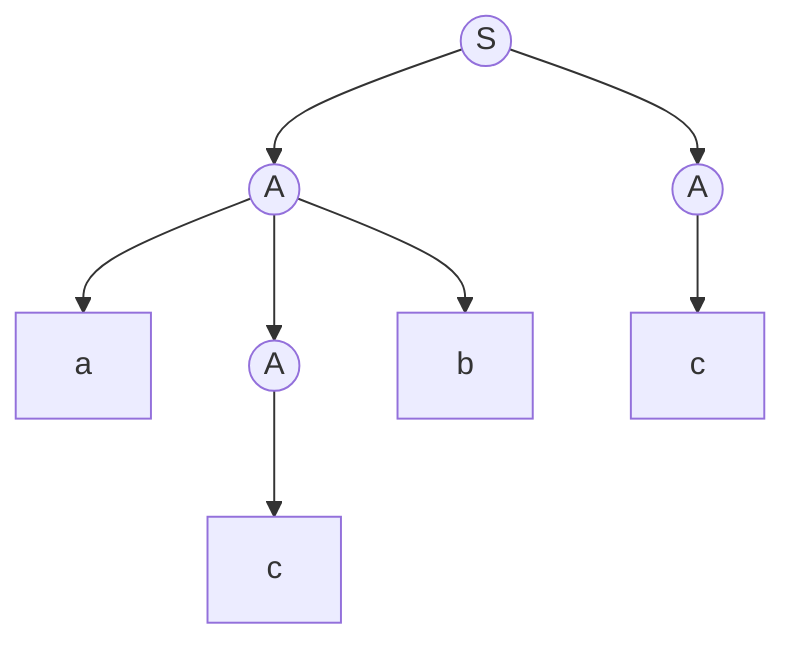
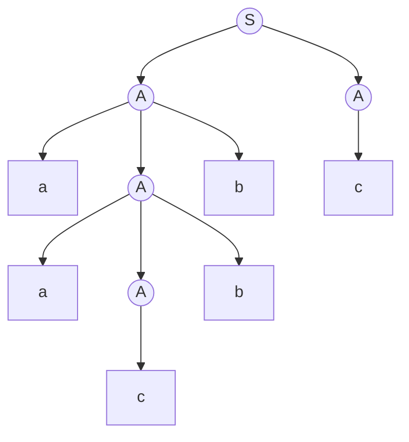

# 東京大学 情報理工学系研究科 コンピュータ科学専攻 2017年8月実施 専門科目I 問題2

## **Author**
祭音Myyura (co-authored with GPT 5.6 SOL)

## **Description**

For a context-free grammar $G$, we write $\mathcal L(G)$ for the language generated by $G$. For a word $w$, we write $|w|$ for its length. We write $\epsilon$ for an empty word.

Answer the following questions.

(1) Let $G_0$ be the context-free grammar consisting of the production rules:

$$
S\to AA\qquad A\to c\qquad A\to aAb,
$$

where $S$ is the start symbol. A derivation of $acbc$ in $G_0$ can be represented by the following syntax tree:

Draw a syntax tree that represents a derivation of $aacbbc$ in $G_0$.

(2) For the grammar $G_0$ in question (1), obtain words $u,v,w,x,y\in\{a,b,c\}^*$ that satisfy all of the following three conditions. (i) $uvwxy=acbc$, (ii) $uv^nwx^ny\in\mathcal L(G_0)$ for every $n\ge0$, and (iii) $|vx|>0$. Here, note that some of $u,v,w,x,y$ may be empty words $\epsilon$.

(3) Prove that, for every context-free grammar $G$, there exists an integer $N$ that satisfies the following property:

> For every word $z\in\mathcal L(G)$, if $|z|>N$, then there exist words $u,v,w,x,y$ that satisfy all of the following four conditions: (i) $uvwxy=z$, (ii) $uv^nwx^ny\in\mathcal L(G)$ for every $n\ge0$, (iii) $|vx|>0$, and (iv) $|vwx|\le N$.

Here, you may assume that $G$ is in Chomsky normal form, i.e., each production rule is one of the forms $A\to BC$, $A\to a$, and $S\to\epsilon$ (where $A$ is a non-terminal symbol, $B$ and $C$ are non-terminal symbols other than $S$, $a$ is a terminal symbol, and $S$ is the start symbol).

(4) Prove that there exists no context-free grammar that generates the language: $\{ww\mid w\in\{a,b\}^*\}$. You may use the result of question (3) above.

### 题目描述

对上下文无关文法 $G$，以 $L(G)$ 表示其生成的语言；$|w|$ 表示串长，$\varepsilon$ 表示空串。

（1）文法 $G_0$ 的产生式为

$$
S\to AA,\qquad A\to c,\qquad A\to aAb.
$$

其中 $S$ 为开始符号，串 $acbc$ 的推导语法树如上图所示。画出串 $aacbbc$ 的语法树。

（2）对串 $acbc$，给出 $u,v,w,x,y\in\{a,b,c\}^*$，使得
$uvwxy=acbc$、$uv^nwx^ny\in L(G_0)$ 对所有 $n\ge0$ 成立，并且
$|vx|>0$。其中 $u,v,w,x,y$ 中的部分串可以为空串 $\varepsilon$。

（3）证明上下文无关语言的泵引理：对任意 CFG $G$，存在整数 $N$，使每个
$z\in L(G)$、$|z|>N$ 均可写为 $z=uvwxy$，满足

$$
uv^nwx^ny\in L(G)\ (n\ge0),\qquad |vx|>0,\qquad |vwx|\le N.
$$

可以假设 $G$ 为 Chomsky 范式，即产生式形如 $A\to BC$、$A\to a$ 或
$S\to\varepsilon$，其中 $A$ 为非终结符，$B,C$ 为不同于开始符号 $S$ 的非终结符，$a$ 为终结符。

（4）利用（3）证明复制语言 $\{ww\mid w\in\{a,b\}^*\}$ 不是上下文无关语言。

## **Kai**

### （1）

叶结点从左到右为 $a,a,c,b,b,c$。

### （2）

取

$$
u=\varepsilon,\quad v=a,\quad w=c,\quad x=b,\quad y=c.
$$

则 $uv^nwx^ny=a^ncb^nc\in L(G_0)$，且 $|vx|=2>0$。

### （3）

设 $G$ 有 $m$ 个非终结符，取 $N=2^m$。Chomsky 范式语法树是一棵二叉树；若
$|z|>N$，则最长的根到叶路径含有超过 $m$ 层非终结符。

在该路径靠近叶端的 $m+1$ 个非终结符中，必有同一符号 $A$ 出现两次。设较高的
$A$ 所生成的子串为 $vwx$，较低的 $A$ 生成 $w$，于是有推导

$$
S\Rightarrow^*uAy\Rightarrow^*uvAxy\Rightarrow^*uvwxy.
$$

重复或删去两个 $A$ 之间的推导段，得
$uv^nwx^ny\in L(G)$（$n\ge0$）。两个 $A$ 是不同层的结点，期间至少有一个非空的兄弟子树，故 $|vx|>0$。较高 $A$ 以下至叶端至多有 $m$ 层二叉分支，因此
$|vwx|\le2^m=N$。这里选取最长路径保证其在较高 $A$ 以下的部分也是该子树中的最长路径。

### （4）

反设复制语言 $L$ 是 CFL，令 $N$ 为泵长度，取

$$
z=a^Nb^Na^Nb^N=(a^Nb^N)(a^Nb^N)\in L.
$$

任意满足 $|vwx|\le N$ 的分解中，$vwx$ 至多跨越四个等长块之间的一个边界。
取 $n=0$，删除 $v,x$ 只会缩短至多两个相邻游程，而且因 $|vx|>0$，至少一个游程严格变短。

若删除后四个游程都非空，所得串形如 $a^ib^ja^kb^l$。这样的串若是平方串，两个副本的字母分界必须对应，因而必有 $i=k$ 且 $j=l$。但受影响的是至多两个相邻游程，不可能同时包含配对的第 1、3 段或第 2、4 段，故上述等式至少有一个不成立。若某个游程被整个删去，所得串仍同时含 $a,b$，却少于四个游程；而一个同时含两种字母的平方串至少有四个游程，也不可能。故 $uwy\notin L$，与泵引理矛盾。
