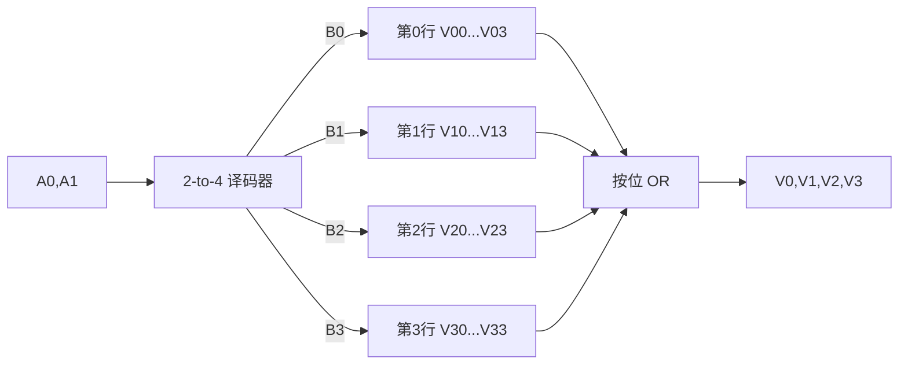

# 東京大学 情報理工学系研究科 コンピュータ科学専攻 2017年8月実施 専門科目I 問題3

## **Author**
祭音Myyura (co-authored with GPT 5.6 SOL)

## **Description**

In this problem, we construct SRAM with 2-bit address width and 4-bit data width. All symbols for inputs and outputs represent 1-bit signals taking values of 0 or 1. We use memory cells with the following specifications. A memory cell has inputs $I$, $W$, and $S$ and an output $O$, and stores a 1-bit value. At a falling edge of $W$, the value of $I$ is stored in the memory cell. While $S$ is 1, the stored value is output to $O$, and otherwise 0 is output to $O$. In your circuit designs, you can use AND, OR, NOT and XOR gates in addition to the specified ones.

Answer the following questions.

(1) Design a 2-bit decoder. It should have inputs $A_0$ and $A_1$, and outputs $B_0$, $B_1$, $B_2$, and $B_3$. $B_i$ ($i=0,1,2,3$) outputs 1 if $i=A_0+2A_1$, and outputs 0 otherwise.

(2) Let $V_{ij}$ be the memory cell for the $j$-th bit of data stored in address $i$ ($i,j=0,1,2,3$). Design a circuit to read the stored data, assuming that values are already stored in the memory cells. The circuit has inputs $A_0$ and $A_1$, and outputs $V_0$, $V_1$, $V_2$, and $V_3$. If $A_0+2A_1=i$, then the value stored at $V_{ij}$ is output as $V_j$ ($j=0,1,2,3$). You can use the decoder designed in question (1).

(3) Add the functionality of storing data to the circuit designed in question (2). Inputs $W_M$, $U_0$, $U_1$, $U_2$ and $U_3$ should be added. At a falling edge of $W_M$, the value of $U_j$ is stored in the memory cell $V_{ij}$ ($j=0,1,2,3$) for $A_0+2A_1=i$. In this case, the other memory cells keep the stored values. Assume that the values of $A_0$ and $A_1$ are kept unchanged while $W_M$ is 1. You may answer only the differences from your answer to question (2).

### 题目描述

设计地址宽度为 $2$ bit、数据宽度为 $4$ bit 的 SRAM。所有输入输出均为取值
$0$ 或 $1$ 的单比特信号。存储单元具有输入 $I,W,S$ 和输出 $O$：$W$ 的下降沿把
$I$ 写入单元；$S=1$ 时从 $O$ 输出所存位，否则输出 $0$。除存储单元外可用
AND、OR、NOT、XOR 门。

（1）设计 2-to-4 译码器。输入为 $A_0,A_1$，输出为 $B_0,\ldots,B_3$，当且仅当
$i=A_0+2A_1$ 时 $B_i=1$。

（2）令 $V_{ij}$ 为地址 $i$ 中第 $j$ 位的存储单元（$i,j=0,1,2,3$）。假设数据已经写入，设计读电路：若 $i=A_0+2A_1$，则输出 $V_j$ 应为 $V_{ij}$ 中存储的值。

（3）在（2）的电路上增加写功能。新增输入 $W_M,U_0,\ldots,U_3$；在 $W_M$ 的下降沿，将 $U_j$ 写入当前地址的 $V_{ij}$，其余单元保持原值。假设 $W_M=1$ 期间 $A_0,A_1$ 保持不变。可只画出相对（2）新增或修改的部分。

## **Kai**

### （1）

$$
\begin{aligned}
B_0&=\overline{A_1}\,\overline{A_0},&
B_1&=\overline{A_1}A_0,\\
B_2&=A_1\overline{A_0},&
B_3&=A_1A_0.
\end{aligned}
$$

任意输入下恰有一个 $B_i$ 为 $1$。

### （2）

把同一行四个单元的选择端均接到该行译码输出：

$$
S_{ij}=B_i,\qquad
V_j=O_{0j}\lor O_{1j}\lor O_{2j}\lor O_{3j}.
$$

因为未选中行的单元输出全为 $0$，按位 OR 后正好得到被选中行的数据。

### （3）

对每个 $V_{ij}$ 增加如下连接：

$$
I_{ij}=U_j,\qquad W_{ij}=W_M\land B_i,\qquad S_{ij}=B_i.
$$

题设保证写入期间地址不变，因此选中行的 $W_{ij}$ 随 $W_M$ 产生下降沿并写入
$U_j$；未选中行始终有 $W_{ij}=0$，不会产生写入下降沿。
