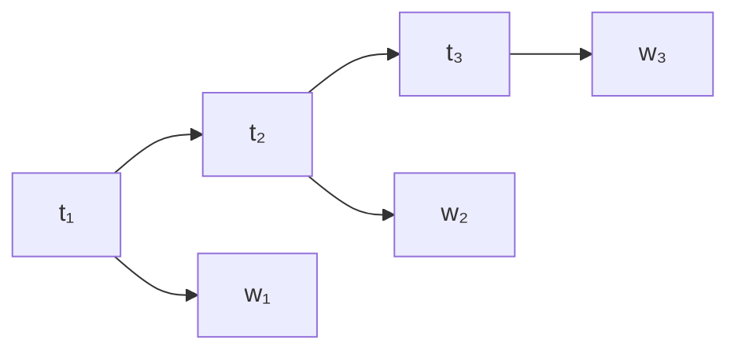

# 東京大学 情報理工学系研究科 コンピュータ科学専攻 2019年8月実施 専門科目II 問題2

## **Author**
祭音Myyura (co-authored with GPT 5.6 SOL)

## **Description**

Consider the problem of obtaining a sequence of part-of-speech (POS) tags $\mathbf t=(t_1,\ldots,t_\ell)$ for a given natural language sentence (word sequence) $\mathbf w=(w_1,\ldots,w_\ell)$. For example, for the following four-word sentence

$$
(w_1,w_2,w_3,w_4)=(\text{John},\text{wrote},\text{a},\text{book}),
$$

our goal is to output the following POS tag sequence.

$$
(t_1,t_2,t_3,t_4)=(\text{NOUN},\text{VERB},\text{DET},\text{NOUN})
$$

In this example, NOUN, VERB, and DET are POS tags, denoting noun, verb, and determiner, respectively. $W$ is a finite set of all words, and $T$ is a finite set of all POS tags. Suppose that a POS-tagged corpus $D=\{(\mathbf w^{(k)},\mathbf t^{(k)})\mid k\in\{1,\ldots,N\}\}$ ($\mathbf w^{(k)}$ is a $k$-th sentence in $D$, $\mathbf t^{(k)}$ is its POS tag sequence, and $N>0$ is the number of elements in $D$) is given as training data. In the following, for a word sequence $\mathbf w=(w_1,\ldots,w_\ell)$, its length $\ell$ is represented as $|\mathbf w|$.

Answer the following questions.

(1) Consider the probability $p_u(t\mid w)$ for assigning a POS tag $t\in T$ to a word $w\in W$, and define the probability function $p_u(\mathbf t\mid\mathbf w)$ for assigning a POS tag sequence $\mathbf t$ to a word sequence $\mathbf w$ as follows.

$$
p_u(\mathbf t\mid\mathbf w)\equiv\prod_{i=1}^{|\mathbf w|}p_u(t_i\mid w_i)
$$

Supposing each element of training data $D$ is independently distributed following $p_u(\mathbf t\mid\mathbf w)$, answer a method for computing the maximum likelihood estimate of $p_u(t\mid w)$.

(2) Assume that $p_u(t\mid w)$ is given for each $w\in W,t\in T$. Describe an algorithm to obtain a POS tag sequence $\mathbf t$ that maximizes $p_u(\mathbf t\mid\mathbf w)$ for an input sentence $\mathbf w$.

(3) Consider the probability $p_b(t\mid v,w)$ for assigning a POS tag $t\in T$ to a word $w\in W$ when a word $v\in W$ immediately precedes $w$ in a sentence. Note that $v$ is considered as a special word `<s>` when $w$ is the first word of the sentence. The probability function $p_b(\mathbf t\mid\mathbf w)$ is defined as follows.

$$
p_b(\mathbf t\mid\mathbf w)\equiv
p_b(t_1\mid\text{<s>},w_1)\prod_{i=2}^{|\mathbf w|}p_b(t_i\mid w_{i-1},w_i)
$$

Supposing each element of training data $D$ is independently distributed following $p_b(\mathbf t\mid\mathbf w)$, answer a method for computing the maximum likelihood estimate of $p_b(t\mid v,w)$.

Also, assuming that $p_b(t\mid v,w)$ is given for each $v\in W\cup\{\text{<s>}\},w\in W,t\in T$, describe an algorithm to obtain a POS tag sequence $\mathbf t$ that maximizes $p_b(\mathbf t\mid\mathbf w)$ for an input sentence $\mathbf w$.

(4) Explain why POS tagging using hidden Markov models is expected to attain higher accuracy than the methods described in questions (1) to (3). You must describe the definition of hidden Markov models and the POS tagging algorithm using hidden Markov models, and provide an explanation including an example where the methods described in questions (1) to (3) output a wrong POS tag but the POS tagging using hidden Markov models outputs a correct POS tag.

### 题目描述

对句子（单词序列）$\mathbf w=(w_1,\ldots,w_\ell)$，输出词性序列 $\mathbf t=(t_1,\ldots,t_\ell)$。例如 `(John, wrote, a, book)` 对应 `(NOUN, VERB, DET, NOUN)`。$W,T$ 分别是有限的单词集、词性集。训练数据为已标注语料

$$
D=\{(\mathbf w^{(k)},\mathbf t^{(k)})\mid k=1,\ldots,N\},\qquad N>0.
$$

（1）定义

$$
p_u(\mathbf t\mid\mathbf w)=\prod_{i=1}^{|\mathbf w|}p_u(t_i\mid w_i).
$$

假设各训练样本独立服从此条件分布，说明如何求 $p_u(t\mid w)$ 的最大似然估计。

（2）已知全部 $p_u(t\mid w)$，给出对任意输入句子求最大概率词性序列的算法。

（3）令 $v$ 为 $w$ 的前一个单词；句首前词记为特殊符号 `〈s〉`。定义

$$
p_b(\mathbf t\mid\mathbf w)
=p_b(t_1\mid\langle s\rangle,w_1)
\prod_{i=2}^{|\mathbf w|}p_b(t_i\mid w_{i-1},w_i).
$$

说明如何由独立训练数据求 $p_b(t\mid v,w)$ 的最大似然估计，以及已知这些概率时如何求最优词性序列。

（4）解释使用隐马尔可夫模型（HMM）为什么有望比（1）至（3）更准确。给出 HMM 的定义和词性标注算法，并举例说明局部方法可能错误而 HMM 正确的情形。

## **Kai**

### (1)

记 $C(w,t)$ 为训练集中单词 $w$ 标为 $t$ 的次数，$C(w)=\sum_tC(w,t)$。对数似然为

$$
\sum_{w,t}C(w,t)\log p_u(t\mid w).
$$

对每个 $w$，在 $\sum_t p_u(t\mid w)=1$ 下最大化，得到

$$
\boxed{\widehat p_u(t\mid w)=C(w,t)/C(w)\quad(C(w)>0).}
$$

若 $C(w)=0$，似然不约束该条件分布，任意归一化分布都是最大似然解。

### (2)

各位置相互独立，故逐词取

$$
\boxed{t_i\in\arg\max_{t\in T}p_u(t\mid w_i).}
$$

时间为 $O(\ell|T|)$；并列时任选。

### (3)

记 $C(v,w,t)$ 为前词 $v$、当前词 $w$、当前词性 $t$ 的次数，句首也计入。则

$$
\boxed{\widehat p_b(t\mid v,w)=\frac{C(v,w,t)}{\sum_{r\in T}C(v,w,r)}}
$$

（分母为零时条件分布任意）。给定句子后所有前词已知，各词性仍相互独立，故逐个取

$$
t_i\in\arg\max_{t\in T}p_b(t\mid w_{i-1},w_i),\qquad w_0=\langle s\rangle.
$$

时间仍为 $O(\ell|T|)$。

### (4)

HMM 将词性 $t_i$ 作为隐状态，单词 $w_i$ 作为观测。隐状态满足一阶 Markov 性，观测在给定状态后条件独立：

$$
p(\mathbf w,\mathbf t)=\pi(t_1)b_{t_1}(w_1)
\prod_{i=2}^{\ell}a(t_{i-1},t_i)b_{t_i}(w_i),
$$

其中 $\pi$ 为初始概率，$a$ 为词性转移概率，$b$ 为词性给定时的发词概率，可由标注语料的相应频数估计。

用 Viterbi 动态规划：

$$
D_1(t)=\pi(t)b_t(w_1),\qquad
D_i(t)=b_t(w_i)\max_{r\in T}D_{i-1}(r)a(r,t).
$$

记录每次最大化的前驱，在末尾选最大值并回溯，得到最优序列，时间 $O(\ell|T|^2)$。

例如在 `They can fish` 中，`fish` 可为名词或动词。若局部模型将 `fish` 及词对 `(can, fish)` 均偏向名词，就会误标。HMM 能利用 `can` 的情态动词词性以及“情态动词后接动词”的高概率选择动词。

具体地，若对前缀的最优路径已以 `MODAL` 结束，且
$a(\mathrm{MODAL},\mathrm{VERB})=0.9$、$a(\mathrm{MODAL},\mathrm{NOUN})=0.1$，又有
$b_{\mathrm{VERB}}(\text{fish})=0.4$、$b_{\mathrm{NOUN}}(\text{fish})=0.6$，则后续得分分别为 $0.36$ 与 $0.06$，HMM 选择正确的动词。HMM 利用词性间的联系和全句信息；准确率的提高取决于数据与参数，并非对每个句子都有保证。
