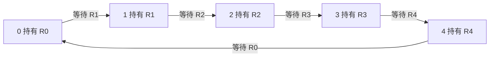

# 東京大学 情報理工学系研究科 コンピュータ科学専攻 2019年8月実施 専門科目I 問題2

## **Author**
祭音Myyura (co-authored with GPT 5.6 SOL)

## **Description**
The following C code models the behavior of each philosopher in the dining philosophers problem.

```c
void philosopher(int i) {
  do {
    pickup(i);
    eat();
    putdown(i);
    think();
  } while (1);
}
```

There are five threads running concurrently on a multiprocessor system, each of which executes the `philosopher` function. The argument $i$ is the index of each thread, where $i = 0, 1, \dots, 4$. In the `philosopher` function, the `eat` and `think` functions are executed in turn repeatedly, while the `pickup` and `putdown` functions are used for synchronization between threads, respectively, before and after the execution of the `eat` function so that two philosophers sitting side by side (namely, the $i$-th and the $(i + 1) \% 5$-th threads for each $i = 0, 1, \dots, 4$) cannot simultaneously execute the `eat` function. Now consider the problem of implementing the `pickup` and `putdown` functions, using binary semaphores. Here, the P and V operations on a binary semaphore X are respectively expressed as `wait(X)` and `signal(X)` in C code, and the counter value of each binary semaphore is initialized to 1. Also, assume that the `eat` and `think` functions never cause a side effect that may influence the outside of each function.

Answer the following questions.

(1) For each $i = 0, 1, \dots, 4$, let $R[i]$ be a binary semaphore. A deadlock may occur when the following `pickup` and `putdown` functions are used. Describe how such a deadlock may occur.

```text
void pickup(int i) {
  wait(R[i]);
  wait(R[(i + 1) % 5]);
}

void putdown(int i) {
  signal(R[i]);
  signal(R[(i + 1) % 5]);
}
```

(2) For each $i = 0, 1, \dots, 4$, let $S[i]$ be a binary semaphore, and `state[i]` be a shared variable that represents the state of the $i$-th thread. Also, let `mutex` be a binary semaphore that is used to achieve a mutual exclusion on all the threads. In order for at least one thread to be able to execute the `eat` and `think` functions repeatedly without a deadlock, the `pickup` and `putdown` functions are redefined as follows. The void-type `test` function sets `state[i]` to `eating` and calls the `signal` function for $S[i]$, if a certain condition is satisfied. Describe the `test` function using C code. Note that you need not consider starvation of each thread. Also, assume that the initial value of `state[i]` is `thinking`.

```text
enum {thinking, eating, waiting} state[5];

void pickup(int i) {
  wait(mutex);
  state[i] = waiting;
  test(i);
  signal(mutex);
  wait(S[i]);
}

void putdown(int i) {
  wait(mutex);
  state[i] = thinking;
  test((i + 4) % 5);
  test((i + 1) % 5);
  signal(mutex);
}
```

(3) Regarding the C code in question (2), answer whether or not a thread may suffer from starvation, assuming that any enabled thread is eventually scheduled. If your answer is "yes", describe how the starvation occurs and briefly explain how to modify the code to avoid the starvation. If your answer is "no", then explain the reason.

### 题目描述

题中 C 函数描述餐桌哲学家问题中每位哲学家的行为：五个线程在多处理器系统上并发运行
`philosopher(i)`，其中 $i=0,1,\ldots,4$。每个线程反复交替执行
`eat()` 和 `think()`；`pickup()`、`putdown()` 分别在进餐前后进行同步，要求相邻的第
$i$ 个与第 $(i+1)\bmod5$ 个线程不能同时执行 `eat()`。需要用初值均为
$1$ 的二值信号量实现这两个函数；P、V 操作分别写作 `wait(X)`、
`signal(X)`。假定 `eat()` 和 `think()` 不产生影响函数外部的副作用。回答下列问题。

（1）对每个 $i$ 设置二值信号量 $R[i]$。在题中第一种实现里，
`pickup(i)` 依次等待 $R[i]$ 和 $R[(i+1)\bmod5]$，
`putdown(i)` 再释放二者。说明该实现如何发生死锁。

（2）对每个 $i$ 设置二值信号量 $S[i]$，共享变量 `state[i]` 表示线程状态，
`mutex` 用于五个线程间的互斥；所有 `state[i]` 初值为 `thinking`。题中重新定义
`pickup`、`putdown`，并调用 `test(i)`：当某个条件满足时，
`test` 应把 `state[i]` 设为 `eating` 并执行 `signal(S[i])`。用 C 代码写出
`test`，使至少有一个线程能够无死锁地反复进餐和思考。本问无需考虑饥饿。

（3）对第（2）问的代码，假设任何已可运行的线程最终都会获得调度，判断某线程是否仍可能饥饿。若可能，描述饥饿发生的过程并简述如何修改代码以避免；若不可能，说明理由。

## **Kai**

### (1)

让五个线程都先完成 `wait(R[i])`，再各自执行第二个 `wait`。此时线程 $i$ 持有 $R[i]$，等待线程 $(i+1)\bmod5$ 持有的资源，形成环形等待，全部无法进入 `putdown`，故死锁。



### (2)

用于许可进餐的信号量必须在启动线程前置为 $S[i]=0$，而 `mutex=1`。若所有信号量已按题面初始化为 $1$，可在启动前对每个 $S[i]$ 执行一次 `wait(S[i])`。

```c
void test(int i) {
    if (state[i] == waiting &&
        state[(i + 4) % 5] != eating &&
        state[(i + 1) % 5] != eating) {
        state[i] = eating;
        signal(S[i]);
    }
}
```

`test` 在 `mutex` 保护下执行，只有两侧均未进餐时才发放许可，因此相邻线程不会同时进餐。若有人等待且无人进餐，检查等待者就会发放许可；正在进餐者放下餐具时也会检查两侧，故不会全体死锁。

若严格保持原题 $S[i]=1$ 且不增加初始化操作，仅补上述 `test` 不能满足互斥要求：邻居已进餐时，新线程虽未获许可，仍会通过第一次 `wait(S[i])`。

### (3)

可能饥饿。在线程 $0$ 等待期间，让互不相邻的线程 $1,4$ 交替进餐，并使每次其中一人结束时另一人仍在进餐。于是两者每次调用 `test(0)` 都失败。线程 $0$ 一直阻塞，故“可运行线程最终获得调度”不能排除此情形。

可在 `mutex` 下维护请求的 FIFO 队列，只允许队首在两侧空闲时取得许可，较晚请求不得越过队首；释放餐具时重新检查队首。在进餐会结束、锁获取也公平的条件下，队首最终获得餐具；每个请求前面只有有限个请求，故不会饥饿。
