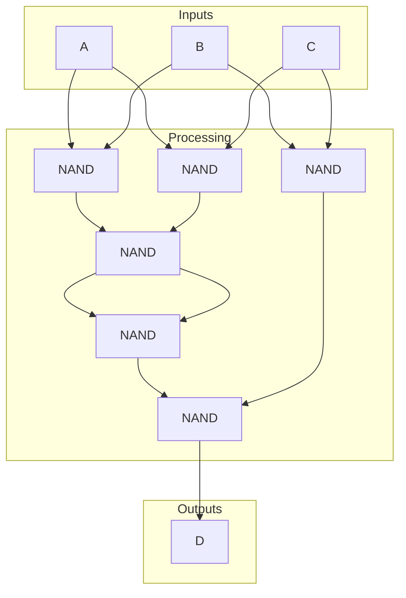
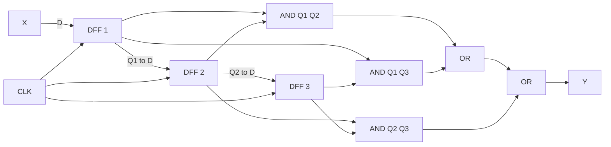

# 東京大学 情報理工学系研究科 コンピュータ科学専攻 2022年2月実施 問題4

## **Author**
[zephyr](https://inshi-notes.zephyr-zdz.space/), 祭音Myyura

## **Description**
Answer the following questions on digital circuits.

(1) Provide a Boolean expression of the output $D$ according to the following truth table. Design and depict a corresponding combinational circuit by using at most six 2-input NAND gates.

Truth table

$$
\begin{array}{|ccc|c|}
\hline
 & \text{Input} & & \text{Output} \\
\hline
A & B & C & D \\
\hline
0 & 0 & 0 & 0 \\
0 & 0 & 1 & 0 \\
0 & 1 & 0 & 0 \\
0 & 1 & 1 & 1 \\
1 & 0 & 0 & 0 \\
1 & 0 & 1 & 1 \\
1 & 1 & 0 & 1 \\
1 & 1 & 1 & 1 \\
\hline
\end{array}
$$

(2) Depict the internal structure of a D-flip-flop, and explain how the D-flip-flop holds a 1-bit value.

(3) Consider a clock-synchronous sequential circuit with a 1-bit input $\mathbf{CLK}$, a 1-bit input $\mathbf{X}$, and a 1-bit output $\mathbf{Y}$, where the input $\mathbf{CLK}$ is used for the clocking. The output $\mathbf{Y}$ is '1' when the number of '1' in the input $\mathbf{X}$ values in the past three clock cycles (excluding the current clock cycle) is greater than the number of '0'. Otherwise, the output $\mathbf{Y}$ is '0'. The output $\mathbf{Y}$ may be any value during the initial three clock cycles after the circuit is powered on. Assume that the circuit satisfies the setup-time and hold-time constraints. Design and depict the circuit. You may use at most two D-flip-flops and an arbitrary number of 2-input AND gates, 2-input OR gates, and NOT gates, if necessary.

---

回答以下有关数字电路的问题。

(1) 根据以下真值表提供输出 $D$ 的布尔表达式。设计并使用最多六个 2 输入 NAND 门绘制相应的组合电路。

真值表

$$
\begin{array}{|ccc|c|}
\hline
 & \text{Input} & & \text{Output} \\
\hline
A & B & C & D \\
\hline
0 & 0 & 0 & 0 \\
0 & 0 & 1 & 0 \\
0 & 1 & 0 & 0 \\
0 & 1 & 1 & 1 \\
1 & 0 & 0 & 0 \\
1 & 0 & 1 & 1 \\
1 & 1 & 0 & 1 \\
1 & 1 & 1 & 1 \\
\hline
\end{array}
$$

(2) 描述 D 触发器的内部结构，并解释 D 触发器如何保持 1 位值。

(3) 考虑一个时钟同步顺序电路，具有 1 位输入 $\mathbf{CLK}$、1 位输入 $\mathbf{X}$ 和 1 位输出 $\mathbf{Y}$，其中输入 $\mathbf{CLK}$ 用于时钟控制。当过去三个时钟周期内（不包括当前时钟周期）输入 $\mathbf{X}$ 的值中 '1' 的数量多于 '0' 的数量时，输出 $\mathbf{Y}$ 为 '1'。否则，输出 $\mathbf{Y}$ 为 '0'。电路上电后的初始三个时钟周期内，输出 $\mathbf{Y}$ 可以是任意值。假设电路满足建立时间和保持时间约束。设计并绘制电路。你可以使用最多两个 D 触发器和任意数量的 2 输入 AND 门、2 输入 OR 门和 NOT 门，如果需要的话。

### 题目描述

回答下列数字电路问题。

（1）题中三输入 $A,B,C$ 的真值表规定：当输入为
`011`、`101`、`110` 或 `111` 时输出 $D=1$，其余四种输入时
$D=0$。写出 $D$ 的布尔表达式，并仅用至多六个二输入 NAND 门设计、画出相应组合电路。

（2）画出 D 触发器的内部结构，并说明它如何保持一位数值。

（3）设计并画出一个时钟同步时序电路：输入为一位时钟 `CLK` 和一位数据
$X$，输出为一位 $Y$。若过去三个时钟周期（不含当前周期）的 $X$ 中
`1` 的数量多于 `0`，则 $Y=1$，否则 $Y=0$；上电后的最初三个周期允许
$Y$ 为任意值。假定满足建立、保持时间约束。最多使用两个 D 触发器，并可任意使用二输入与门、二输入或门和非门。

## **Kai**
### (1)
#### Karnaugh Map

The truth table can be represented as a Karnaugh map:

| C\AB | 00 | 01 | 11 | 10 |
|------|----|----|----|----|
| 0    | 0  | 0  | 1  | 0  |
| 1    | 0  | 1  | 1  | 1  |

We can circle the 1s in the Karnaugh map to simplify the expression:

- $AB = 1$ and $C = 0$
- $A + B = 1$ and $C = 1$

#### Simplified Expression

The simplified Boolean expression for the output $D$ is:

$$
D = AB\overline{C} + (A + B)C
= AB\overline{C} + AC + BC = A(B\overline{C} + C) + BC = AB + AC + BC
$$

#### Combinational Circuit using 2-input NAND Gates

NAND: $A \text{ NAND } B = (A \cdot B)'$

Especially, $A \text{ NAND } A = A'$, so we can use the NAND gate to implement the NOT gate.

First, we simplify the expression further:

$$
D = AB + AC + BC = ((AB + AC + BC)')' = ((AB)' \cdot (AC)' \cdot (BC)')' = ((((AB)' \cdot (AC)')')' \cdot (BC)')'
$$

The corresponding combinational circuit using at most six 2-input NAND gates is as follows:



The circuit uses six 2-input NAND gates to implement the simplified expression for $D$.

### (2)
#### Internal Structure

A D-flip-flop consists of the following components:

1. **D input**: The input data bit to be input to the flip-flop.
2. **Clock input**: The clock signal that controls the operation of the flip-flop.
3. **Q output**: The output of the flip-flop that stores the value of the D input.
4. **Q' output**: The complement of the Q output.

The output Q table for a D-flip-flop is as follows:

| D | CLK | Q(t) | Q(t+1) |
|---|-----|------|--------|
| 0 | 0   | Q(t) | Q(t)   |
| 1 | 0   | Q(t) | Q(t)   |
| 0 | ↑   | Q(t) | 0      |
| 1 | ↑   | Q(t) | 1      |
| 0 | 1   | Q(t) | Q(t)   |
| 1 | 1   | Q(t) | Q(t)   |
| 0 | ↓   | Q(t) | Q(t)   |
| 1 | ↓   | Q(t) | Q(t)   |

A positive-edge-triggered D flip-flop can be built from two level-sensitive D latches in series:

```plaintext
                 E=CLK̅                    E=CLK
D --------> [master D latch] ---- M ----> [slave D latch] --------> Q
CLK --[NOT]--------^                CLK --------^                  Q̅
```

Each D latch may be formed from a gated NAND SR latch. For enable $E$,

$$
\overline S=\operatorname{NAND}(D,E),\qquad
\overline R=\operatorname{NAND}(\overline D,E),
$$

and $\overline S,\overline R$ drive a cross-coupled pair of NAND gates whose outputs are $Q,\overline Q$. When `CLK=0`, the master is transparent and the slave holds. At the rising edge, the master closes and the slave opens, transferring the captured bit to $Q$; the output then remains unchanged until the next rising edge.

#### Explanation

The D-flip-flop therefore stores the value present at $D$ at a rising edge and holds that one-bit value until the next rising edge.

### (3)

Let $X_n$ be the input during cycle $n$. If the output throughout that cycle must be

$$
Y_n=\operatorname{maj}(X_{n-3},X_{n-2},X_{n-1}),
$$

then two D-flip-flops are insufficient. The output must be independent of the current $X_n$.

Write a three-bit history from oldest to newest. Its six distinguishable state classes are:

| State | Histories | $Y$ | Next state for $X=0$ | Next state for $X=1$ |
|---|---|---:|---|---|
| A | 000, 100 | 0 | A | B |
| B | 001 | 0 | C | D |
| C | 010 | 0 | A | E |
| D | 011, 111 | 1 | F | D |
| E | 101 | 1 | C | D |
| F | 110 | 1 | A | E |

States with different current outputs are distinguishable immediately. Among the zero-output states, input $1$ separates A from B and C, while the two-symbol input $01$ separates B from C. Among the one-output states, input $0$ separates D from E and F, while input $01$ separates E from F. All six states can occur after the unconstrained initial three cycles. Therefore any implementation needs at least

$$
\lceil\log_2 6\rceil=3
$$

stored bits; two D-flip-flops provide only four states.

With three D-flip-flops, a direct implementation is

$$
Q_1(n+1)=X_n,\quad Q_2(n+1)=Q_1(n),\quad Q_3(n+1)=Q_2(n),
$$

$$
Y_n=Q_1Q_2+Q_1Q_3+Q_2Q_3.
$$



After three sampling edges, $(Q_1,Q_2,Q_3)=(X_{n-1},X_{n-2},X_{n-3})$, independently of the initial register contents, so this circuit gives the specified output.

## **Knowledge**

布尔代数 逻辑电路 D触发器

### 难点解题思路

对于第（3）问，考生需要理解D触发器的工作原理以及如何使用组合逻辑电路进行计数和比较。这需要扎实的时序电路基础和布尔代数知识。

### 解题技巧和信息

在解答涉及时序电路的题目时，先画出状态图或状态表，明确各个状态之间的转换关系。然后，根据状态图设计出D触发器的连接方式和所需的逻辑门。

### 重点词汇

- **Boolean expression** 布尔表达式
- **NAND gate** 与非门
- **D-flip-flop** D触发器
- **Clock signal** 时钟信号
- **Sequential circuit** 时序电路

### 参考资料

1. "Digital Design" by M. Morris Mano, Chap. 5
2. "Fundamentals of Logic Design" by Charles H. Roth, Chap. 7
