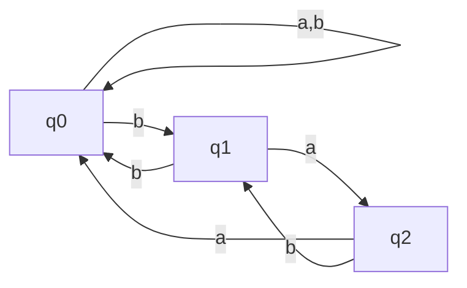
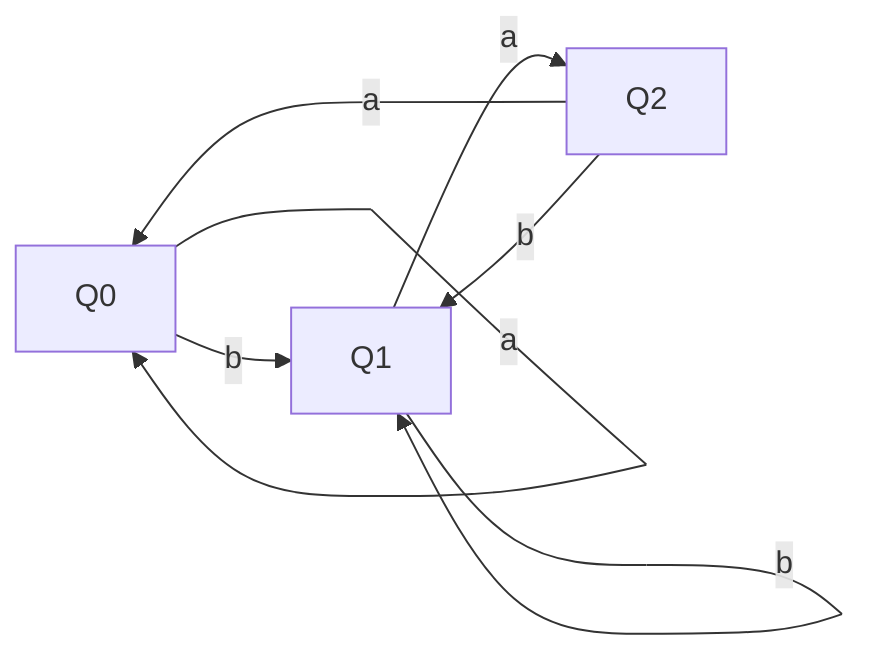

# 東京大学 情報理工学系研究科 コンピュータ科学専攻 2022年2月実施 問題3

## **Author**
[zephyr](https://inshi-notes.zephyr-zdz.space/)

## **Description**
Let $\Sigma = \{a,b\}$. Answer the following questions.

(1) Give a non-deterministic finite state automaton with 3 states that accepts the following language.

$$
\{wba | w \in \Sigma^*\}
$$

(2) Show the minimal deterministic finite state automaton that accepts the language given in question (1).

(3) Prove that the following language $L$ over $\Sigma$ is not regular. You may use the pumping lemma for regular languages.

$$
L = \{w^Rbaw | w \in \Sigma^*\}
$$

Here, $w^R$ denotes the reverse of $w$. For example, $(abb)^R = bba$.

(4) Is the language $L$ in question (3) a context-free language? If it is, construct a context-free grammar that generates $L$. If not, prove that $L$ is not a context-free language.

---

让 $\Sigma = \{a,b\}$。回答以下问题。

(1) 给出一个具有 3 个状态的非确定性有限状态自动机，该自动机接受以下语言。

$$
\{wba | w \in \Sigma^*\}
$$

(2) 展示接受问题 (1) 中给出的语言的最小确定性有限状态自动机。

(3) 证明以下语言 $L$ 在 $\Sigma$ 上不是正则的。你可以使用正则语言的泵引理。

$$
L = \{w^Rbaw | w \in \Sigma^*\}
$$

这里，$w^R$ 表示 $w$ 的反转。例如，$(abb)^R = bba$。

(4) 问题 (3) 中的语言 $L$ 是上下文无关语言吗？如果是，构造一个生成 $L$ 的上下文无关文法。如果不是，证明 $L$ 不是上下文无关语言。

## **Kai**
### (1)

A non-deterministic finite state automaton (NFA) with 3 states that accepts the language $\{wba \mid w \in \Sigma^*\}$ can be constructed as follows:

- States: $q_0, q_1, q_2$
- Alphabet: $\{a, b\}$
- Start state: $q_0$
- Accept state: $q_2$
- Transition function:
  - $q_0 \xrightarrow{a,b} q_0$
  - $q_0 \xrightarrow{b} q_1$
  - $q_1 \xrightarrow{a} q_2$
  - $q_1 \xrightarrow{b} q_0$
  - $q_2 \xrightarrow{a} q_0$
  - $q_2 \xrightarrow{b} q_1$

The state diagram for the NFA is as follows:

### (2)

To construct the minimal deterministic finite state automaton (DFA) for the language $\{wba \mid w \in \Sigma^*\}$, we can use the subset construction method to convert the NFA to a DFA.

We can represent the NFA as a DFA with the following states:

- $\delta(q_0, a) = q_0$
- $\delta(q_0, b) = \{q_0, q_1\}$
- $\delta(\{q_0, q_1\}, a) = \{q_0, q_2\}$
- $\delta(\{q_0, q_1\}, b) = \{q_0, q_1\}$
- $\delta(\{q_0, q_2\}, a) = q_0$
- $\delta(\{q_0, q_2\}, b) = \{q_0, q_1\}$

This DFA is minimal and accepts the language $\{wba \mid w \in \Sigma^*\}$.

The transition table for the DFA is as follows:

So we can construct the minimal DFA as follows:

- States: $\{Q_0, Q_1, Q_2\}$
- Alphabet: $\{a, b\}$
- Start state: $Q_0$
- Accept state: $Q_2$
- Transition function:
  - $\delta(Q_0, a) = Q_0$
  - $\delta(Q_0, b) = Q_1$
  - $\delta(Q_1, a) = Q_2$
  - $\delta(Q_1, b) = Q_1$
  - $\delta(Q_2, a) = Q_0$
  - $\delta(Q_2, b) = Q_1$

The state diagram for the minimal DFA is as follows:

### (3)

To prove that the language $L = \{w^{\mathbf{R}}baw \mid w \in \Sigma^*\}$ is not regular, we will use the pumping lemma for regular languages.

#### Pumping Lemma for Regular Languages

If $L$ is a regular language, then there exists a pumping length $p$ such that any string $s \in L$ with $|s| \geq p$ can be split into three parts $s = xyz$ satisfying the following conditions:

1. $|xy| \leq p$
2. $|y| > 0$
3. $xy^iz \in L$ for all $i \geq 0$

Let $w = a^p$, and consider the string $s = w^{\mathbf{R}}baw = a^p b a a^p$. According to the pumping lemma, $s$ can be decomposed into $xyz$ such that the conditions are met.

- Let $x = a^i$, $y = a^j$, $z = a^{p-i-j} b a a^p$ where $1 \leq i+j \leq p$ and $j > 0$.

If we pump $y$, the resulting string is $xy^2z = a^i a^{2j} a^{p-i-j} b a a^p = a^{p+j} b a a^p$.

This string is not in $L$ because it does not match the form $w^{\mathbf{R}}baw$ where $w = a^p$. Thus, $L$ is not a regular language.

### (4)

To determine whether $L$ is a context-free language, we can use the context-free grammar (CFG) approach.

#### Constructing a CFG for $L$

We need to create a CFG that generates strings of the form $w^{\mathbf{R}}baw$ where $w \in \Sigma^*$.

A CFG that generates this language can be defined as follows:

- Non-terminals: $S, A$
- Terminals: $a, b$
- Start symbol: $S$
- Production rules:
  - $S \rightarrow ba \mid a S a \mid b S b$

This CFG generates strings of the form $w^{\mathbf{R}}baw$ by recursively placing matching symbols $a$ and $b$ around the center substring $b$.

Therefore, $L$ is a context-free language.

## **Knowledge**

NFA DFA 正则语言 泵引理 上下文无关语言

### 难点解题思路

对于问题 3，使用抽象的语言对泵引理的证明往往会遇到困难。我们选择具体的字符串 $w = a^p$ 并展示在不同情况下的行为以证明该语言非正则性。问题 4 则是运用构造法，结合递归的生成规则，清晰地表达语言的上下文无关性质。

### 解题技巧和信息

1. NFA 转换为 DFA 时，确保考虑每种状态转换的可能性，尽量简化状态数量。
2. 利用泵引理证明非正则性时，选择一个能覆盖所有可能情况下的字符串。
3. 构造 CFG 时，利用递归规则可以简洁地表达嵌套的结构。

### 重点词汇

- Non-deterministic finite state automaton (NFA) 非确定性有限状态自动机
- Deterministic finite state automaton (DFA) 确定性有限状态自动机
- Pumping Lemma 泵引理
- Context-free grammar (CFG) 上下文无关文法
- Regular language 正则语言
- Context-free language 上下文无关语言

### 参考资料

1. "Introduction to the Theory of Computation" by Michael Sipser, Chapters 1-2 for Automata and Regular Languages, Chapter 4 for Context-Free Grammars.
