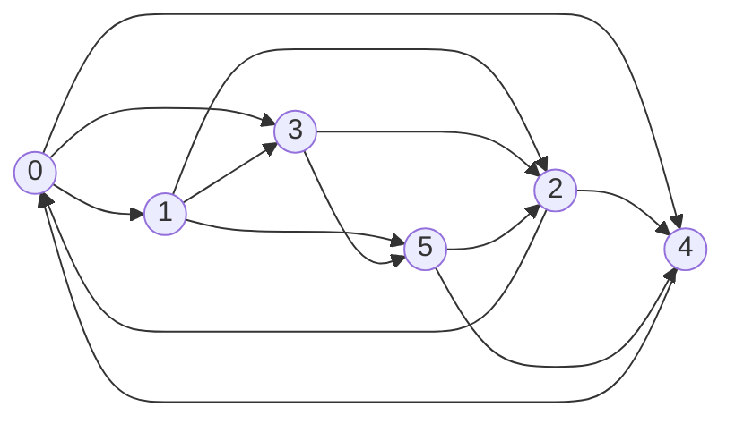
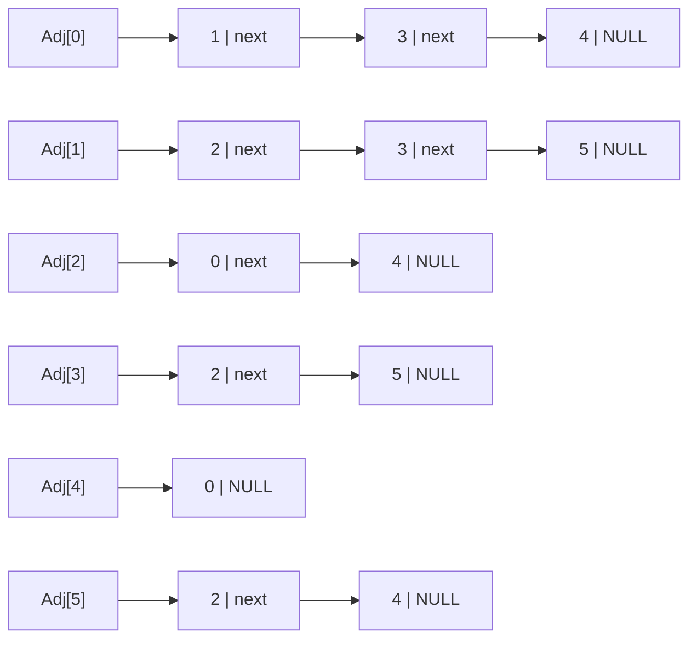
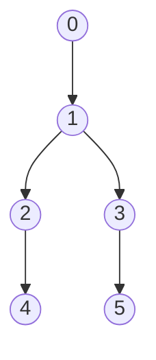

# 東京大学 情報理工学系研究科 電子情報学専攻 2012年8月実施 専門 第3問

## **Author**


祭音Myyura (co-authored with GPT 5.6 SOL)

## **Description**

有向グラフに関する以下の設問に答えよ。本問題では、有向グラフは自己ループも多重辺も含まないものとする。

(1) 図1に示された有向グラフの隣接行列による表現と、隣接リストによる表現を図示せよ。隣接リストの表現としては図2に示すものを用いよ。

(2) 隣接行列の各要素、隣接リストにおける各頂点のラベル、および各ポインタを格納するのに同じ大きさのメモリを使用する場合、図1の有向グラフについてどちらの表現がよりメモリ容量を必要とするか答えよ。

(3) 有向グラフの頂点数を $N$ に固定したとき、どちらの表現でもメモリ容量が同じになる辺の数を答えよ。この条件を満たすとき有向グラフは必ず弱連結となるかどうか、理由と共に答えよ。ただし、弱連結とは有向辺を無向に置き換えた無向グラフが連結であることを言う。

(4) 以下の疑似コードは有向グラフ $G$ を深さ優先探索するものである。$G$ は頂点集合 $V$ と有向辺集合 $E$ からなるものとする。図1の有向グラフを頂点 $0$ から深さ優先探索したときの探索木を図示せよ。

```text
Traverse(Graph G)
    foreach v ∈ V { v.setMark(UNVISITED) }
    foreach v ∈ V {
        if (v.getMark() == UNVISITED) DFS(G, v)
    }
DFS(Graph G, Vertex v)
    v.setMark(VISITED)
    foreach (v, w) ∈ E {
        if (w.getMark() == UNVISITED) DFS(G, w)
    }
```

(5) グラフ上において、始点と終点が同じである有向経路を有向サイクルと呼ぶ。グラフに有向サイクルが存在すればそのうち1つを発見し、それに含まれる頂点の集合を出力するアルゴリズムを、疑似コードを用いて記述せよ。

図1：



図2：各セルは「頂点ラベル、次セルへのポインタ」を持ち、最後のポインタは `NULL` とする。


## **Kai**

### (1)

行を辺の始点、列を終点とし、頂点を $0,1,\ldots,5$ の順に並べる。

$$
A=\begin{pmatrix}
0&1&0&1&1&0\\
0&0&1&1&0&1\\
1&0&0&0&1&0\\
0&0&1&0&0&1\\
1&0&0&0&0&0\\
0&0&1&0&1&0
\end{pmatrix}.
$$

隣接リストは頂点番号を添字とする先頭ポインタ配列 `Adj` で管理する。



### (2)

各要素の大きさを1単位とする。頂点数 $6$、辺数 $13$ より、

$$
\text{隣接行列}:6^2=36,\qquad
\text{隣接リスト}:6+2\cdot13=32.
$$

したがって、隣接行列の方が大きい。リストの $6$ は先頭ポインタ、$2\cdot13$ は各辺の終点ラベルと次ポインタの容量である。

### (3)

辺数を $M$ とすると、

$$
N^2=N+2M\quad\Longrightarrow\quad
\boxed{M=\frac{N(N-1)}2}.
$$

必ずしも弱連結ではない。例えば $N=4$ とし、3頂点の間に両方向の辺をすべて置き、残りの1頂点を孤立させると、辺数は $3\cdot2=6=N(N-1)/2$ だが弱連結ではない。

### (4)

隣接頂点を番号の昇順で調べると、発見順は $0,1,2,4,3,5$ であり、探索木は次のとおり。



### (5)

未発見を `WHITE`、探索中を `GRAY`、探索終了を `BLACK` とする。探索中の祖先への辺を発見したら、親をたどってサイクルの頂点集合を得る。

```text
FindCycle(G):
    for v in V:
        color[v] = WHITE
        parent[v] = NIL
    for v in V:
        if color[v] == WHITE:
            C = DFS(v)
            if C != NONE:
                output C
                return
    output "有向サイクルなし"

DFS(v):
    color[v] = GRAY
    for w in Adj[v]:
        if color[w] == WHITE:
            parent[w] = v
            C = DFS(w)
            if C != NONE:
                return C
        else if color[w] == GRAY:
            C = {w}
            x = v
            while x != w:
                C.add(x)
                x = parent[x]
            return C
    color[v] = BLACK
    return NONE
```

`GRAY` の頂点は再帰スタック上にあるので、親の道 $w\leadsto v$ と辺 $v\to w$ が有向サイクルをなす。各頂点・辺を高々一定回調べるため、時間計算量は $O(|V|+|E|)$ である。
