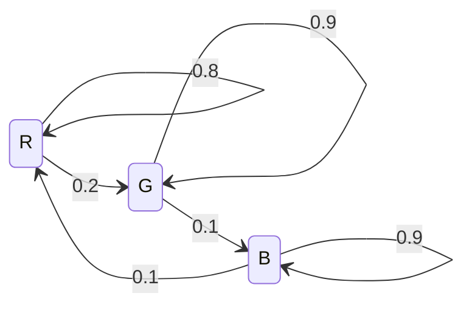

# 東京大学 情報理工学系研究科 電子情報学専攻 2012年8月実施 専門 第5問

## **Author**

祭音Myyura (co-authored with GPT 5.6 SOL)

## **Description**

一定の時間間隔で、赤（R）、緑（G）、青（B）のいずれかのランプの光る装置がある。その光り方には、以下のような特徴がある。

- R の直後には、R と G のどちらかが、それぞれ $0.8$ と $0.2$ の確率で光る。
- G の直後には、G と B のどちらかが、それぞれ $0.9$ と $0.1$ の確率で光る。
- B の直後には、B と R のどちらかが、それぞれ $0.9$ と $0.1$ の確率で光る。

この装置の光の点灯を情報源 $S$ として、以下の問いに答えよ。

(1) 情報源 $S$ は、一次のマルコフ情報源である。その状態遷移図を示せ。

(2) R, G, B それぞれが点灯する定常状態確率を求めよ。

(3) 情報源 $S$ からの点灯系列を効率よく符号化して伝送したい。点灯を $2$ つずつまとめて $0,1$ からなる $2$ 元符号を割り当てる場合に、最も効率の良い符号を設計せよ。また、その時の $1$ 点灯あたりの平均符号長を求めよ。

(4) 同じ色の点灯が継続して続く傾向があることを考慮し、以下に示す $9$ つの点灯のまとまりに対して $0,1$ からなる $2$ 元符号の割り当てを行う場合、最も効率の良い符号を設計せよ。また、その時の $1$ 点灯あたりの平均符号長を求めよ。

$$
\mathrm{RG,\ RRG,\ RRR,\ GB,\ GGB,\ GGG,\ BR,\ BBR,\ BBB}
$$

(5) この情報源 $S$ の平均符号長はどこまで短くすることができるか。その最小値を求めよ。

（なお、計算に当たっては、$\log_2 3=1.58,\ \log_2 5=2.32$ を必要に応じて用いよ。）

## **Kai**

### (1)

### (2)

定常確率を $(\pi_R,\pi_G,\pi_B)$ とすると、

$$
0.2\pi_R=0.1\pi_G=0.1\pi_B,\qquad
\pi_R+\pi_G+\pi_B=1.
$$

したがって、

$$
\boxed{(\pi_R,\pi_G,\pi_B)=\left(\frac15,\frac25,\frac25\right)}.
$$

### (3)

$P(X_n=i,X_{n+1}=j)=\pi_iP_{ij}$ に対してハフマン符号を構成する。

| 点灯の組 | 確率 | 符号 |
| --- | --- | --- |
| GG | $0.36$ | `0` |
| BB | $0.36$ | `10` |
| RR | $0.16$ | `110` |
| RG | $0.04$ | `1110` |
| GB | $0.04$ | `11110` |
| BR | $0.04$ | `11111` |

他の組の確率は $0$ である。$1$ 点灯あたりの平均符号長は

$$
\boxed{\overline L_2=
\frac{0.36+2(0.36)+3(0.16)+(4+5+5)(0.04)}2
=1.06\ \text{bit／点灯}}.
$$

### (4)

系列を指定されたまとまりに順次、重なりなく区切る。まとまりの先頭色の定常分布を $\mu$ とする。先頭色から末尾色への遷移行列 $D$ と、通常の一段遷移行列 $P$ は

$$
D=\begin{pmatrix}.64&.36&0\\0&.81&.19\\.19&0&.81\end{pmatrix},\qquad
P=\begin{pmatrix}.8&.2&0\\0&.9&.1\\.1&0&.9\end{pmatrix}.
$$

次のまとまりの先頭色への遷移は $DP$ なので、$\mu=\mu DP$、$\sum_i\mu_i=1$ より

$$
\boxed{\mu=(\mu_R,\mu_G,\mu_B)
=\frac1{62277}(12773,24772,24732)}.
$$

この分布に対するハフマン符号の一例は次のとおり。

| まとまり | 確率 | 符号 |
| --- | --- | --- |
| RG | $.2\mu_R$ | `0101` |
| RRG | $.16\mu_R$ | `0000` |
| RRR | $.64\mu_R$ | `011` |
| GB | $.1\mu_G$ | `0100` |
| GGB | $.09\mu_G$ | `0010` |
| GGG | $.81\mu_G$ | `11` |
| BR | $.1\mu_B$ | `0011` |
| BBR | $.09\mu_B$ | `0001` |
| BBB | $.81\mu_B$ | `10` |

まとまりあたりの平均符号長と平均点灯数はそれぞれ

$$
\begin{aligned}
\mathrm E[\ell]&=3.36\mu_R+2.38\mu_G+2.38\mu_B
=\frac{803684}{311385},\\
\mathrm E[N]&=2.8\mu_R+2.9\mu_G+2.9\mu_B
=\frac{179326}{62277}.
\end{aligned}
$$

したがって、

$$
\boxed{\overline L_{\mathrm{v}}=\frac{\mathrm E[\ell]}{\mathrm E[N]}
=\frac{57406}{64045}\simeq0.8963\ \text{bit／点灯}}.
$$

### (5)

下限は情報源のエントロピー率である。$h_2(p)=-p\log_2p-(1-p)\log_2(1-p)$ とおき、指定の対数近似を用いると

$$
\begin{aligned}
H(S)&=\frac15h_2(0.2)+\frac45h_2(0.1)\\
&=\log_2 5+\frac{12}{25}-\frac{36}{25}\log_2 3\\
&\simeq\boxed{0.5248\ \text{bit／点灯}}.
\end{aligned}
$$

十分長いブロックを符号化すれば、この値に任意に近づけられる。
