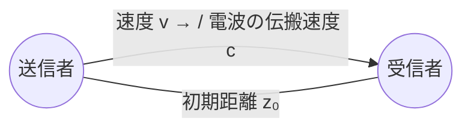

# 東京大学 情報理工学系研究科 電子情報学専攻 2013年8月実施 専門 第4問

## **Author**

祭音Myyura (co-authored with GPT 5.6 SOL)

## **Description**

図1のフーリエ変換 $M(f)$ を持つ、帯域幅 $B\ [\mathrm{Hz}]$ のベースバンド信号 $m(t)$ について、以下の設問に答えよ。ただし、送信者と受信者間の通信には理想的な電波伝搬を仮定し、マルチパスによる影響はないものとする。三角関数の公式

$$
\cos A\cos B=\frac12\bigl(\cos(A+B)+\cos(A-B)\bigr)
$$

を必要に応じて使ってもよい。

(1) $m(t)$ により、周波数 $f_C>B\ [\mathrm{Hz}]$ の搬送波 $\cos(2\pi f_Ct)$ を振幅変調する。このとき、変調された電磁波の信号 $x(t)=m(t)\cos(2\pi f_Ct)$ のフーリエ変換 $X(f)$ を図示せよ。

(2) $m(t)=M$（$M$ は定数）としたときの変調信号 $x(t)$ を $z\ [\mathrm m]$ 離れた場所で受信する。受信信号 $y(t)$ を求めよ。ここで、電磁波の伝搬速度を $c\ [\mathrm{m/sec}]$ とし、伝搬による信号減衰は無視してよい。

(3) 図2に示すように、送信者が受信者に向かって一定速度 $v\ [\mathrm{m/sec}]$（$v<c$）で近づいていたとき、受信信号の搬送波周波数 $f\ [\mathrm{Hz}]$ を求めよ。ここで、送信者と受信者は最初 $z_0\ [\mathrm m]$ 離れているものとする。

(4) (3) において $m(t)=\cos(2\pi pt)$ としたときの受信信号 $y(t)$ を求めよ。ここで、$\cos$ の積は和に展開せよ。

(5) (3) の搬送波周波数 $f\ [\mathrm{Hz}]$ が予測できたため、(4) の受信信号 $y(t)$ を $\cos(2\pi ft)$ で同期検波したとする。得られるベースバンド信号 $m_R(t)$ を求め、振幅、周波数、位相にいかなる影響が生じるか述べよ。

(6) (5) において、ほぼ元信号に比例した信号を得るためにはどのような条件が必要か述べよ。

図1：$M(f)$ は原点で最大となる山形のスペクトルで、$|f|>B$ では $0$ である。

図2：送信者は、初期距離 $z_0$ だけ離れた静止受信者に向かって速度 $v$ で移動する。

## **Kai**

### (1)

変調の性質より、

$$
\boxed{X(f)=\frac12M(f-f_C)+\frac12M(f+f_C).}
$$

$M(f)$ を $\pm f_C$ に平行移動し、高さを $1/2$ にした二つのスペクトルとなる。各帯域は $[-f_C-B,-f_C+B]$ と $[f_C-B,f_C+B]$ である。

### (2)

伝搬遅延は $z/c$ なので、

$$
\boxed{y(t)=M\cos\left(2\pi f_C\left(t-\frac zc\right)\right).}
$$

### (3)

以下では、送信信号の時刻を受信者と共通の座標時刻で定義し、振幅の変化を無視する。

時刻 $\tau$ に送信された波の受信時刻を $t$ とすると、

$$
t=\tau+\frac{z_0-v\tau}{c},\qquad
\tau=\frac{ct-z_0}{c-v}.
$$

したがって、ドップラー効果によって

$$
\boxed{f=\frac{c}{c-v}f_C.}
$$

### (4)

$\kappa=c/(c-v)$、$t_0=z_0/c$ とおくと、$\tau=\kappa(t-t_0)$ である。よって、

$$
\boxed{y(t)=\frac12\cos\bigl(2\pi\kappa(f_C+p)(t-t_0)\bigr)
+\frac12\cos\bigl(2\pi\kappa(f_C-p)(t-t_0)\bigr).}
$$

### (5)

$y(t)$ に $\cos(2\pi ft)$ を掛け、周波数 $2f$ 付近の高周波成分を低域通過フィルタで除くと、

$$
\boxed{m_R(t)=\frac12\cos(2\pi ft_0)\,
\cos\bigl(2\pi\kappa p(t-t_0)\bigr).}
$$

したがって、振幅係数は $\frac12\cos(2\pi f_Cz_0/(c-v))$、周波数は $\kappa p$、位相は $-2\pi pz_0/(c-v)$ となる。搬送波の位相差によって出力が消失する場合もある。

### (6)

ベースバンドのドップラー変化と遅延が無視でき、搬送波の位相差による振幅係数が $0$ にならないことが必要である。十分条件は

$$
\frac vc\ll1,\qquad \frac{pz_0}{c-v}\ll1,
\qquad \left|\cos\frac{2\pi f_Cz_0}{c-v}\right|\not\approx0.
$$

観測時間 $T_{\mathrm{obs}}$ にわたり波形を一致させるには、さらに $|\kappa-1|pT_{\mathrm{obs}}\ll1$ とする。遅延を補償し、搬送波の位相も同期させれば、位相差に関する制約を除ける。
