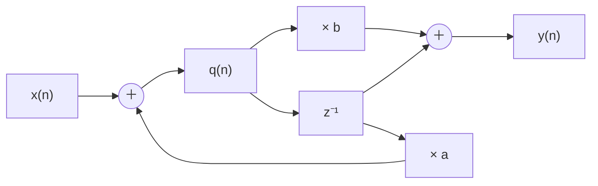

# 東京大学 情報理工学系研究科 電子情報学専攻 2013年8月実施 専門 第5問

## **Author**

祭音Myyura (co-authored with GPT 5.6 SOL)

## **Description**

離散信号処理に関する以下の問いに答えよ。

(1) $z$ を複素変数として、離散信号 $x(n)$ の $Z$ 変換の定義 $X(z)$ を示せ。ただし、$n<0$ のとき $x(n)=0$ とする。

(2) $x(n)$ を $m$ だけずらした信号 $x(n-m)$ の $Z$ 変換 $X'(z)$ を導出過程を示した上で求めよ。

(3) 下図に示す離散時間システムの応答を考える。システムの内部状態を示す状態変数 $q(n)$ を用いて、本システムを連立差分方程式で表せ。

(4) (3) の差分方程式の $Z$ 変換を示せ。ただし、$q(n)$ の $Z$ 変換を $Q(z)$、初期値を $q(-1)=q_0$ とする。

(5) (3) と (4) の結果を用いて、入力 $x(n)$ がゼロの場合のゼロ入力応答 $y(n)$ を求めよ。

(6) 初期値を $q_0=0$ とし、下記の単位ステップ信号 $u(n)$ を入力とした場合の単位ステップ応答 $y(n)$ を求めよ。

$$
u(n)=\begin{cases}1&n\ge0,\\0&n<0.\end{cases}
$$

## **Kai**

### (1)

$$
\boxed{X(z)=\sum_{n=0}^{\infty}x(n)z^{-n}}
$$

と定義する。$z$ はこの級数が収束する領域に取る。

### (2)

$m\ge0$ のとき、$k=n-m$ とおけば、$k<0$ で $x(k)=0$ より

$$
X'(z)=\sum_{n=0}^{\infty}x(n-m)z^{-n}
=z^{-m}\sum_{k=-m}^{\infty}x(k)z^{-k}
=\boxed{z^{-m}X(z)}.
$$

前進 $m=-r<0$ の場合は、片側 $Z$ 変換なので

$$
X'(z)=z^r\left[X(z)-\sum_{k=0}^{r-1}x(k)z^{-k}\right].
$$

### (3)

遅延器の出力は $q(n-1)$ だから、

$$
\boxed{q(n)=x(n)+a q(n-1),\qquad y(n)=b q(n)+q(n-1)}.
$$

### (4)

$$
\mathcal Z\{q(n-1)\}=z^{-1}Q(z)+q_0
$$

より、

$$
\boxed{(1-a z^{-1})Q(z)=X(z)+a q_0},\qquad
\boxed{Y(z)=(b+z^{-1})Q(z)+q_0}.
$$

### (5)

$X(z)=0$ とすると

$$
Q(z)=\frac{a q_0}{1-a z^{-1}},\qquad
Y(z)=\frac{(ab+1)q_0}{1-a z^{-1}}.
$$

したがって、

$$
\boxed{y(n)=(ab+1)a^n q_0\quad(n\ge0)}.
$$

### (6)

$q_0=0$ より $q(n)=\sum_{k=0}^{n}a^k$ である。したがって、$n\ge0$ に対し

$$
\boxed{
y(n)=\begin{cases}
\displaystyle\frac{b+1-(ab+1)a^n}{1-a},&a\ne1,\\[2mm]
b(n+1)+n,&a=1.
\end{cases}}
$$

実際、$y(0)=b$ である。
