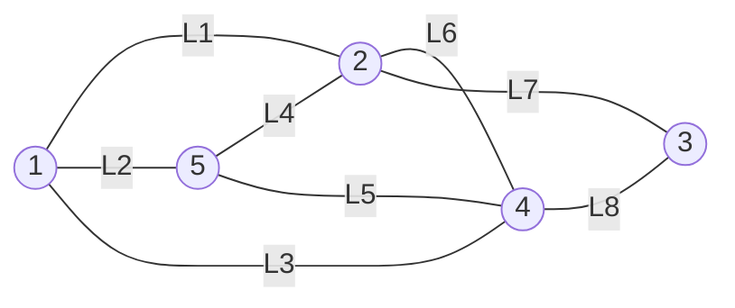
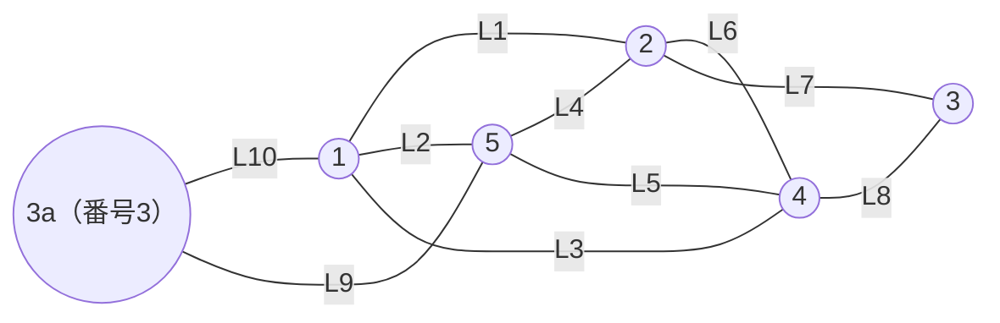
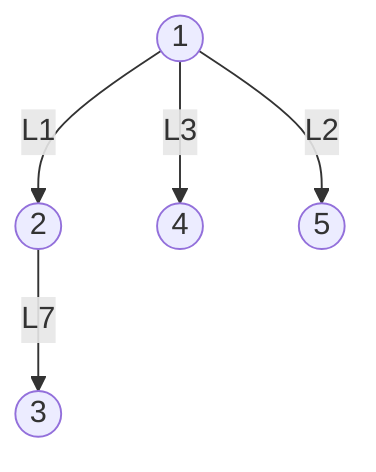
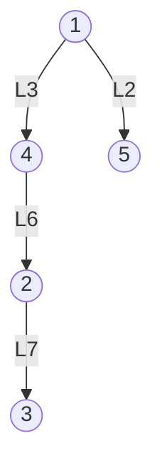
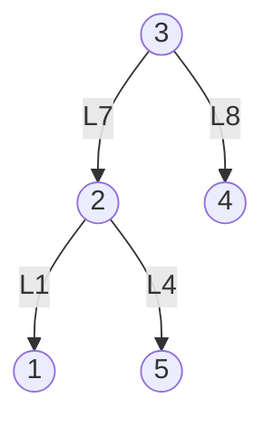
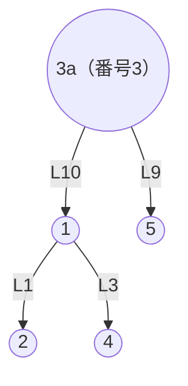

# 東京大学 情報理工学系研究科 電子情報学専攻 2014年8月実施 専門 第4問

## **Author**

祭音Myyura (co-authored with GPT 5.6 SOL)

## **Description**

ノードとリンクから構成されるネットワークにおける IP パケットの配送経路を計算するために以下に述べるアルゴリズムが適用されたシステムを考える。

経路計算アルゴリズム：各ノードは、各ノードがリンクで接続されているすべての隣接ノードに、$\{\text{宛先ノード、次ホップノード、ホップ数}\}$ を行ベクトルとする経路表を $30\ [\mathrm{sec}]$ ごとに通知する。図1は、ノード A の経路表の例を示している。なお、図のホップ数 $d(i,j)$ は、次の計算式にしたがって計算され、自ノード $i$ から宛先ノード $j$ に到達するために必要な最小ホップ数を示している。

$$
d(i,j)=\min_k\{d(i,k)+d(k,j)\},\qquad
k\text{ はノード }i\text{ のすべての隣接ノード}.
$$

なお、同じコストの経路が存在する時には、ノードの番号がより小さい値を持つ隣接ノードを経由する経路が選択されるものとする。以下の問いに答えよ。

(1) 図2のネットワークにおいて、経路表の交換がノード間で十分に行われ、経路表が収束した時のノード $1$ の経路表を示せ。図中の丸がノードを表し、その中の数字がノード番号を示しているものとする。ノードを接続するリンクは線で示されており $L_i$（$i$ は整数）でリンクを表現している。

(2) 各ノードの経路表の情報から、ノード $1$ を根とする残りのすべてのノード $(2,3,4,5)$ への転送経路を示す Spanning Tree を作成することができる。この Spanning Tree を示せ。

(3) リンク $L_1$ と $L_8$ が同時に切断された。経路表が収束した時の、ノード $1$ の経路表を示すとともに、収束時のノード $1$ を根とする残りのすべてのノード $(2,3,4,5)$ への転送経路を示す Spanning Tree を示せ。

(4) 図3に示すように、ノード $3$ と同じノード番号を持つノード $3a$ が、リンク $L_{10}$ を用いてノード $1$ と、リンク $L_9$ を用いてノード $5$ と接続された。この新しく接続されたノード $3a$ は、図の右端のノード $3$ と同じノード番号を用いて経路表を隣接ノードに通知するものとする。経路表の交換がノード間で十分に行われ、経路表が収束した時の、ノード $3$ を根とする Spanning Tree とノード $3a$ を根とする Spanning Tree をそれぞれ示せ。

(5) 同じ番号を持つ複数のノードを、意図的にインターネット上に存在させることがある。この運用法の良い利用法と悪い利用法を示せ。

図1：ノード A の経路表の例。

| 宛先ノード | 次ホップノード | ホップ数 |
| --- | --- | --- |
| A | A | $d(A,A)=0$ |
| B | C | $d(A,B)=3$ |
| C | C | $d(A,C)=1$ |
| $\vdots$ | $\vdots$ | $\vdots$ |
| Z | B | $d(A,Z)=4$ |

図2：各リンクのホップ数は $1$。

図3：図2に $3a$ と $L_9,L_{10}$ を追加したネットワーク。

## **Kai**

### (1)

宛先 $3$ への最短路は $1\to2\to3$ と $1\to4\to3$ で同長なので、番号の小さい次ホップ $2$ を選ぶ。

| 宛先 | 次ホップ | ホップ数 |
| --- | --- | --- |
| 1 | 1 | 0 |
| 2 | 2 | 1 |
| 3 | 2 | 2 |
| 4 | 4 | 1 |
| 5 | 5 | 1 |

### (2)

### (3)

宛先 $2$ への最短路は $4$ 経由と $5$ 経由で同長なので $4$ を選び、宛先 $3$ へも $4\to2$ を経由する。

| 宛先 | 次ホップ | ホップ数 |
| --- | --- | --- |
| 1 | 1 | 0 |
| 2 | 4 | 2 |
| 3 | 4 | 3 |
| 4 | 4 | 1 |
| 5 | 5 | 1 |

### (4)

図3のリンク構成を用いる。根 $3$ から宛先 $1,5$ へは、同長の経路のうち次ホップ $2$ を選ぶ。

根 $3a$ から宛先 $2,4$ へは、同長の経路のうち次ホップ $1$ を選ぶ。

両者は同じ宛先番号 $3$ として扱われるため、これらは番号 $1,\ldots,5$ への転送木であり、$3$ と $3a$ を相互に区別して配送することはできない。

### (5)

良い利用法は、同一サービスを提供する複数拠点に同じ IP アドレスを割り当て、経路上近い拠点へ配送するエニーキャストである。負荷分散と冗長化に利用できる。

悪い利用法は、他者の IP アドレスへの経路を不正に広告し、パケットを自分へ誘導して盗聴・改ざん・破棄する経路ハイジャックである。
