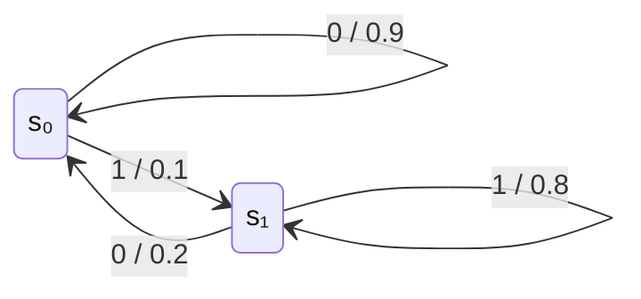

# 東京大学 情報理工学系研究科 電子情報学専攻 2014年8月実施 専門 第5問

## **Author**

[diohabara](https://github.com/diohabara/open_inshi), 祭音Myyura

## **Description**

以下のような状態遷移図で示される二元単純マルコフ情報源を考える。枝のラベルは「出力／遷移確率」を表す。

以下の問いに答えよ。

(1) 状態 $s_0,s_1$ の定常確率 $w_0,w_1$ を求めよ。

(2) 定常状態において出力 $1$ の発生する確率を求めよ。

(3) 出力系列から、直前および直後が $0$ である $1$ の連続（$1$ のラン）を任意に一つ取り出した時、その長さが $1,2,k$ である確率をそれぞれ求めよ。

(4) $1$ のランの平均長を求めよ。

(5) この情報源のエントロピーを求めよ。

(6) (2) で求めた生成確率でランダムに $1$ が発生する情報源のエントロピーを求めよ。この値と (5) で求めた値の違いについて論ぜよ。

（なお、計算に当たっては、$\log_2 3=1.58,\ \log_2 5=2.32$ を必要に応じて用いよ。）

### 题目描述

考虑上图状态转移图所表示的二元一阶马尔可夫信息源，回答下列问题。

(1) 求状态 $s_0,s_1$ 的平稳概率 $w_0,w_1$。

(2) 求平稳状态下输出符号 $1$ 的概率。

(3) 从输出序列中任取一段前后均为 $0$ 的连续 $1$（即一个 $1$ 游程），分别求其长度为 $1$、$2$、$k$ 的概率。

(4) 求 $1$ 游程的平均长度。

(5) 求该信息源的熵率。

(6) 构造一个以 (2) 所求概率独立随机地产生 $1$ 的信息源，求其熵，并讨论该值与 (5) 结果的差异。

计算时可按需使用 $\log_2 3=1.58$、$\log_2 5=2.32$。

## **Kai**

### (1)

定常条件 $w_0=0.9w_0+0.2w_1$ と $w_0+w_1=1$ より、

$$
\boxed{w_0=\frac23,\qquad w_1=\frac13}.
$$

### (2)

$$
\boxed{P(1)=0.1w_0+0.8w_1=\frac13}.
$$

### (3)

ランが始まった後、さらに $k-1$ 回 $1$ が出て、次に $0$ が出ればよい。ラン長を $L$ とすると

$$
\boxed{P(L=k)=0.2\cdot0.8^{k-1}\quad(k\ge1)}.
$$

特に、$\boxed{P(L=1)=0.2,\quad P(L=2)=0.16}$。

### (4)

$$
\boxed{\mathrm E[L]=\sum_{k=1}^{\infty}k\cdot0.2\cdot0.8^{k-1}
=\frac{0.2}{(1-0.8)^2}=5}.
$$

### (5)

$h_2(p)=-p\log_2p-(1-p)\log_2(1-p)$ とおく。指定の対数近似を用いると、情報源のエントロピー率は

$$
\begin{aligned}
H(S)&=\frac23 h_2(0.1)+\frac13 h_2(0.2)\\
&=1+\log_2 5-\frac65\log_2 3-\frac{13}{15}\\
&\simeq\boxed{0.557\ \text{bit／出力}}.
\end{aligned}
$$

### (6)

独立に $1$ を確率 $1/3$ で出す情報源のエントロピーは、指定の対数近似を用いると

$$
\boxed{H_{\mathrm{iid}}=h_2(1/3)=\log_2 3-\frac23\simeq0.913\ \text{bit／出力}}.
$$

元の情報源では直前の出力が分かると次の出力を予測しやすいため、条件付きエントロピー $H(X_n\mid X_{n-1})$ は周辺エントロピー $H(X_n)$ より小さい。両者の差は隣接出力間の相互情報量である。
