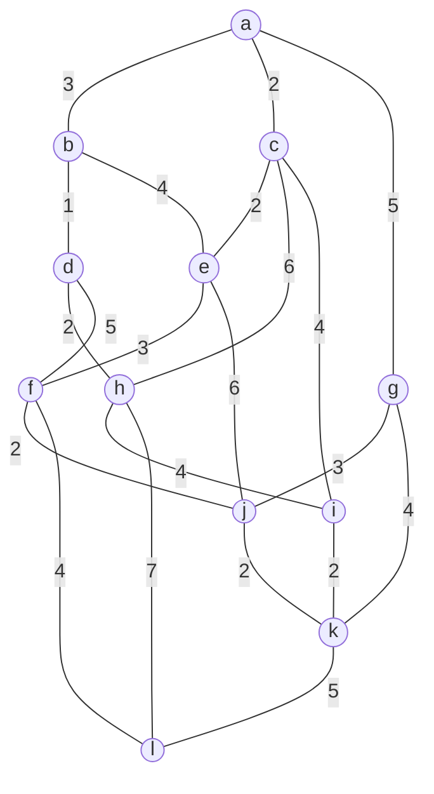
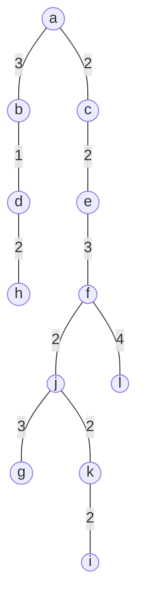
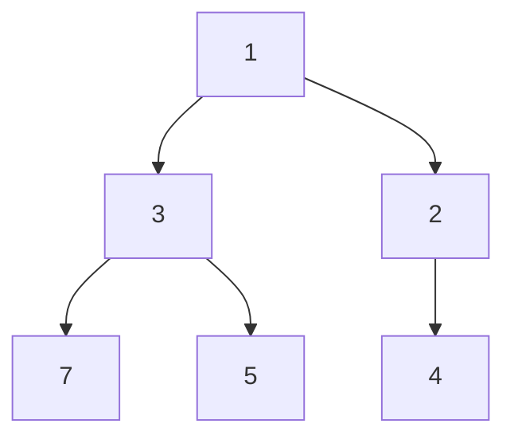

# 東京大学 情報理工学系研究科 電子情報学専攻 2015年8月実施 専門 第3問

## **Author**


祭音Myyura (co-authored with GPT 5.6 SOL)

## **Description**

グラフの最小全域木を求めるアルゴリズムについて、以下の問いに答えよ。本問では、辺の重みは全て正であるとする。

(1) 与えられたグラフの頂点の集合を $V$ とし、辺の集合を $E$ とする。また、初期状態として、頂点の部分集合 $B$ が $V$ の任意の1つの頂点を含み、辺の部分集合 $T$ が空集合とする。アルゴリズムの各ステップにおいて、$B$ に属する頂点と、$V-B$ に属する頂点を結ぶ辺のうち、重みが最小である辺 $\{u,v\}:u\in V-B,v\in B$ を求める。そして、頂点 $u$ を $B$ に加え、辺 $\{u,v\}$ を $T$ に加える。このアルゴリズムにより、最小全域木を求めることができることを説明せよ。解答に図を用いてよい。

(2) 下図のグラフの最小全域木を求めよ。それぞれの辺に付された数字は、辺の重みを表す。



(3) 下記の変数を用いて、(1) のアルゴリズムを実現するプログラムを擬似コードを用いて記述せよ。グラフの頂点の数を $n$、辺の数を $m$ とする。

| 変数 | 意味 |
| :-- | :-- |
| $L[s,t]$ | 辺の重みを表す対称行列。辺が存在しない場合は $\infty$ とする。 |
| $nearest[s]$ | $s\in V-B$ に対して、$L[s,t]$ が最小となるような頂点 $t\in B$。 |
| $mindist[s]$ | $s\in V-B$ について $mindist[s]=L[s,nearest[s]]$、$s\in B$ について $mindist[s]=-1$。 |

(4) (3) で解答したプログラムの計算量のオーダーを見積もれ。

(5) 二分ヒープとは何か、説明せよ。解答に図を用いてよい。

(6) 二分ヒープを用いることで (3) のプログラムを効率化できる場合がある。二分ヒープをプログラムにどのように適用すればよいか説明し、計算量のオーダーを見積もれ。また、プログラムを効率化できるのは、頂点の数 $n$ と辺の数 $m$ がどのような関係にあるときか論ぜよ。

## **Kai**

### (1)

グラフが連結であるとする。現在の $T$ を含む最小全域木 $T^*$ が存在することを保つ。選ばれた辺を $e=\{u,v\}$ とする。

$e\notin T^*$ の場合、$T^*$ に $e$ を加えるとサイクルができる。このサイクルには $B$ と $V-B$ を結ぶ別の辺 $e'$ がある。$e$ はこのカットを横切る最小重みの辺なので $w(e)\le w(e')$ である。従って $T^*-e'+e$ も最小全域木であり、$T\cup\{e\}$ を含む。

初期状態では $T=\varnothing$ なので成立し、$n-1$ 回の追加後には $T$ 自身が最小全域木となる。

### (2)

最小全域木の一つは以下であり、重みの総和は

$$\boxed{1+6\cdot2+3\cdot3+4=26}.$$



### (3)

頂点は $0,\ldots,n-1$ とし、初期頂点を $0$ とする。

```text
Prim(L, n):
    T = {}
    for s = 0 to n - 1:
        nearest[s] = 0
        mindist[s] = L[s, 0]
    mindist[0] = -1

    repeat n - 1 times:
        u = NIL
        best = ∞
        for s = 0 to n - 1:
            if 0 <= mindist[s] < best:
                u = s
                best = mindist[s]
        if u == NIL:
            return "全域木なし"
        T.add({u, nearest[u]})
        mindist[u] = -1
        for s = 0 to n - 1:
            if mindist[s] >= 0 and L[s, u] < mindist[s]:
                nearest[s] = u
                mindist[s] = L[s, u]
    return T
```

### (4)

各反復で最小値の選択と更新にそれぞれ $O(n)$、反復回数は $n-1$ なので、時間計算量は $\boxed{O(n^2)}$ である。

### (5)

二分ヒープは完全二分木で表し、最小ヒープでは各親のキーが子のキー以下となる。根に最小値を保持し、木の高さは $O(\log n)$ である。配列で表すことができ、挿入・最小要素の取り出し・キーの減少は各 $O(\log n)$ で行える。



### (6)

未選択頂点を `mindist` をキーとする最小二分ヒープに保持する。最小頂点の選択を `extract-min`、距離の更新を `decrease-key` で行う。頂点からヒープ内の位置を求める配列を持つ。

隣接リストを用いて新しく加えた頂点に接続する辺だけを調べれば、取り出しが $n$ 回、更新が高々 $2m$ 回なので、

$$\boxed{O((n+m)\log n)}$$

となる。連結グラフでは $m\ge n-1$ より $O(m\log n)$ とも書ける。$m\log n=o(n^2)$、すなわち $m=o(n^2/\log n)$ の疎なグラフでは漸近的に改善する。

ただし、行列 $L$ の全行を走査し続けると $O(n^2)$ が残る。行列から隣接リストを新たに作る場合も、その変換に $O(n^2)$ を要する。
