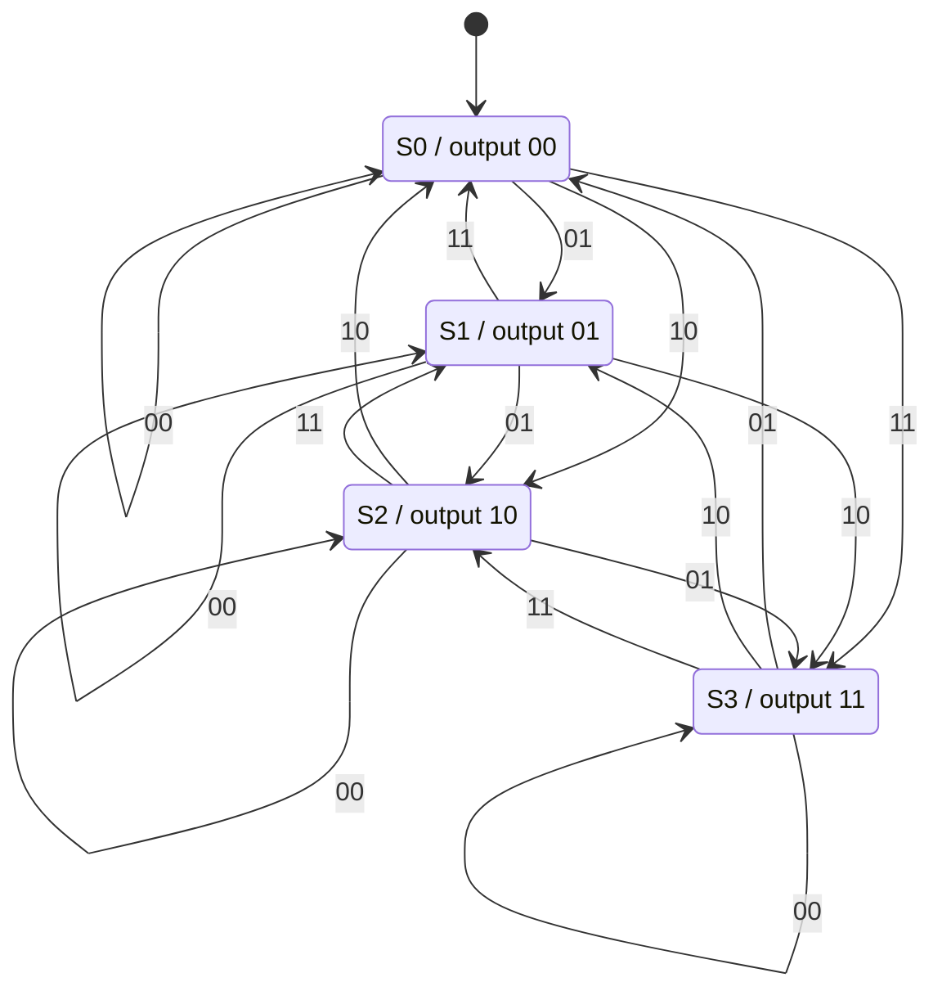

# 東京大学 情報理工学系研究科 電子情報学専攻 2017年8月実施 専門 第2問

## **Author**
[diohabara](https://github.com/diohabara/open_inshi)

## **Description**
以下のような剰余計算回路 $C$ を設計する。$C$ はクロックに同期して毎サイクル $2$ ビットの整数 $I_1I_0$ を受け取り続ける。$C$ には $2$ ビット出力 $O_1O_0$ が備わっており、それまでに入力された値の総計を $4$ で割った剰余を出力し続ける。入力、出力とも符号無し整数として表現され、 $I_1$ および $O_1$ を $MSB$ とする。回路の初期状態では、入力値の総計は $0$ であるとする。以下の問いに答えよ。

(1) $C$ について、出力がその回路状態からのみ決まる回路とし設計するとき、状態遷移図を示せ。最も状態数が少ない設計とすること。

(2) (1) で設計した状態遷移図の状態遷移表を下表のように示せ。ここで状態は $n$ ビットのレジスタで保持することを想定し、$S_{n-1}\dots S_0$ のように表している。また、$S_{n-1}'\dots S_0'$ は次状態を表している。状態レジスタから出力を生成する回路が最も簡単になるように状態を割り振ること。

<figure style="text-align:center;">
  
</figure>

(3) 状態レジスタの各ビットの次状態を決定する論理式を、それぞれ加法標準形（積項を+でつないで出来た式）で示せ。カルノー図を用いて項数を最小とすること。

(4) 図 $1$ を具体化する形で、(3) で導いた論理式を実現する回路をANDゲート、ORゲート、NOTゲート、およびDフリップ・フロップの組み合わせにて示せ。図 $2$ のように、入力値の反転を意味する記法を用いても良い。また、クロックの分配線は省略して良い。フリップ・フロップは理想的であると仮定する。

<figure style="text-align:center;">
  
</figure>

### 题目描述

设计一个求余电路 $C$。它与时钟同步，每个周期持续接收一个表示无符号整数的 $2$ 位输入 $I_1I_0$，并通过 $2$ 位无符号输出 $O_1O_0$，持续给出迄今所有输入值之和除以 $4$ 的余数；$I_1$、$O_1$ 均为最高有效位。初始状态下，输入值总和为 $0$。

(1) 将 $C$ 设计成输出只由当前电路状态决定的电路，画出状态转移图，并使状态数最少。

(2) 按上图给出的表格形式，写出 (1) 的状态转移表。假设状态用 $n$ 位寄存器 $S_{n-1}\dots S_0$ 保存，$S'_{n-1}\dots S'_0$ 表示下一状态。分配状态编码时，应使由状态寄存器生成输出的电路最简单。

(3) 分别写出决定状态寄存器各位下一状态的逻辑式，采用积项之和的加法标准形；使用卡诺图将项数减至最少。

(4) 按上图中图 1 的框架，把 (3) 的逻辑式实现为由 AND、OR、NOT 门和 D 触发器构成的具体电路。可以采用图 2 所示的输入反相记法，可以省略时钟分配线，并假设触发器理想。

## **Kai**
### (1)
異なる剰余は異なる出力を持つので、少なくとも4状態が必要である。状態 $S_r$ の出力を $r$、初期状態を $S_0$ とすれば、4状態で実現できる。矢印のラベルは入力値を表す。

### (2)
|$I_1$|$I_0$|$S_1$|$S_0$|$S_1'$|$S_0'$|
|-|-|-|-|-|-|
|0|0|0|0|0|0|
|0|0|0|1|0|1|
|0|0|1|1|1|1|
|0|0|1|0|1|0|
|0|1|1|0|1|1|
|0|1|1|1|0|0|
|0|1|0|1|1|0|
|0|1|0|0|0|1|
|1|1|0|0|1|1|
|1|1|0|1|0|0|
|1|1|1|1|1|0|
|1|1|1|0|0|1|
|1|0|1|0|0|0|
|1|0|1|1|0|1|
|1|0|0|1|1|1|
|1|0|0|0|1|0|

### (3)
行を $I_1I_0$、列を $S_1S_0$ とし、ともに $00,01,11,10$ の順とする。

$S_1'$

|$I_1I_0$ / $S_1S_0$|00|01|11|10|
|---|---|---|---|---|
|00|0|0|1|1|
|01|0|1|0|1|
|11|1|0|1|0|
|10|1|1|0|0|

$S_0'$

|$I_1I_0$ / $S_1S_0$|00|01|11|10|
|---|---|---|---|---|
|00|0|1|1|0|
|01|1|0|0|1|
|11|1|0|0|1|
|10|0|1|1|0|

加法標準形は

$$
\begin{aligned}
S_1'={}&I_1\overline{S_1}\,\overline{S_0}
+I_1\overline{I_0}\,\overline{S_1}
+\overline{I_1}\,\overline{I_0}S_1
+\overline{I_1}S_1\overline{S_0}\\
&+\overline{I_1}I_0\overline{S_1}S_0
+I_1I_0S_1S_0,\\
S_0'={}&\overline{I_0}S_0+I_0\overline{S_0}.
\end{aligned}
$$

$S_1'$ のカルノー図では、孤立した $1$ が2個あり、残る6個の $1$ は3個ずつの二つの組に分かれる。各組を覆うには2項が必要で、計6項が最小である。$S_0'$ は二つの4セルのグループで覆えるため、2項が最小である。

### (4)

(3) の $S_1'$ の6積項をそれぞれ AND ゲートで作り、OR ゲートでまとめて状態 $S_1$ の D 入力に接続する。同様に $S_0'$ の2積項を AND–OR 回路で作って $S_0$ の D 入力に接続する。反転入力は NOT ゲートで生成できる。状態の出力はそのまま $O_1=S_1,\ O_0=S_0$ とする。

同じ信号名は接続されているものとし、図では NOT をゲート入力の小円で表す。入力レジスタも含め、D フリップ・フロップは同じクロックを用い、状態レジスタの初期値を $S_1S_0=00$ とする。
