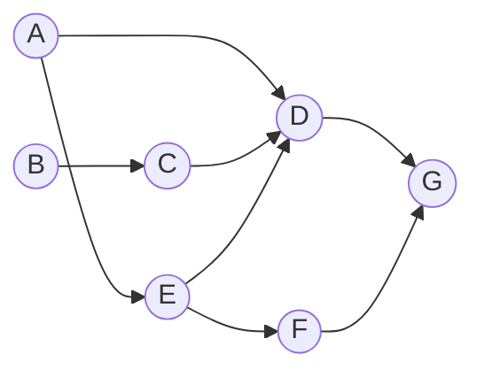
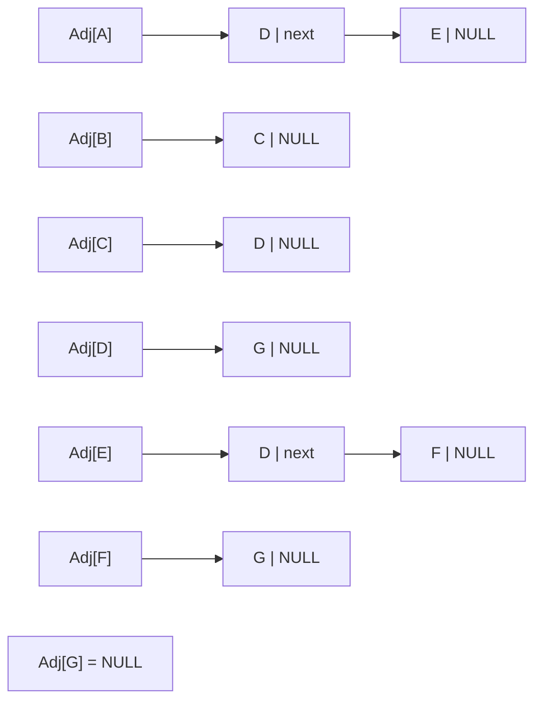

# 東京大学 情報理工学系研究科 電子情報学専攻 2017年8月実施 専門 第3問

## **Author**


祭音Myyura (co-authored with GPT 5.6 SOL)

## **Description**

有向グラフに関するアルゴリズムについて、以下の問いに答えよ。

図1：



図2（矢印の順が隣接リストを走査する順であり、各セルは頂点名と次ポインタを持つ）：



図3：

```text
function DFS1(Vertex u)
    visited[u] = TRUE
    print u
    foreach v in Adj[u]
        if (visited[v] != TRUE)
            DFS1(v)
```

図4：

```text
function DFS2(Vertex u)
    visited[u] = TRUE
    foreach v in Adj[u]
        if (visited[v] != TRUE)
            DFS2(v)
    print u
```

(1) 図1の有向グラフを考える。図2の `Adj[]` はこの有向グラフのエッジを隣接リストによって表現したものである。この有向グラフに対して、図3の疑似コードの関数を `DFS1(A)` として実行したところ、`ADGEF` という結果が得られた。同じ有向グラフに対して図4の疑似コードの関数を `DFS2(A)` として実行した場合の出力を示せ。

(2) 頂点 $u$ から頂点 $v$ へ向かうエッジを $(u,v)$ と表す。有向グラフのトポロジカルソートとは、そのグラフ中の任意のエッジ $(u,v)$ に関して、$u$ が $v$ よりも必ず前に位置しているような頂点の並びである。図1の有向グラフの頂点のトポロジカルソートの一例を示せ。

(3) トポロジカルソートが役に立つような現実の問題をひとつあげ、その理由を簡潔に説明せよ。

(4) トポロジカルソートを計算するアルゴリズムは、図3および図4に示したような有向グラフ上の走査処理を利用して実現することができる。図5にトポロジカルソートを計算する疑似コードを示す。関数 DFS の中身を疑似コードで示せ。ただし、図5において $V$ はグラフの頂点の集合を表す。また、$s$ はスタックを実現するオブジェクトであり、以下の3つのメソッドを持つものとする。

- `empty()`：スタックが空であれば `TRUE`、そうでなければ `FALSE` を返す。
- `pop()`：スタックのトップの値を返す。その値はスタックから削除される。
- `push(X)`：スタックに値 $X$ を追加する。

図5：

```text
Bool visited[|V|]
Stack s

function DFS(Vertex u)
    （空欄）

function TopologicalSort()
    foreach v in V
        if (visited[v] != TRUE)
            DFS(v)
    while (s.empty() != TRUE)
        print(s.pop())
```

(5) 図5のアルゴリズムの時間計算量を説明せよ。

(6) トポロジカルソートを実現する別のアルゴリズムをひとつ考え、そのアルゴリズムと時間計算量を簡潔に説明せよ。

## **Kai**

### (1)

再帰から戻る際に出力するので、$\boxed{\mathrm{GDFEA}}$。

### (2)

一例は $\boxed{\mathrm{ABCEFDG}}$。全ての辺の始点が終点より前に現れる。

### (3)

ソフトウェアのビルド順序の決定に使える。モジュール $v$ のビルドに $u$ が必要なら辺 $u\to v$ を置くと、トポロジカル順に処理することで依存先を先にビルドできる。

### (4)

最初に `visited` を全て `FALSE`、スタックを空に初期化する。

```text
function DFS(Vertex u)
    visited[u] = TRUE
    foreach v in Adj[u]
        if visited[v] != TRUE
            DFS(v)
    s.push(u)
```

有向非巡回グラフでは辺 $u\to v$ に対して $v$ の探索が $u$ より先に終了する。従って終了順をスタックで逆転すれば、$u$ が $v$ より先に出力される。

### (5)

各頂点を1回探索し、隣接リストの各辺を1回調べる。スタックへの追加・取り出しも各頂点につき1回なので、$\boxed{O(|V|+|E|)}$。

### (6)

各頂点の入次数を求め、入次数0の頂点をキューに入れる。キューから頂点を取り出して出力し、その頂点の各出辺を削除する（終点の入次数を1減らす）。入次数が0になった頂点をキューに追加し、空になるまで繰り返す。

全頂点が出力されればトポロジカル順であり、未出力頂点が残れば有向サイクルがある。各頂点・辺を高々一定回処理するので、時間は $\boxed{O(|V|+|E|)}$ である。
