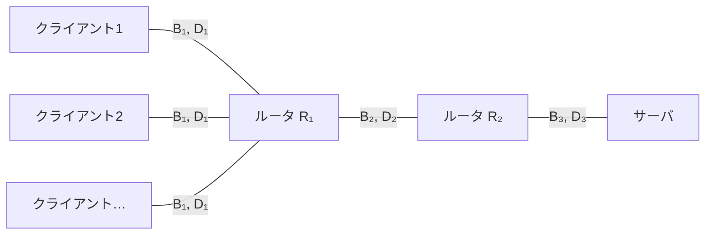
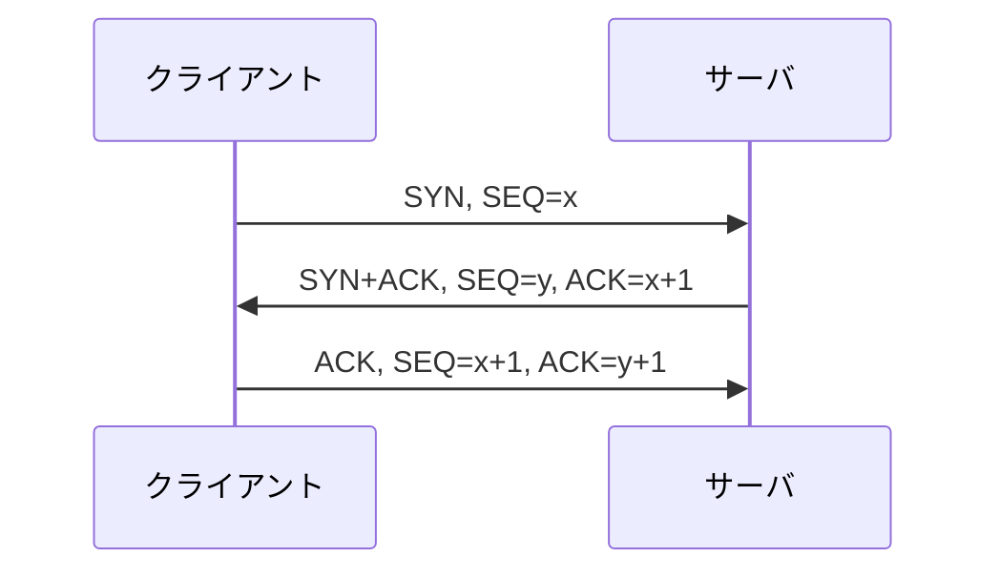
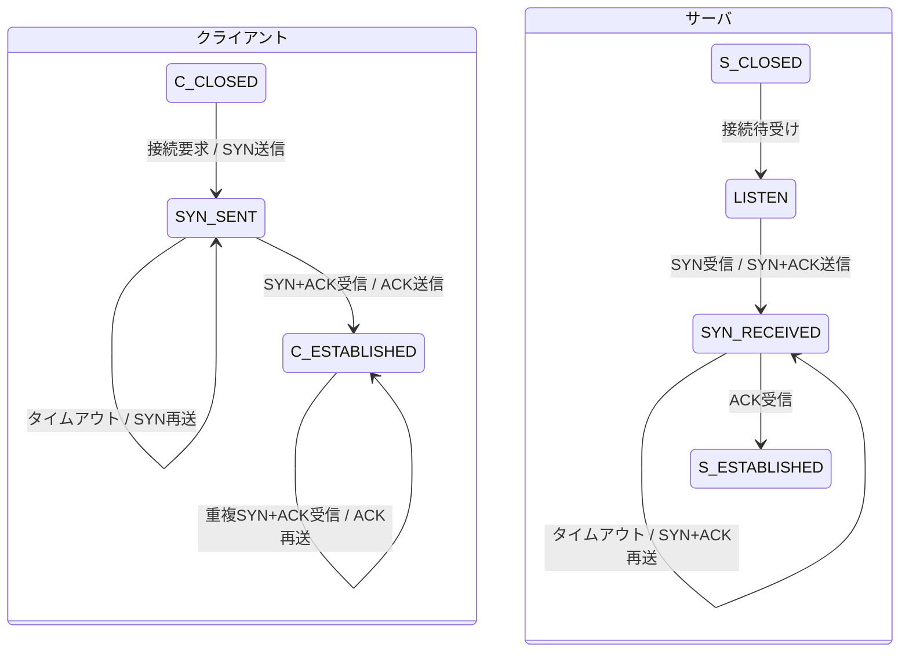

# 東京大学 情報理工学系研究科 電子情報学専攻 2017年8月実施 専門 第4問

## **Author**

祭音Myyura (co-authored with GPT 5.6 SOL)

## **Description**

図に示すようなシステムで、サーバからクライアントへ、TCP/IP を用いた IP パケットの転送を行う。転送されるパケットは、すべて $M\ [\mathrm{Bytes}]$ とする。また、各通信回線の帯域幅は $B_i\ [\mathrm{Bytes/sec}]$、遅延時間は $D_i\ [\mathrm{sec}]$（$1\le i\le3$）である。

(1) IP パケットの転送に際しては、伝送経路上で IP パケットが廃棄される場合が想定されている。TCP において、IP パケットの通信を開始する時には、サーバとクライアントの間で、通信の開始に必要な情報を同期しなければならない。どのような手順で、サーバとクライアントの間で情報の同期を行えばよいか、サーバおよびクライアントのそれぞれにおける手順を状態遷移図を用いて説明せよ。

(2) サーバが同じクライアントに向かって連続的に IP パケットを転送する時、クライアントで観測される IP パケットの到着間隔の理論上の最小値を示せ。

(3) TCP は、サーバとクライアント間で誤りのないデータ転送を提供するために、IP パケットの到達確認を行いながらデータ転送を行う。$1$ パケットずつ到達確認を行いながら IP パケットを転送する時には、サーバとクライアントとの間での IP パケットの転送遅延が大きな時には、高速なデータ転送を行うことができない。そこで、TCP では、データ転送速度を向上させる方法として、ウィンドウ制御と呼ばれる手法が適用されている。その動作原理を説明するとともに、最大転送速度を実現するために必要な条件式を示せ。

(4) サーバからのクライアントに向かって複数のコンテンツのデータ転送を行う場合を考える。コンテンツの転送をコンテンツごとに順次行うと、後の順番になったコンテンツのデータ転送は、前の順番のコンテンツの転送終了まで待たなくてはならない。TCP におけるこの問題を解決するための手法を説明せよ。

次に、サーバとクライアントとの間での転送遅延が非常に大きくなるクライアントが多数存在するようなシステムにおいて、これらのクライアントが、同一コンテンツの転送要求を非同期に行う場合を考える。

(5) 図に示したシステムにおいて、$D_2\ [\mathrm{sec}]$ が非常に大きい場合に、サーバからクライアントへのコンテンツの転送遅延を小さくするための手法を示せ。

(6) サーバの負荷を軽減し大量の転送要求に対応するためには、インターネット上に複数のサーバを設置して、クライアントからの転送要求を分散させる手法が適用されている。この方法を $3$ つ示せ。

図：各クライアントと $R_1$ の間の回線は、それぞれ帯域幅 $B_1$、遅延 $D_1$ を持つ。

## **Kai**

### (1)

クライアントが接続を開始する場合、初期シーケンス番号をそれぞれ $x,y$ として、3 ウェイハンドシェイクを行う。

各端点の状態遷移は次のとおりである。

両方向の初期シーケンス番号などを交換し、それぞれの受信を確認する。SYN や SYN+ACK が廃棄されればタイムアウト後に再送し、最後の ACK が廃棄された場合も、SYN+ACK の再送に再度 ACK を返す。

### (2)

$B_{\min}=\min(B_1,B_2,B_3)$ とすると、ボトルネック回線の送信時間によって

$$
\boxed{\Delta t_{\min}=\max_i\frac{M}{B_i}=\frac{M}{B_{\min}}.}
$$

伝搬遅延は最初の到着時刻を遅らせるが、定常的な連続転送の最小到着間隔には加算されない。

### (3)

ウィンドウ内の複数のデータを ACK を待たずに連続送信し、ACK の到着に伴ってウィンドウを先へ進める。これにより確認待ち時間にも回線を利用できる。

実効ウィンドウを $W\ [\mathrm{Bytes}]$、送信から確認までの往復時間を $R\ [\mathrm{sec}]$ とすると、転送速度の上限は

$$
\min\left(B_{\min},\frac WR\right).
$$

したがって、回線の最大速度に達するには

$$
\boxed{W\ge B_{\min}R}
$$

が必要である。受信ウィンドウと輻輳ウィンドウの両方がこの条件を満たし、十分な送受信バッファと送信データが必要となる。伝搬遅延が支配的なら $R\simeq2(D_1+D_2+D_3)$ である。

### (4)

コンテンツごとに別の TCP コネクションを確立して並列に転送する。各コネクションは独立したシーケンス番号とウィンドウを持つため、一つのコンテンツの転送完了を待たずに他の転送を進められる。

### (5)

$R_1$ 側にキャッシュサーバを置き、一度取得したコンテンツを保存して以後の要求に応答する。キャッシュが命中すれば大きな遅延 $D_2$ を持つ回線を毎回通る必要がなくなる。

### (6)

1. **DNS による分散**：同じサービス名に複数のサーバの IP アドレスを対応させ、応答するアドレスを分散する。
2. **ロードバランサ**：共通の入口で接続や HTTP 要求を受け、各サーバの負荷に応じて振り分ける。
3. **HTTP リダイレクト**：最初の応答で別サーバの URL を通知し、クライアントをそのサーバへ誘導する。
