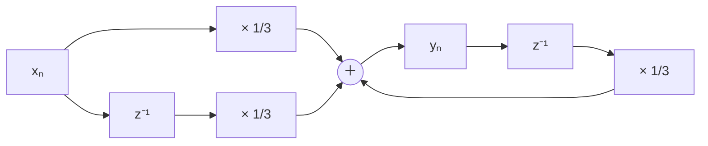
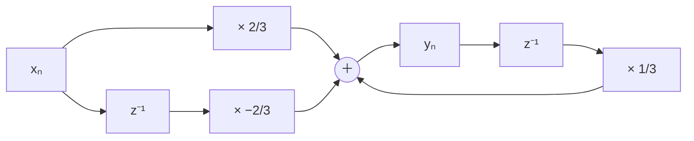

# 東京大学 情報理工学系研究科 電子情報学専攻 2017年8月実施 専門 第5問

## **Author**

[Josuke](https://www.xiaohongshu.com/user/profile/6136a1b40000000002025c4f?xhsshare=QQ&appuid=5de61ebb0000000001004b64&apptime=1718276766), 祭音Myyura, OpenAI

## **Description**

離散信号処理に関する以下の問いに答えよ。ただし、信号のサンプリング周期を $T$ とする。

(1) $n\ge0$ で定義された離散信号系列 $x_n$（$n=0,1,2,\ldots$）の $Z$ 変換の定義 $X(z)$ を示せ。ここで、$z$ は複素変数とする。

(2) 図 $1$ に示した回路の $s$ 領域（ラプラス変換領域）伝達関数 $H(s)$ を求めよ。

(3) ラプラス変換と $Z$ 変換の関係は $z=e^{sT}$ で与えられる。近似式

$$
s\simeq\frac2T\frac{1-z^{-1}}{1+z^{-1}}
$$

を導出せよ。ただし、必要に応じて下記の式を用いてよい。

$$
e^x\simeq1+x
$$

(4) (3) の近似式を用いて $H(s)$ を $z$ 領域伝達関数 $H(z)$ に変換せよ。ただし、$T=1$ とする。

(5) (4) で求めた $H(z)$ を実現する離散時間回路の構成を示せ。

(6) 同様の手順で図 $2$ に示した回路を離散時間回路で実現し構成を示せ。

### 题目描述

回答下列离散信号处理问题，其中 $T$ 为采样间隔，上图给出了题目所用的图 1 与图 2。

(1) 对定义于 $n\ge0$ 的离散信号序列 $x_n$（$n=0,1,2,\ldots$），写出其 $Z$ 变换 $X(z)$ 的定义，其中 $z$ 为复变量。

(2) 求图 1 电路在 $s$ 域（拉普拉斯变换域）中的传递函数 $H(s)$。

(3) 拉普拉斯变换与 $Z$ 变换满足 $z=e^{sT}$。推导近似式

$$
s\simeq\frac{2}{T}\frac{1-z^{-1}}{1+z^{-1}}.
$$

必要时可使用 $e^x\simeq1+x$。

(4) 使用 (3) 的近似，把 $H(s)$ 转换为 $z$ 域传递函数 $H(z)$，并令 $T=1$。

(5) 画出与 (4) 的 $H(z)$ 对应的离散信号处理电路。

(6) 按相同过程，画出与图 2 电路对应的离散信号处理电路。

## **Kai**

### (1)

$$
\boxed{X(z)=\sum_{n=0}^{\infty}x_nz^{-n}}.
$$

### (2)

初期状態を零とすると、コンデンサのインピーダンスは $1/(sC)$ である。分圧則と $R=C=1$ より

$$
\boxed{H(s)=\frac{1/(sC)}{R+1/(sC)}=\frac1{1+s}}.
$$

### (3)

$$
z^{-1}=e^{-sT}=\frac{e^{-sT/2}}{e^{sT/2}}
\simeq\frac{1-sT/2}{1+sT/2}.
$$

したがって、$(1+z^{-1})sT/2\simeq1-z^{-1}$ より

$$
\boxed{s\simeq\frac2T\frac{1-z^{-1}}{1+z^{-1}}}.
$$

### (4)

$T=1$ として代入すると、

$$
\boxed{H(z)=\frac1{1+2(1-z^{-1})/(1+z^{-1})}
=\frac{1+z^{-1}}{3-z^{-1}}}.
$$

### (5)

$H(z)=Y(z)/X(z)$ より

$$
\boxed{y_n=\frac13x_n+\frac13x_{n-1}+\frac13y_{n-1}}.
$$

以下で $z^{-1}$ は $1$ サンプル遅延を表す。

### (6)

図 $2$ は抵抗の両端を出力とするので、

$$
H(s)=\frac R{R+1/(sC)}=\frac s{1+s},\qquad
\boxed{H(z)=\frac{2(1-z^{-1})}{3-z^{-1}}}.
$$

よって、

$$
\boxed{y_n=\frac23x_n-\frac23x_{n-1}+\frac13y_{n-1}}.
$$

