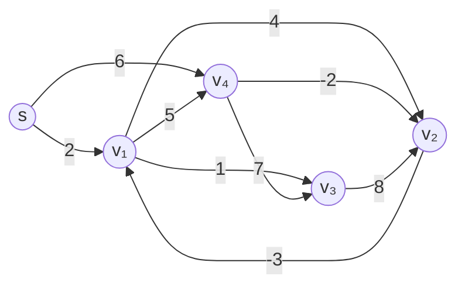
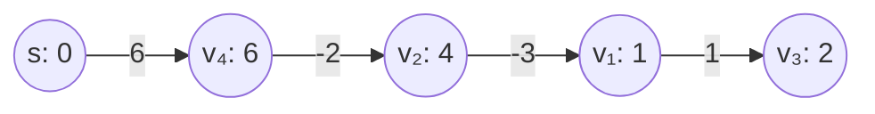

# 東京大学 情報理工学系研究科 電子情報学専攻 2018年8月実施 専門 第3問

## **Author**


祭音Myyura (co-authored with GPT 5.6 SOL)

## **Description**

単一始点最短経路問題は、頂点集合 $V$、辺集合 $E$ からなる有向グラフ $G=(V,E)$ について、始点 $s\in V$ が与えられた時、$s$ から各頂点 $v\in V$ への最短経路を求める問題である。ここで、頂点間の最短経路とは、経路上の辺長の和が最短となるような経路である。以下では、頂点 $u$ から頂点 $v$ への有向辺を $(u,v)$、その辺長を $d_{uv}$ とした時の単一始点最短経路問題を考える。なお、辺長 $d_{uv}$ は負になることがあるが、グラフ $G$ の任意の閉路について、その閉路長は負にはならないとする。以下の問いに答えよ。

(1) グラフ $G$ の各頂点 $v\in V$ に対して、始点 $s$ から頂点 $v$ への最短経路長の推定値を $v.d$ とする。最短経路長を求める初期状態においては、始点を除いたすべての頂点 $v\in V-\{s\}$ について $v.d=\infty$ とする。この時、グラフ $G$ の辺を次々に緩和することで、始点 $s$ から各頂点 $v$ への最短経路長の推定値 $v.d$ を実際の最短経路長に一致するまで徐々に減らすことを考える。ここで、辺 $(u,v)$ の緩和とは頂点 $u$ を経由することで頂点 $v$ への既知の最短経路長を短くできるか否かを判定し、短くできるならば $v.d$ を更新する手続きである。グラフ $G$ の辺の緩和を元に、下図のグラフについて、頂点 $s$ を始点とする各頂点への最短経路長を求めよ。その過程を図示すること。なお、図中の数字は対応する辺の辺長を表している。



(2) 単一始点最短経路問題を解く (1) のアルゴリズムを次の Algorithm に示す擬似コードで記述する。(A) を埋めよ。

```text
Algorithm
    for each v ∈ V - {s} do
        v.d = ∞
    end for
    s.d = 0
    for i = 1 to |V| - 1 do
        for each (u, v) ∈ E do
            if v.d > (A) then
                v.d = (A)
            end if
        end for
    end for
```

(3) (2) のアルゴリズムを用いて単一始点最短経路長だけでなく各最短経路上の頂点集合も求めることを考える。グラフ $G$ の各頂点 $v\in V$ に対して、単一始点最短経路中の先行頂点を $v.pre$ と表す時、各最短経路上の頂点集合を求めるためには、(2) の擬似コードにどのような手続きを追加すればよいか説明せよ。

(4) (2) のアルゴリズムにより単一始点最短経路問題を解いた時の時間計算量をグラフの頂点の数 $|V|$ と辺の数 $|E|$ を用いて見積もれ。

(5) 辺長が負となることはないグラフに Dijkstra のアルゴリズムを適用することを考える。データ構造として二分ヒープを用いた Dijkstra のアルゴリズムについて説明せよ。このアルゴリズムにより単一始点最短経路問題を解いた時の時間計算量をグラフの頂点の数 $|V|$ と辺の数 $|E|$ を用いて見積もれ。

## **Kai**

### (1)

$s.d=0$ とし、各周で

$$
(s,v_1),(s,v_4),(v_1,v_2),(v_1,v_4),(v_1,v_3),
(v_2,v_1),(v_3,v_2),(v_4,v_2),(v_4,v_3)
$$

の順に緩和する。各周終了時の推定値は次のように変化する。

| 周 | $s.d$ | $v_1.d$ | $v_2.d$ | $v_3.d$ | $v_4.d$ |
| :--: | :--: | :--: | :--: | :--: | :--: |
| 初期 | 0 | $\infty$ | $\infty$ | $\infty$ | $\infty$ |
| 1 | 0 | 2 | 4 | 3 | 6 |
| 2 | 0 | 1 | 4 | 3 | 6 |
| 3 | 0 | 1 | 4 | 2 | 6 |
| 4 | 0 | 1 | 4 | 2 | 6 |

最終的な最短経路木は以下である。頂点内は「頂点名：最短経路長」、辺上は辺長を示す。



### (2)

両方の (A) は $\boxed{u.d+d_{uv}}$。

### (3)

初期化時に全頂点の `pre` を `NIL` にする。緩和が成功した `if` 節の内部で、距離更新と同時に `v.pre = u` とする。

到達可能な目的頂点 $t$ から `pre` をたどって $s$ までの頂点を集めれば、その最短経路上の頂点集合を得る。$t.d=\infty$ なら経路は存在しない。

### (4)

$|V|-1$ 回の反復で全 $|E|$ 辺を調べるため、時間計算量は通常 $\boxed{O(|V||E|)}$ と表す。初期化も含めて辺が0本の場合まで書けば $O(|V|+|V||E|)$ である。

負閉路がなければ最短経路として高々 $|V|-1$ 辺の単純路を選べる。1周ごとに、少なくともその経路の次の辺まで正しい距離が伝播するので、この反復回数で十分である。

### (5)

始点の距離を0、他を $\infty$ とし、未確定頂点を推定距離をキーとする最小二分ヒープで管理する。次を繰り返す。

1. `extract-min` で推定距離最小の頂点 $u$ を取り出し、その距離を確定する。
2. $u$ の出辺 $(u,v)$ を調べ、未確定の $v$ について $u.d+d_{uv}<v.d$ なら距離を更新し、`decrease-key` を行う。

全辺長が非負なので、取り出した頂点への距離が後で小さくなることはない。隣接リストと、頂点からヒープ位置を求める配列を用いれば、取り出しは高々 $|V|$ 回、キー更新は高々 $|E|$ 回である。従って

$$\boxed{O((|V|+|E|)\log|V|)}$$

となる。
