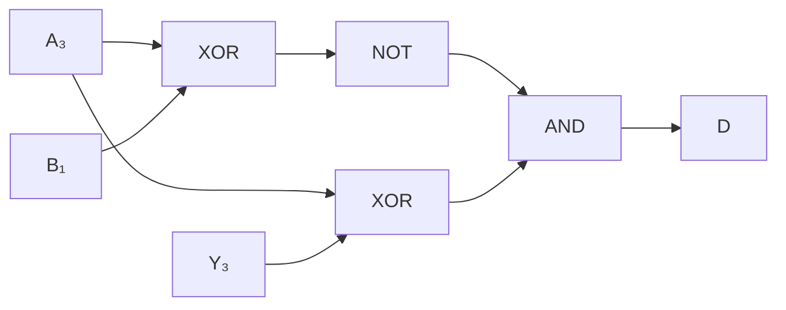

# 東京大学 情報理工学系研究科 電子情報学専攻 2019年8月実施 専門 第2問 

## **Author**
[Josuke](https://www.xiaohongshu.com/user/profile/6136a1b40000000002025c4f?xhsshare=QQ&appuid=5de61ebb0000000001004b64&apptime=1718276766), [diohabara](https://github.com/diohabara/open_inshi)

## **Description**
Let us design a circuit that obtains a 4-bit signed integer $Y_{3..0}$ by calculating 4-bit addition/subtraction of a 4-bit signed integer $A_{3..0}$ and a 2-bit signed integer $B_{1,0}$. The integers $A,B$ and $Y$ are expressed in two's complement. The types of logic gates that you can use are NOT, AND , OR, and XOR, each of which is equipped with as many inputs as the design requires. Answer the following questions.

(1) Show the maximum and minimum values of $A$ and $B$ in decimal form.

(2) Show a circuit that calculates $A + B$ to obtain $Y$ by combining logic gates. Organize the adder as a ripple carry adder. You can use signals from $A_{3..0},B_{1,0}$, supply voltage $V_{DD}$, and grounding voltage GND as inputs, The output should be $Y_{3..0}$. To simplify the diagram, use the "half-adder" blocks and the "full-adder" blocks after showing gate-level designs of both blocks.

(3) Consider adding an overflow detection mechanism to the circuit designed in (2). Show the overflow detection circuit by combining the logic gates. You can use signals from $A_{3..0},B_{1,0}$ and $Y_{3..0}$ as inputs. The output should be a 1-bit signal named $D$; it should be '1' when the overflow occurred, or '0' otherwise.

(4) Show a circuit that calculates $A - B$ to obtain $Y$ by combining logic gates. Organize the adder as a ripple carry adder. You can use signals from $A_{3..0},B_{1,0},V_{DD}$ and GND as inputs. The output should be $Y_{3..0}$. Use the "half-adder" blocks and the "full-adder" blocks in (2).

(5) Show all the input patterns that cause overflows for the calculation designed in (4).

### 题目描述

设计一个电路，对 $4$ 位有符号整数 $A_{3..0}$ 与 $2$ 位有符号整数 $B_{1,0}$ 做 $4$ 位加/减运算，得到 $4$ 位有符号整数 $Y_{3..0}$。$A,B,Y$ 均用二进制补码表示。可用的门为 NOT、AND、OR、XOR，每种门的输入数可按设计需要确定。

(1) 用十进制写出 $A$、$B$ 各自的最大值和最小值。

(2) 用逻辑门组合出计算 $Y=A+B$ 的行波进位加法器。可使用 $A_{3..0}$、$B_{1,0}$、电源电压 $V_{DD}$ 和地电压 GND 作为输入，输出为 $Y_{3..0}$。先给出半加器和全加器的门级设计，随后可用二者的模块符号简化总图。

(3) 为 (2) 的电路增加溢出检测。用 $A_{3..0}$、$B_{1,0}$、$Y_{3..0}$ 中的信号组合逻辑门，输出一位信号 $D$；发生溢出时 $D=1$，否则 $D=0$。

(4) 用逻辑门组合出计算 $Y=A-B$ 的行波进位加法器。可使用 $A_{3..0}$、$B_{1,0}$、$V_{DD}$ 和 GND，输出为 $Y_{3..0}$，并使用 (2) 中的半加器、全加器模块。

(5) 列出 (4) 所设计减法运算中会造成溢出的全部输入模式。

## **Kai**
### (1)

$$
\boxed{-8\le A\le7,\qquad -2\le B\le1}.
$$

最大値のビット表現は $A=0111,B=01$、最小値は $A=1000,B=10$ である。

### (2)

<figure style="text-align:center;">
  
</figure>

<figure style="text-align:center;">
  
</figure>

半加器は $S=a\oplus b,\ C=ab$、全加器は $S=a\oplus b\oplus c,\ C=ab+c(a\oplus b)$ を実現する。

$B$ を4ビットに符号拡張して $B_{3..0}^{\mathrm{ext}}=(B_1,B_1,B_1,B_0)$ とする。下図の $U$ を GND（$0$）に接続すれば、4段の全加器で $A+B$ が得られる。最下位段は $C_0=0$ なので半加器に置き換えてもよい。

### (3)

加算の符号付きオーバーフローは、二つの入力の符号が同じで、結果の符号がその符号と異なるときに発生する。$B$ の符号ビットは $B_1$ なので

$$
\boxed{D=\overline{A_3\oplus B_1}\,(A_3\oplus Y_3)}.
$$

### (4)

$$
A-B=A+\overline{B^{\mathrm{ext}}}+1\pmod{16}.
$$

(2) の回路で $U$ を $V_{DD}$（$1$）に接続する。二つの XOR ゲートにより $B_0,B_1$ を反転し、$\overline{B_1}$ を上位2段にも入力する。最下位のキャリー入力は $C_0=1$ とする。4段の全加器から $Y_{3..0}$ が得られる。

### (5)

$A-B>7$ または $A-B<-8$ となる組を列挙すればよい。全入力パターンは次の4通りである。

| $A$ | $A_{3..0}$ | $B$ | $B_{1..0}$ | 真の $A-B$ |
|---|---|---|---|---|
| $6$ | `0110` | $-2$ | `10` | $8$ |
| $7$ | `0111` | $-2$ | `10` | $9$ |
| $7$ | `0111` | $-1$ | `11` | $8$ |
| $-8$ | `1000` | $1$ | `01` | $-9$ |

減算時の検出式は $D=(A_3\oplus B_1)(A_3\oplus Y_3)$ である。
