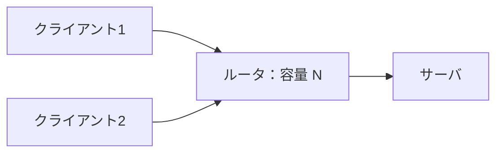
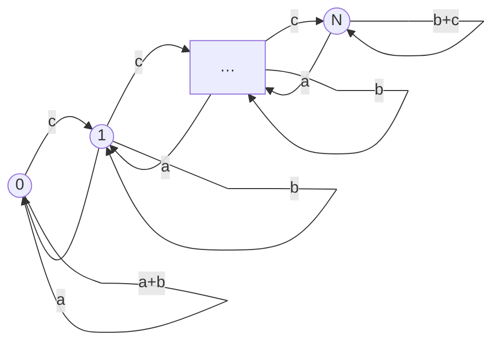

# 東京大学 情報理工学系研究科 電子情報学専攻 2019年8月実施 専門 第4問

## **Author**

祭音Myyura (co-authored with GPT 5.6 SOL)

## **Description**

図に示すように、$2$ つのクライアントからサーバへ、IP パケットの転送を行う。転送される IP パケットは、すべて同じ大きさとする。また、$2$ つのクライアントからルータへの IP パケットの転送とルータからサーバへの IP パケットの転送はすべて同期しているものとし、単位時間 $T$ ごとに、IP パケットの転送が行われる。ルータは $N$ 個の IP パケットを蓄積可能であるとする。また、$2$ つの IP パケットがルータに到着し、ルータが両方のパケットを保持できない時は、いずれかの IP パケットがランダムに廃棄される。

(1) $2$ つのクライアントは、両方とも確率 $\alpha$（$0\le\alpha\le1$）で独立にパケットを生成する。ルータにバッファリングされている IP パケットの数に関する状態遷移図を示せ。

(2) $\alpha=0.5$ の時の各状態の発生確率を示せ。

(3) (2) において、$N=2$ の時の IP パケットの廃棄確率を示せ。

(4) クライアント $1$ からの IP パケットの転送をストリーム型の IP パケットの転送、すなわち定期的に IP パケットを生成・転送するようにシステムを変更する。具体的には、$2T$ ごとに $1$ 個の IP パケットを転送するものとする。なお、クライアント $2$ からの IP パケットの転送は (1) と同様であり、$\alpha=0.5,N=2$ とする。この時のルータにおける IP パケットの廃棄確率を示せ。

(5) クライアント $1$ のストリーム型の IP パケット転送における IP パケットの廃棄確率を低下させるために、前方誤り訂正方式を適用する。クライアント $1$ から転送されるべき $k$ 個の IP パケットに対して、$s$ 個（$k\ge s$）の冗長パケットを生成する。これによって、クライアント $1$ からサーバに転送される $k+s$ 個の IP パケットのうち $s$ 個以下の IP パケットが廃棄されても、サーバにおいては、クライアント $1$ からの IP パケットの再転送を行うことなく $k$ 個の IP パケットを誤りなく復号可能になるものとする。

(a) クライアント $1$ から送信された $k$ 個の IP パケットが、IP パケットの再転送を行うことなく、サーバで誤りなく復号される確率を数式で示せ。

(b) $k=3,s=1$ の時に、サーバで誤りなく $k$ 個の IP パケットが復号される確率を示せ。さらに、前方誤り訂正がない場合に $k$ 個の IP パケットが誤りなく受信される確率を示せ。なお、$\alpha=0.5,N=2$ とする。

## **Kai**

各同期時刻に到着分を含めて高々 $1$ 個を送出し、その直後の残数を $Q_n$ とする。到着数を $A_n$ とすると、

$$
Q_{n+1}=\min\{N,\max(0,Q_n+A_n-1)\}.
$$

### (1)

$a=(1-\alpha)^2$、$b=2\alpha(1-\alpha)$、$c=\alpha^2$ とおく。内部状態 $1\le i\le N-1$ では

$$
P_{i,i-1}=a,\qquad P_{i,i}=b,\qquad P_{i,i+1}=c.
$$

境界では $P_{0,0}=a+b$、$P_{0,1}=c$、$P_{N,N-1}=a$、$P_{N,N}=b+c$ である。

### (2)

$\alpha=1/2$ では $a=c=1/4$。隣接状態の詳細釣合い $\pi_i c=\pi_{i+1}a$ より、

$$
\boxed{\pi_i=\frac1{N+1}\quad(0\le i\le N).}
$$

### (3)

廃棄は $Q_n=N,A_n=2$ の時に $1$ 個発生する。平均到着数は $E[A_n]=2\alpha=1$ なので、到着パケット当たりの廃棄確率は

$$
\boxed{p=\frac{\pi_N\alpha^2}{2\alpha}
=\frac1{4(N+1)}=\frac1{12}.}
$$

### (4)

クライアント $1$ が送信する時刻の直前の残数を $R_j$ とし、次の送信時刻までの $2T$ を一ステップとする。その遷移行列は

$$
P=\begin{pmatrix}
3/4&1/4&0\\
1/4&1/2&1/4\\
0&1/2&1/2
\end{pmatrix},\qquad
\boldsymbol\pi=\left(\frac25,\frac25,\frac15\right).
$$

廃棄は $R_j=2$ でクライアント $2$ も同時に送信した時だけ生じる。$2T$ 当たりの平均廃棄数は $(1/5)(1/2)=1/10$、平均到着数は $1+2(1/2)=2$ なので、

$$
\boxed{p=\frac{1/10}{2}=\frac1{20}.}
$$

二つの到着のどちらを廃棄するかは等確率なので、クライアント $1$ の各パケットの廃棄率も $(1/5)(1/2)(1/2)=1/20$ である。

### (5)

冗長パケットも含めてクライアント $1$ は $2T$ ごとに $1$ 個ずつ送り、定常状態で符号ブロックを開始するものとする。

#### (a)

一つの送信周期でのクライアント $1$ の廃棄数を $D\in\{0,1\}$ とし、状態遷移に廃棄数を記録する行列を

$$
K(z)_{ij}=E\bigl[z^D\boldsymbol1_{\{R_{n+1}=j\}}\mid R_n=i\bigr]
$$

と定義する（行・列添字はそれぞれ遷移前・後の状態）。$\boldsymbol\pi$ を定常行ベクトル、$\boldsymbol1$ を全成分 $1$ の列ベクトルとすれば、復号成功確率は

$$
\boxed{\sum_{r=0}^{s}[z^r]\,
\boldsymbol\pi K(z)^{k+s}\boldsymbol1.}
$$

$[z^r]$ は $z^r$ の係数を表す。

#### (b)

(4) の系では、廃棄時にも残数の遷移先は変わらないから、

$$
K(z)=\begin{pmatrix}
3/4&1/4&0\\
1/4&1/2&1/4\\
0&(3+z)/8&(3+z)/8
\end{pmatrix}.
$$

よって、

$$
\boldsymbol\pi K(z)^4\boldsymbol1
=\frac{8493+1472z+250z^2+24z^3+z^4}{10240}.
$$

したがって、前方誤り訂正を用いる場合は

$$
\boxed{P_{\mathrm{FEC}}=\frac{8493+1472}{10240}=\frac{1993}{2048}.}
$$

用いない場合は $3$ 個すべてが届く必要があり、

$$
\boxed{P_{\mathrm{no\ FEC}}=\boldsymbol\pi K(0)^3\boldsymbol1=\frac{1109}{1280}.}
$$

各パケットの廃棄を確率 $p$ の独立事象で近似する場合、(a) は $\sum_{r=0}^{s}\binom{k+s}{r}p^r(1-p)^{k+s-r}$ となる。この近似で $p=1/20$ を用いると、(b) はそれぞれ $157757/160000$、$6859/8000$ である。
