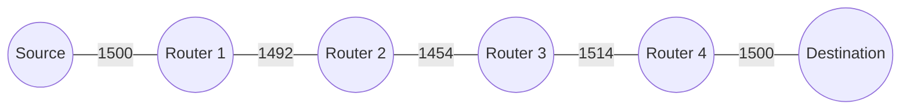

# 東京大学 情報理工学系研究科 電子情報学専攻 2020年8月実施 専門 第4問

## **Author**

祭音Myyura (co-authored with GPT 5.6 SOL)

## **Description**

TCP/IP に関して、以下の問いに答えよ。

(1) データリンク層において、ブリッジにはできてリピータにはできないことの具体例を述べよ。

(2) ネットワークセグメント内で対象ホストの MAC アドレスを IP アドレスから取得するプロトコルの名前を述べよ。

(3) ネットワークセグメント $192.168.10.16/28$ では、何個の IP アドレスを割り当て可能か答えよ。

(4) DHCP がホストに割り当てる IP アドレスと共に配布する情報を $3$ 種類答えよ。

(5) IP パケットヘッダに含まれる TTL フィールドの役割を述べよ。

(6) ICMP がもたらす代表的な機能を $3$ つ答えよ。

(7) パケット A（宛先：$192.168.10.5$）とパケット B（宛先：$192.168.10.12$）が、下記経路表に従うルータで転送される。パケット A とパケット B はそれぞれどの IP アドレスに転送されるかを示せ。

| Destination | Gateway |
| --- | --- |
| 192.168.10.8/29 | 192.168.11.249 |
| 192.168.10.0/26 | 192.168.11.246 |
| 192.168.10.0/24 | 192.168.11.244 |
| 0.0.0.0/0 | 192.168.11.1 |

(8) 転送する IPv4 パケットの大きさがデータリンク層の Maximum Transmission Unit（MTU）を超えるときの処理を述べよ。

(9) TCP において、Source-to-Destination 経路上の MTU が下記である場合に Source の最長の Maximum Segment Size（MSS）を求めよ。MSS は TCP セグメントの最大ペイロード長である。IP ヘッダ長は $20$ オクテットであり、TCP ヘッダ長は $20$ オクテットである。

(10) traceroute がどのように経路を探索するかを述べよ。

(11) TCP は、信頼性のあるデータ配送サービスを提供するとされている。しかし、TCP を使えば必ず相手ホストと通信できるようになるとは限らない。また、配送途中でデータが改ざんされてしまう可能性もある。ここで言う TCP の信頼性について述べよ。

(12) IPv6 のアドレス長を述べよ。

(13) IPv6 のアドレスの例を一つ示せ。

(14) DNS がどのように名前を解決するかを述べよ。

## **Kai**

### (1)

ブリッジは宛先 MAC アドレスと学習した転送表に基づいてフレームを転送・抑止できる。例えば、送信元と宛先が同じ接続ポート側にあるフレームを他のポートへ流さずに済む。リピータは物理信号を再生するだけで、この選択はできない。

### (2)

ARP（Address Resolution Protocol、アドレス解決プロトコル）。

### (3)

ホスト部は $32-28=4$ ビット。ネットワークアドレスとブロードキャストアドレスを除き、

$$
\boxed{2^4-2=14\text{ 個}.}
$$

割り当て範囲は $192.168.10.17$ から $192.168.10.30$ である。

### (4)

サブネットマスク、デフォルトゲートウェイ、DNS サーバの IP アドレス。

### (5)

パケットがネットワーク内で無限に循環するのを防ぐ。ルータは転送時に TTL を少なくとも $1$ 減らし、$0$ になればパケットを破棄する。通常は送信元へ ICMP Time Exceeded を返す。

### (6)

1. Echo Request / Echo Reply による到達性の確認。
2. Destination Unreachable による宛先到達不能の通知。
3. Time Exceeded による TTL 超過などの通知。

### (7)

一致する経路のうちプレフィックスが最長のものを選ぶ。

| パケット | 選択する経路 | 次ホップの IP アドレス |
| --- | --- | --- |
| A | 192.168.10.0/26 | **192.168.11.246** |
| B | 192.168.10.8/29 | **192.168.11.249** |

### (8)

DF ビットが $0$ なら、MTU 以下の複数の IPv4 フラグメントへ分割して転送する。各断片に IP ヘッダを付け、識別子・フラグメントオフセット・MF ビットを設定し、宛先で再構成する。

DF ビットが $1$ なら分割せずに破棄し、送信元へ ICMP Destination Unreachable（fragmentation needed）を返す。

### (9)

経路 MTU は $\min(1500,1492,1454,1514,1500)=1454$。したがって、

$$
\boxed{\mathrm{MSS}=1454-20-20=1414\text{ オクテット}.}
$$

### (10)

TTL を $1,2,3,\ldots$ と増やしたプローブを送る。各途中ルータが TTL 超過により返す ICMP Time Exceeded の送信元アドレスから、ホップごとのルータを調べる。宛先の応答を受ければ到達したと判断する。

### (11)

シーケンス番号、ACK、チェックサム、再送を用いて、欠落・順序逆転・重複・偶発的な誤りに対処し、受信側アプリケーションへ順序どおりのバイト列を渡す性質である。

到達不能な相手への通信成功や無期限の障害からの回復は保証しない。また、チェックサムは暗号学的な認証ではないため、悪意ある改ざんの防止や相手の認証も保証しない。

### (12)

$\boxed{128\text{ ビット}}$。

### (13)

例：`2001:db8::1`。

### (14)

リゾルバはまずキャッシュを調べ、答えがなければ DNS の階層をたどる。再帰リゾルバがルートサーバ、トップレベルドメインのサーバ、対象ドメインの権威サーバへ順に問い合わせ、委任先を得ながら名前に対応する A・AAAA レコードなどを取得する。結果をクライアントに返し、TTL の範囲でキャッシュする。
