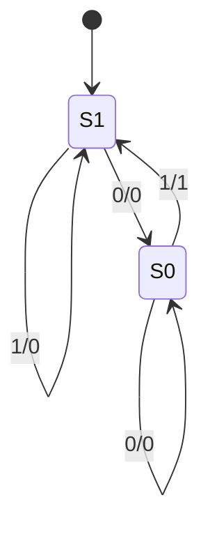
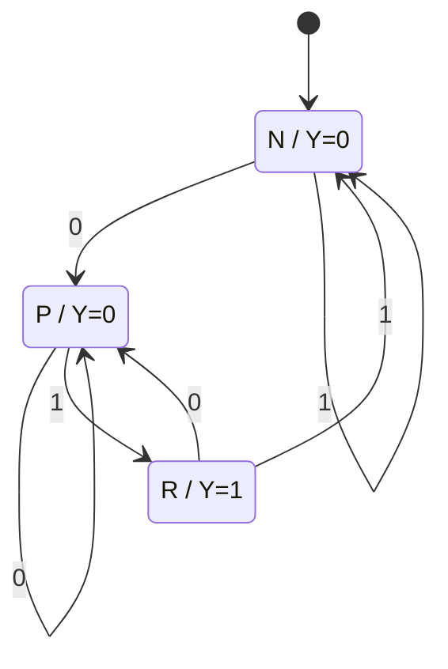

# 東京大学 情報理工学系研究科 電子情報学専攻 2026年1月実施 専門 第2問

## **Author**
[瑞穂](https://github.com/LiRunyi2001)

## **Description**

*Recalled statement.*
A synchronous circuit has a one-bit input $A$ and a one-bit output $Y$. The output is $1$ exactly when the previous sampled input was $0$ and the current input is $1$. Before the first input has been sampled, the output is $0$ for either value of $A$.

(1) Draw the state transition diagram.

(2) Draw the state transition table.

(3) Express the next-state bits $s_i^N$ and output $Y$ using the current state bits $s_i$ and input $A$. Use Karnaugh maps to simplify the expressions.

(4) Draw an implementation using AND, OR, NOT gates and D flip-flops.

### 题目描述

同步电路有一位输入 $A$ 和一位输出 $Y$。前一次采样为 $0$、当前输入为 $1$ 时输出 $1$，其余情况输出 $0$。尚未采样任何输入时，无论 $A$ 为何，输出均为 $0$。求状态图、状态表、由卡诺图化简的次态及输出表达式，并用指定逻辑门和 D 触发器实现。

## **Kai**

The following (1)–(4) use a combinational Mealy output. A clocked Moore-output implementation is given afterward.

### (1)

Use a Mealy machine. State $S_0$ means that the previous input was $0$; state $S_1$ means that it was $1$. The initial state can also be $S_1$, because its output is $0$ for both possible first inputs. Edge labels are input/output.

### (2)

Encode $S_0$ by $s=0$ and $S_1$ by $s=1$.

| $s$ | $A$ | $s^N$ | $Y$ |
|---|---|---|---|
| 0 | 0 | 0 | 0 |
| 0 | 1 | 1 | 1 |
| 1 | 0 | 0 | 0 |
| 1 | 1 | 1 | 0 |

### (3)

The Karnaugh maps are

| $s^N$: $s$ / $A$ | 0 | 1 |
|---|---|---|
| 0 | 0 | 1 |
| 1 | 0 | 1 |

| $Y$: $s$ / $A$ | 0 | 1 |
|---|---|---|
| 0 | 0 | 1 |
| 1 | 0 | 0 |

Grouping the two $1$ cells of the first map gives

$$
\boxed{s^N=A,\qquad Y=\overline s A}.
$$

### (4)

Connect $A$ to the D input, and combine $A$ with the complemented Q output in an AND gate. Initialize Q to $1$ before sampling starts. The output is evaluated from the current input and the state holding the previous sample; the active clock edge stores the current sample.

### Clocked state-output interpretation

If $Y$ must remain at the detected value after the sampling edge, use a three-state Moore machine. Let $P$ mean “last input $0$, output $0$”, $R$ mean “last input $1$, output $1$”, and $N$ mean “last input $1$, output $0$”. Start in $N$, whose initial output is $0$.

Encode $P=00$, $R=01$, $N=10$ in bits $(s_1,s_0)$. The state transition table is:

| State | $Y$ | Next state for $A=0$ | Next state for $A=1$ |
|---|---|---|---|
| $P=00$ | 0 | 00 | 01 |
| $R=01$ | 1 | 00 | 10 |
| $N=10$ | 0 | 00 | 10 |

The Karnaugh maps, with unused state $11$ as a don't-care, are:

| $s_1^N$: $s_1s_0$ / $A$ | 0 | 1 |
|---|---|---|
| 00 | 0 | 0 |
| 01 | 0 | 1 |
| 11 | $d$ | $d$ |
| 10 | 0 | 1 |

| $s_0^N$: $s_1s_0$ / $A$ | 0 | 1 |
|---|---|---|
| 00 | 0 | 1 |
| 01 | 0 | 0 |
| 11 | $d$ | $d$ |
| 10 | 0 | 0 |

| $Y$: $s_1$ / $s_0$ | 0 | 1 |
|---|---|---|
| 0 | 0 | 1 |
| 1 | 0 | $d$ |

Thus, with the shared term $B=s_1\lor s_0$,

$$\boxed{s_1^N=AB,\qquad s_0^N=A\overline B,\qquad Y=s_0}.$$

The two D flip-flops use the same clock and start at $(1,0)$. The labelled $s_1,s_0$ nets connect each register output to the OR inputs.

