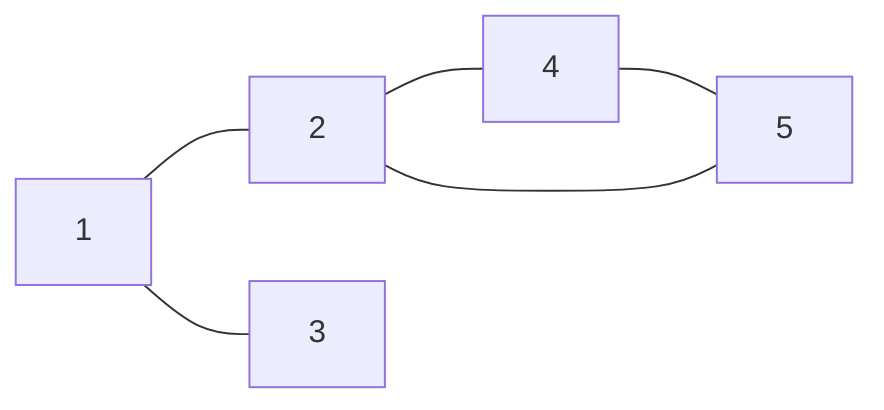
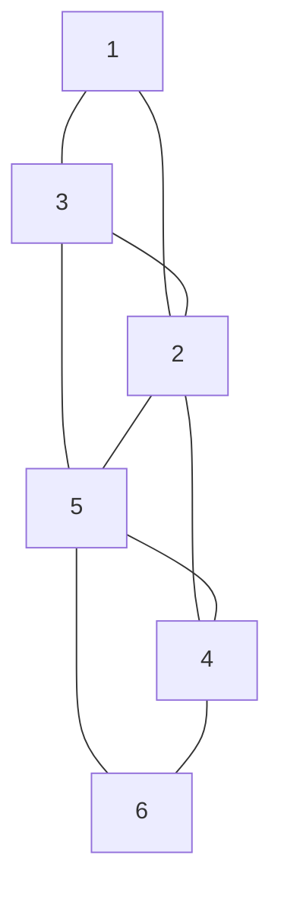
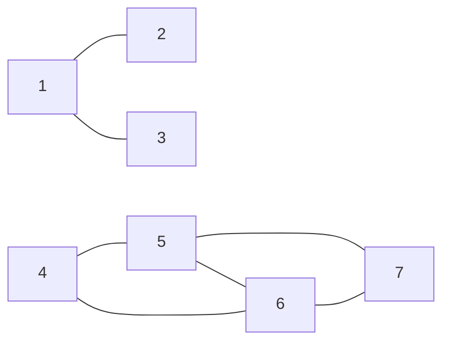

# 東京大学 新領域創成科学研究科 メディカル情報生命専攻 2023年8月実施 問題9

## **Author**
[zephyr](https://inshi-notes.zephyr-zdz.space/), 祭音Myyura

## **Description**

Here is an example of a graph, and its corresponding adjacency list:



$$
\begin{aligned}
1: & \ 2, 3 \\
2: & \ 1, 4, 5 \\
3: & \ 1 \\
4: & \ 2, 5 \\
5: & \ 2, 4 \\
\end{aligned}
$$

(1) Write the adjacency list for this graph:



(2) Draw the graph for this adjacency list:

$$
\begin{aligned}
1: & \ 2, 3 \\
2: & \ 1\\
3: & \ 1 \\
4: & \ 5, 6 \\
5: & \ 4, 6, 7 \\
6: & \ 4, 5, 7 \\
7: & \ 5, 6 \\
\end{aligned}
$$

(3) Suppose we perform a depth-first search of the graph at the top of this page, starting at node 2. Write a possible order in which we might visit the nodes. The first node should be node 2, and the second should be one of the nodes connected to node 2.

(4) Write a possible order in which we might visit the nodes, if we do breadth-first search of the graph at the top of this page, starting at node 2.

(5) Suppose a graph has $n$ nodes, and node $i$ has $m_i$ edges $(1 \leq i \leq n)$. The adjacency list is $A_{ij}$ $(1 \leq i \leq n, 1 \leq j \leq m_i)$. Write pseudocode for an algorithm that outputs the number of connected components, using depth-first search. The algorithm should explicitly use each element of $A_{ij}$.

(6) Write pseudocode for an algorithm that outputs the number of connected components, using breadth-first search. The algorithm should explicitly use each element of $A_{ij}$.

---

这里有一个图的例子及其对应的邻接表：


$$
\begin{aligned}
1: & \ 2, 3 \\
2: & \ 1, 4, 5 \\
3: & \ 1 \\
4: & \ 2, 5 \\
5: & \ 2, 4 \\
\end{aligned}
$$

(1) 为这个图写出邻接表：


(2) 画出这个邻接表的图：

$$
\begin{aligned}
1: & \ 2, 3 \\
2: & \ 1\\
3: & \ 1 \\
4: & \ 5, 6 \\
5: & \ 4, 6, 7 \\
6: & \ 4, 5, 7 \\
7: & \ 5, 6 \\
\end{aligned}
$$

(3) 假设我们对本页最上方的图从节点 2 开始进行深度优先搜索。写出可能访问节点的顺序。第一个节点应该是节点 2，第二个应该是与节点 2 相连的节点之一。

(4) 写出如果我们从节点 2 开始对图进行广度优先搜索时可能访问节点的顺序。

(5) 假设一个图有 $n$ 个节点，节点 $i$ 有 $m_i$ 条边 $(1 \leq i \leq n)$。邻接表是 $A_{ij}$ $(1 \leq i \leq n, 1 \leq j \leq m_i)$。写出一个使用深度优先搜索输出连通分量数的算法伪代码。该算法应明确使用每个 $A_{ij}$ 元素。

(6) 写出一个使用广度优先搜索输出连通分量数的算法伪代码。该算法应明确使用每个 $A_{ij}$ 元素。

### 题目描述

上文先给出一个五顶点无向图及其邻接表，边为

$$
\{1\!-\!2,\,1\!-\!3,\,2\!-\!4,\,2\!-\!5,\,4\!-\!5\}.
$$

回答下列问题：

1. 对题中第二幅六顶点无向图写出完整邻接表；其边为

   $$
   \{1\!-\!3,1\!-\!2,3\!-\!2,3\!-\!5,2\!-\!5,
   2\!-\!4,5\!-\!4,5\!-\!6,4\!-\!6\}.
   $$

2. 画出由下列邻接表表示的图：

   $$
   \begin{aligned}
   1:&\ 2,3& 2:&\ 1& 3:&\ 1\\
   4:&\ 5,6& 5:&\ 4,6,7& 6:&\ 4,5,7& 7:&\ 5,6.
   \end{aligned}
   $$

3. 对最上方的五顶点示例图，从顶点 2 开始做深度优先搜索，写出一种可能的访问顺序；第一项须为 2，第二项须为 2 的某个邻点。
4. 对同一五顶点图，从顶点 2 开始做广度优先搜索，写出一种可能的访问顺序。
5. 一般地，设图有 $n$ 个顶点，顶点 $i$ 有 $m_i$ 条关联边，邻接表元素为

   $$
   A_{ij}\qquad(1\le i\le n,\ 1\le j\le m_i).
   $$

   编写用 DFS 输出连通分量数的伪代码，并显式访问每个 $A_{ij}$。
6. 对同一输入表示，编写用 BFS 输出连通分量数的伪代码，同样显式访问每个 $A_{ij}$。

## **Kai**

Written by [zephyr](https://inshi-notes.zephyr-zdz.space/)

### (1) Write the adjacency list for the given graph


The adjacency list for the given graph is:

$$
\begin{aligned}
1: & \ 2, 3 \\
2: & \ 1, 3, 4, 5 \\
3: & \ 1, 2, 5 \\
4: & \ 2, 5, 6 \\
5: & \ 3, 4, 2, 6 \\
6: & \ 5, 4 \\
\end{aligned}
$$

### (2) Draw the graph for the given adjacency list

$$
\begin{aligned}
1: & \ 2, 3 \\
2: & \ 1 \\
3: & \ 1 \\
4: & \ 5, 6 \\
5: & \ 4, 6, 7 \\
6: & \ 4, 5, 7 \\
7: & \ 5, 6 \\
\end{aligned}
$$



### (3) Depth-First Search (DFS) starting from node 2

A possible order to visit the nodes could be:

$$
2 \rightarrow 1 \rightarrow 3 \rightarrow 5 \rightarrow 4
$$

### (4) Breadth-First Search (BFS) starting from node 2

A possible order to visit the nodes could be:

$$
2 \rightarrow 1 \rightarrow 4 \rightarrow 5 \rightarrow 3
$$

### (5) Pseudocode for DFS to Find the Number of Connected Components with Explicit Use of $A_{ij}$

```text
COUNT-COMPONENTS-DFS(n, m, A):
    visited[1..n] = false
    count = 0

    DFS(v):
        visited[v] = true
        for j = 1 to m[v]:
            u = A[v,j]
            if not visited[u]:
                DFS(u)

    for v = 1 to n:
        if not visited[v]:
            DFS(v)
            count += 1
    output count
```

### (6) Pseudocode for BFS to Find the Number of Connected Components with Explicit Use of $A_{ij}$

```text
COUNT-COMPONENTS-BFS(n, m, A):
    visited[1..n] = false
    count = 0
    for v = 1 to n:
        if not visited[v]:
            count += 1
            Q = empty queue
            visited[v] = true
            enqueue(Q, v)
            while Q is not empty:
                u = dequeue(Q)
                for j = 1 to m[u]:
                    w = A[u,j]
                    if not visited[w]:
                        visited[w] = true
                        enqueue(Q, w)
    output count
```

## **Knowledge**
### 重点词汇

1. Depth-First Search (DFS) 深度优先搜索
2. Breadth-First Search (BFS) 广度优先搜索
3. Adjacency List 邻接表

### 参考资料

1. Introduction to Algorithms, Thomas H. Cormen, Charles E. Leiserson, Ronald L. Rivest, and Clifford Stein, Chap. 22.
2. Graph Theory with Applications, J.A. Bondy and U.S.R. Murty, Chap. 1.
